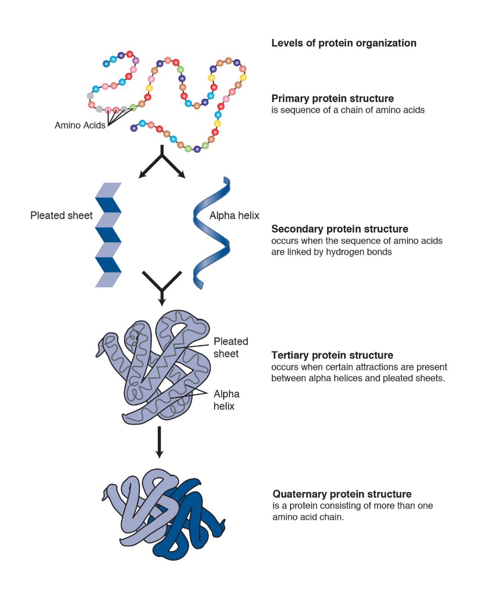
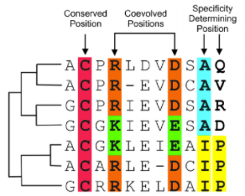

## Protein Organization

- We are composed mostly of proteins, and proteins are composed of amino acids (e.g. Tryptophan). Proteins can have four levels of organization:

- **Primary Structure**: amino acid sequence
- **Secondary Structure**: amino acid sequences linked by hydrogen bonds
- **Tertiary Structure**: organization of secondary structures
- **Quaternary Structure**: organization of multiple amino acid chains

## The Importance of Protein Structure

- Can help determine what a protein does
- Often more conserved than the amino acid sequences that form them

## Protein Structure Problem

As of now there are a few different ways to predict protein structure in the lab:

!!! info ""
    - X-ray Crystallography
    - Nuclear Magnetic Resonance (NMR) Spectroscopy
    - 3D Electron Microscopy
    
However there are 100,000,000 known distinct proteins, each with a unique structure that determines function. Determining protein structure is time consuming and as such only a small fraction of exact 3D structures are known.

??? info "Where can I find protein structure information?"

    You can use the [Protein Data Bank (PDB)](https://www.rcsb.org/) to find information on a protein's structure and the study that created that structure.

## Levinthal's Paradox

- Finding the native folded state of a protein by random searching of all possible configurations would take an enormous amount of time
- However, proteins can often fold within seconds
- Meaning some process must be guiding this folding

## Using Sequence To Predict Structure

- Instead of laboratory experimentation, there have been massive efforts to use a protein’s sequence to determine structure
- In 1994, the Critical Assessment of Structure Protein (CASP) was established as a biennial assessment of methods to predict structure from sequence

## How Could Sequence Predict Structure?

- Sequences can be aligned to one another to find overlaps
- These sequences are _aligned_ with one another as to best match similar regions, this is called a **multiple sequence alignment or MSA**
- These sequences don’t always line up perfectly and as such we see:
    - **Conserved positions**: where the letter does not change
    - **Coevolved positions**: where the letter will change with another letter
    - **Specificity Determining positions**: where the letter is consistently different 

## Why is an MSA Useful In Structure Prediction?

- The theory is that residues that coevolve are generally close to each other in the protein’s folded state
- So, by assessing what residues change together we get an idea of where they might be spatially!

## Our Data

Today we will be comparing AlphaFold2's structure prediction of Proliferating Cell Nuclear Antigen (PCNA) and DNA ligase 1 (LIG1)!

