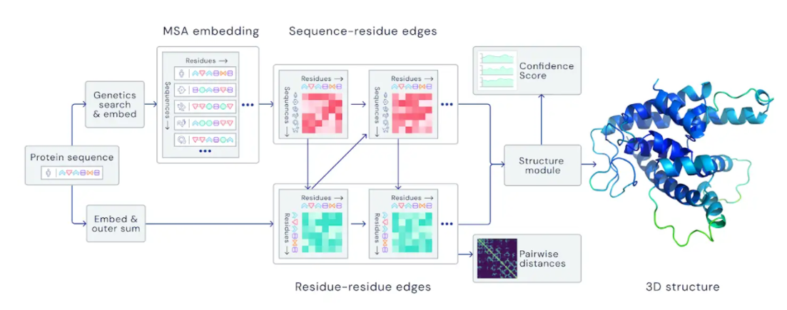

## AlphaFold2 Algorithm

## Enter AlphaFold2 

- Google’s DeepMind team Entered AlphaFold 2 in CASP14 
- Achieved a median Global Distance Test Score of 92.4 
    - This score essentially says: How close is my predicited structure to the known structure?

## AlphaFold2 Algorithm

- AlphaFold 2 works by:
    - starts with a user's query protein sequence
    - finding similar sequences to that query
    - aligns these sequences to create a mutliple sequence alignment
    - uses available structure data based on query sequence to create initial distances between residues
    - uses a neural network to iteratively update the distances between residues by using information from the sequence alignment
    - passes this to another neural network to determine how these residues are oriented in 3D space

## 
