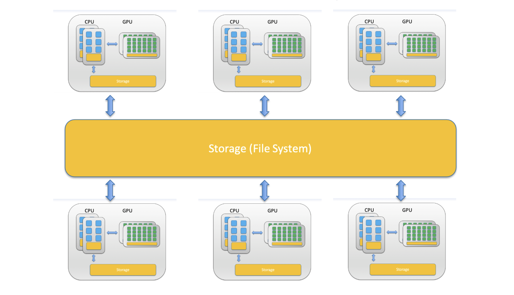
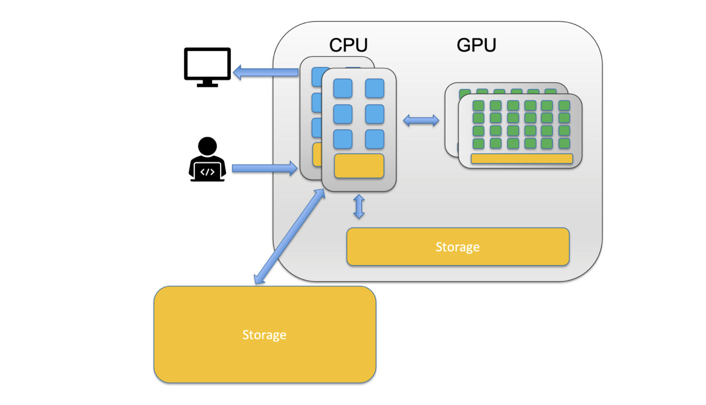
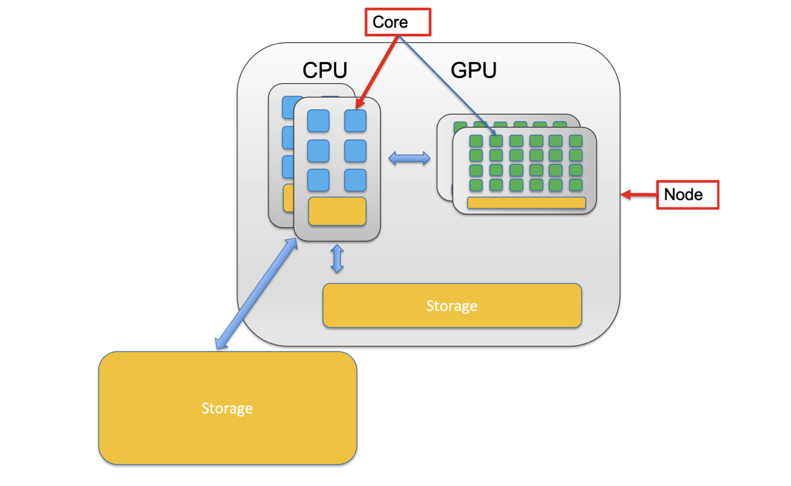
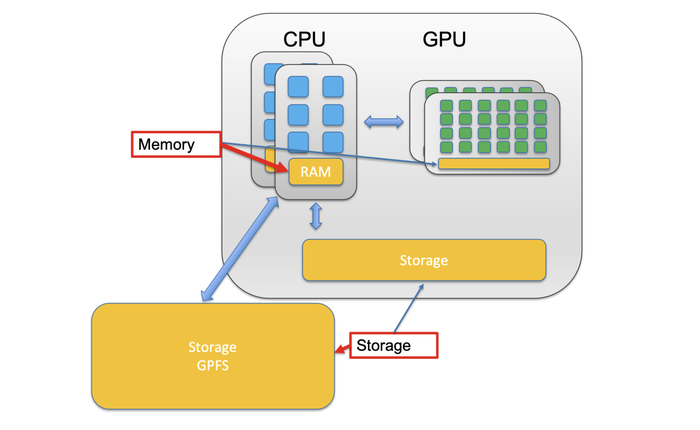

## Cluster Terminologies
### What is "Cluster"

- A computer cluster is a set of loosely or tightly **connected** **computers** that work together so that, in many respects, they can be viewed as a single system. Computer clusters have each node set to perform the same/similar tasks, controlled and scheduled by **[software](#SLURM)**. 

### CPU vs GPU

- CPU -- **Central Processing Unit** 

    - A CPU can never be fully replaced by a GPU

    - Can be thought of as the **taskmaster** of the entire system, coordinating a wide range of general-purpose computing tasks

- GPU -- **Graphics Processing Unit**

    - GPUs were originally designed to create images for computer graphics and video game consoles

    - GPGPU

    - Performing a narrower range of more specialized tasks

### Cores vs Node

- A **node** is a single computer in the system, which has a number of computing units, aka **cores**. 

### Memory vs Storage

The central processing unit (CPU) of a computer is what manipulates data by performing computations.  In practice, almost all computers use a [storage hierarchy](https://en.wikipedia.org/wiki/Memory_hierarchy), which puts fast but expensive and small storage options close to the  CPU and slower but less expensive and larger options further away.  Generally the fast volatile technologies (which lose data when off  power) are referred to as "memory", while slower persistent technologies are referred to as "storage".

- Memory
    - Small, fast, expensive
    - Used to store information for immediate use
- Storage
    - Larger, slower, cheaper
    - Non-volatile (retaining data when its power is shut off)

