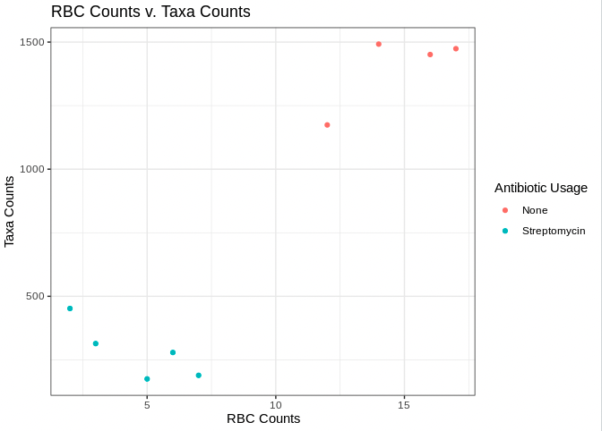

## Markdown Language
  
- Way of writing HTML content without having to deal with HTML code
- At the top of the page you'll notice a header section
  - this header section is defined by two sets of three dashes 
  - contains 
    - the title of our markdown report
    - the output format of our markdown report
- In the body of the document headers can be specified by adding hastags before the text
- Lists can be specified by adding a dash or asterisk before the text
- for more information on markdown formatting visit:
  https://www.markdownguide.org/basic-syntax/
- While we will be working with an R markdown document today you can also run code in an R script. To open an R script you can go to File > New File > R Script. 

NOTE: R scripts will end in ".R", while R markdowns will end in ".Rmd"

## Code chunks
  
- code chunks can be included in our markdown document with two sets of three tick marks
- you'll notice in the brackets we add in, `r`, which indicates we are running R code

Let's start with R by defining what is called a variable. We can run this chunk of code by clicking the play button in the corner of the code chunk:
  
```{r}
num <- 18
num
```

!!! info "output"

    ```
    [1] 18
    ```

What did we do:
  
  - assigned the value 18 to the word "num" 
  - assign value with  the "<-" operator
  - call the value of this variable with the word "num" 
  - NOTE: our variable appears in the environment window to the right.
  - NOTE: when we ran the code chunk our console window shrank! This is because our output is appearing below the code chunk. We can always reopen it by clicking on it!
  
## Variable Names

- variable names are case sensitive
- they can include any combination of:
  - lower-case letters
  - upper-case letters
  - underscores/periods/numbers (however, these cannot be the first character)
  
```{r}
second.number.2 <- 2
third_number_3 <- 3
fourthNumber4 <- 4
```

Whate did we do:

- we assigned three numbers 2,3,4 to the variables second.number.2, third_number_3,fourthNumber4
- all are valid variable names
- keep you variable names as short as possible to still convey what they represent
- just be consistent with your naming convention

## Variable Properties

- When we define variables we can treat that variable name as the value itself
- We can also add variable names together
- We can assign more than one value to a variable name

Let's try this out in code!

```{r}
# add 5 to num
num <- num + 5
num

# assign 20 to new num and add it to num
new_num <- 20
new_num + num

#create a variable with multiple values
combined <- c(3,4,6)
combined
```

!!! info "output"

    ```
    [1] 23
    
    [1] 43
    
    [1] 3 4 6
    ```

What did we do:

- First we added 5 to the variable `num`
- We assigned that num + 5 back to the variable `num` which overwrote the original value of 18! (now it's 23)
- we assigned a new variable `new_num` to the value 20 and then showed we can add the values of `new_num` and `num` together with just their names
- we then assigned multiple values to the variable `combined` by separating values by commas and enclosing them in `c()`
- this variable with multiple values is called a vector!


- You'll also note we add text inside our code block by putting a hashtag in front of it. This is called a comment and they are very useful in giving your code context. 

## Accessing/Manipulating Values in a Vector

- Suppose we want to access one value in our vector `combined`
- We can do this by specifying the value number in that vector.
- Let's try grabbing the second value in `combined`

```{r}
# call the second value in combined
combined[2]

# replace second value in combined
combined[2] <- 10
combined[2]
```

!!! info "output"
    
    ```
    [1] 4
    
    [1] 10
    ```

What did we do:

- grabbed the second value in `combined` by specifying the vector and then the number value we want in brackets
- vectors in R are one-indexed meaning that when you want the first value in a vector you use `[1]`, second value you would use `[2]` and so on
- we also replaced the second value of `combined` by calling `combined[2]` and reassigning it to `10`

## Libraries

- R has a collection of base functions (we just used the file.copy() function!)
- However, there are thousands of other functions we can use by importing different libraries
- Tufts HPC has a collection of different libraries pre-installed we can use!

Let's access that collection and import a library:

```{r}
.libPaths("/cluster/tufts/hpc/tools/R/4.0.0/")
library(tidyverse)
```

!!! info "output"

    ```
    Registered S3 methods overwritten by 'dbplyr':
    method         from
    print.tbl_lazy     
    print.tbl_sql      
    ── Attaching packages ─────────── tidyverse 1.3.0 ──
    ✓ ggplot2 3.3.5     ✓ purrr   0.3.4
    ✓ tibble  3.1.6     ✓ dplyr   1.0.8
    ✓ tidyr   1.2.0     ✓ stringr 1.4.0
    ✓ readr   1.4.0     ✓ forcats 0.5.1
    ── Conflicts ────────────── tidyverse_conflicts() ──
    x dplyr::filter() masks stats::filter()
    x dplyr::lag()    masks stats::lag()
    ```

What did we do:

- we used the .libPaths() function to point to where Tufts is keeping this collection of R packages
- after pointing to this location we can import a package!
- here we imported the tidyverse package using the library() function

## Importing Data

So what does this package do? 
- the tidyverse package contains all sorts of functions to load, manipulate, and visualize data!
 
Let's try use the read_delim() function to import some data:

```{r}
# load our data
meta <- read_delim(file="../data/meta.tsv",
                   delim = "\t")
```

What did we do:

- specified where our data  is
  - it is one folder up (a.k.a. "../") and in the data folder ("data/")
- we specified the delimiter or the separator between our data
  - here we say "\t" to indicate our file is separated by tabs
- assign our data to the variable "meta"

## Inspecting Data

- It is good practice to inspect your data before using it
- we can use the str() function to get a high level summary of our data :

```{r}
str(object=meta)
```

!!! info "output"

    ````
    spec_tbl_df [9 × 5] (S3: spec_tbl_df/tbl_df/tbl/data.frame)
     $ SampleID       : chr [1:9] "sample 1" "sample 2" "sample 3" "sample 4" ...
     $ AntibioticUsage: chr [1:9] "None" "None" "None" "None" ...     
     $ Day            : chr [1:9] "Day0" "Day0" "Day0" "Day0" ...     
     $ Organism       : chr [1:9] "mouse" "mouse" "mouse" "mouse" ...    
     $ TaxaCount      : num [1:9] 1174 1474 1492 1451 314 ...    
     - attr(*, "spec")=     
      .. cols(     
      ..   SampleID = col_character(),  
      ..   AntibioticUsage = col_character(),
      ..   Day = col_character(),
      ..   Organism = col_character(),
      ..   TaxaCount = col_double()
      .. )
    ````
What did we do:

- we input our variable "meta" into the str() function which takes some `object`, here specify that `object` is our variable `meta`
- Our output indicates a few things:
  - the dimensions of our data (9 rows by 5 columns)
  - our data is a table/data.frame
  - the names of our columns (SampleID, AntibioticUsage, etc.)
  - the data type of our columns (chr = character data, num = numeric data)
  - how many values per column
  - a preview of the first few values

NOTE: If you want more information on R data types and how to convert between data types, visit:
https://swcarpentry.github.io/r-novice-inflammation/13-supp-data-structures/

To view the entire data frame, click on the variable in the environment window:
  - here we can see the entire data frame and even search for values
  - You'll note that our rows are different samples
  - and our columns are different attributes about those samples

## Accessing Values By Number 

- We can access values in our data frame by specifying their row and column
- Let's try finding the value in the second row and the third column:

```{r}
meta[[2,3]] # [[row,column]]
meta[[3]][2] # [[column]][row]
```  

!!! info "output"

    ```
    [1] "Day0"
    
    [1] "Day0"
    ```
What did we do:

- accessed our value using double brackets
- single brackets would subset our data frame instead of accessing our value
- we can either specify the row then column  inside the double brackets
- or specify our column in double brackets and then the second element in single brackets

## Accessing Values By Name

- But what if we don't have our index number? What if we wanted to determine the antibiotic usage of "sample 5"?
- Let's see how we can do this:

```{r}
#data[[column name]]
meta[["AntibioticUsage"]]
```

!!! info "output"

    ```
    [1] "None"         "None"         "None"         "None"         "Streptomycin" "Streptomycin" "Streptomycin"
    
    [8] "Streptomycin" "Streptomycin"
    ```

```{r}
# data[[column name]][data[[column name]]==pattern]
meta[["AntibioticUsage"]][meta[["SampleID"]]=="sample 5"] 

#data$ColumnName[data$ColumnName == pattern]
meta$AntibioticUsage[meta$SampleID=="sample 5"] 
```

!!! info "output"

    ```
    [1] "Streptomycin"
    
    [1] "Streptomycin"
    ```

What did we do:

- first we accessed our AntibioticUse column by calling our data frame, then in double brackets we reference our column name.
- we accessed our value by:
  - specifying the column in double brackets
  - we then use single brackets to select some value in that column
  - we then specify a condition:
    - where the column "SampleID" is equal to "sample 5"
- second we accessed our value by using the "$" operator
- when we are dealing with a data frame we can use the "$" operator to avoid having to write double brackets!

## Comparison Operators

- You'll have noticed above we used a comparison operator
- We asked which value in the "SampleID" column was equal to "sample 5"
- Let's look at some other comparison operators:
  - `==` equals
  - `!=` does not equal
  - `<` less than
  - `>` greater than
  - `=<` less than or equal to
  - `>=` greater than or equal to
  - `%in%` is a value in another set of values
  - `&` and
  - `|` or
- Let's try to use these operators to ask a few questions about our data:
  - Do we have any samples with over 1000 different taxa?
  - Is "sample 8" in our SampleID column?
  
```{r}
# first let's see if there are any samples with over 1000 different taxa
# df$column_name1[df$column_name2>threshold]
meta$SampleID[meta$TaxaCount>1000]

# now let's see if there is a "sample 8" in our SampleID column
# pattern %in% df$column_name
"sample 8" %in% meta$SampleID
```

!!! info "output"

    ```
    [1] "sample 1" "sample 2" "sample 3" "sample 4"
    
    [1] TRUE
    ```

What did we do:

- To identify samples with over 1000 different taxa we:
  - specified our SampleID column
  - specified our condition column (here it is TaxaCount)
  - used the greater than operator and threshold to specify we only want to identify samples with a TaxaCount greater than 1000
  
- To identify if "sample 8" was in our Sample ID column we:
  - specifed our pattern (here it is "sample 8")
  - specified our column of interest (SampleID)
  - used the %in% operator to see if our pattern was in our column of interest

## Applying Subsetting To Data Frames

- So far we have accessed individual values in a data frame. But what about filtering our data frame?
- Let's filter or subset our data frame into two data frames:
   - one with just samples and their antibiotic usage
   - another with samples on Day 5 of treatment

```{r}
# filter data frame for just samples and their antibiotic usage
# df[c("column_name1","column_name2")]
samples_antibiotics <- meta[,c("SampleID","AntibioticUsage")]
head(samples_antibiotics)
```

!!! info "output" 

    ```
      SampleID AntibioticUsage
      <chr>    <chr>          
    1 sample 1 None           
    2 sample 2 None           
    3 sample 3 None           
    4 sample 4 None           
    5 sample 5 Streptomycin   
    6 sample 6 Streptomycin 
    ```

```{r}
# filter data frame for just samples on Day 5 of treatment
#df[df$column_name == pattern,]
day_5 <- meta[meta$Day == "Day5",]
head(day_5)
```

!!! info "output"

    ```
    SampleID AntibioticUsage Day   Organism TaxaCount
    <chr>    <chr>           <chr> <chr>        <dbl>
    1 sample 5 Streptomycin    Day5  mouse          314
    2 sample 6 Streptomycin    Day5  mouse          189
    3 sample 7 Streptomycin    Day5  mouse          279
    4 sample 8 Streptomycin    Day5  mouse          175
    5 sample 9 Streptomycin    Day5  mouse          452
    ```
         
What did we do:

- To filter the data frame for just samples and their antibiotic usage:
  - specified our data frame (meta)
  - identified which columns we wanted to keep within `c()`
  - specified we are grabbing columns by placing our column names behind the comma
  - saved this filtered data frame to `samples_antibiotics`
  - used the `head()` function to view the first 6 rows of our new data frame
- To filter the data frame to just samples on Day 5 of treatment:
  - specified our data frame (`meta`)
  - specified the column we intend to filter (`Day`)
  - used `==` to filter for only values that are equal to "Day5"
  - specified we are filtering rows by placing the comma after our pattern
  
## Merging Data Frames

- Often times you may want to merge in data from another data frame
- Let's see how to do this!

```{r}
# read in second meta data file
meta2 <- read_delim("../data/meta2.tsv",delim = "\t")
head(meta2)
```

!!! info "output"

    ```
      SampleID   RBC
      <chr>    <dbl>
    1 sample 1    12
    2 sample 2    17
    3 sample 3    14
    4 sample 4    16
    5 sample 5     3
    6 sample 6     7
    ```
    
```{r}
# merge with existing meta data file
merged <- inner_join(
  x = meta,
  y = meta2,
  by = c("SampleID")
)
head(merged)
```    

!!! info "output"

    ```
      SampleID AntibioticUsage Day   Organism TaxaCount   RBC  
      <chr>    <chr>           <chr> <chr>        <dbl> <dbl>   
    1 sample 1 None            Day0  mouse         1174    12
    2 sample 2 None            Day0  mouse         1474    17 
    3 sample 3 None            Day0  mouse         1492    14 
    4 sample 4 None            Day0  mouse         1451    16
    5 sample 5 Streptomycin    Day5  mouse          314     3
    6 sample 6 Streptomycin    Day5  mouse          189     7 
    ```

What did we do:

- we read in another data frame from our `data` folder and named this data frame `meta2`
- we then previewed this data frame to see that we have our SampleID column and a new column `RBC`
- we then use the inner_join function to merge the two data frames, which takes:
  - `x`  data frame 1
  - `y` data frame 2,
  - `by` the column to merge on in both data frames
- we then use the `head()` command to preview our merged data frame

## Adding Columns

- Sometimes you may want to create columns in your data frame based on data in your existing data frame:

```{r}
# add column based on data on data
merged$RBC_Status <- ifelse(
  test = merged$RBC > 13,
  yes = "High RBC Count",
  no = "Low RBC Count"
)
head(merged)
```

!!! info "output"

    ```
      SampleID AntibioticUsage Day   Organism TaxaCount   RBC RBC_Status    
      <chr>    <chr>           <chr> <chr>        <dbl> <dbl> <chr>         
    1 sample 1 None            Day0  mouse         1174    12 Low RBC Count 
    2 sample 2 None            Day0  mouse         1474    17 High RBC Count
    3 sample 3 None            Day0  mouse         1492    14 High RBC Count
    4 sample 4 None            Day0  mouse         1451    16 High RBC Count
    5 sample 5 Streptomycin    Day5  mouse          314     3 Low RBC Count 
    6 sample 6 Streptomycin    Day5  mouse          189     7 Low RBC Count   
    ```
        
What did we do:

- we added a new column by specifying the name of our data frame, `merged` and then the new column name after the `$` symbol
- used the `ifelse()` function to add different values based on some `test`
  - here our test was to see if the value in the `RBC` column was over 13
  - if the answer was `yes`, it was over 13, then we input the value "High RBC Count"
  - if the answer was `no`, it was under 13, then we input the value "Low RBC Count"
- we again use the `head()` function to preview our updated data frame

## Creating a Factor

- We have two data types in our data frame, character values, and numeric values
- Sometimes a character value will have an order to it (i.e. low, medium, high) 
- In R when you provide an order to a character variable it is a factor data type
- Let's make our RBC Status column a factor specifying the order should be Low then High RBC count

```{r}
# make the day column a factor
merged$RBC_Status <- factor(
  merged$RBC_Status,
  levels = c(
    "Low RBC Count",
    "High RBC Count"
  )
)
merged$RBC_Status
```

!!! info "output"
    
    ```
    [1] Low RBC Count  High RBC Count High RBC Count High RBC Count Low RBC Count  Low RBC Count  Low RBC Count 
    [8] Low RBC Count  Low RBC Count 
    Levels: Low RBC Count High RBC Count
    ```


## Visualizing Data

- Now for the fun part of R: data visualization!
- There are a few different ways to plot in R, but today we will show you how to plot using the `ggplot2` package as it is widely popular among R users.
- NOTE: `ggplot2` is a part of the `tidyverse` package that we already loaded so we don't need to load it again.
- Here we will plot:
  - RBC counts versus Taxa Counts
  - Antibiotic Usage versus Taxa Counts
  
```{r}
rbc_v_taxa <- ggplot(merged,                        # data to use
                     aes(x=RBC,                     # x axis data
                         y = TaxaCount,             # y axis data
                         color=AntibioticUsage))+   # column to color data by
  geom_point()+                                     # this plot is a scatterplot
  theme_bw()+                                       # the theme is theme_bw()
  labs(                                             
    x="RBC Counts",                                 # x axis title
    y="Taxa Counts",                                # y axis title
    color="Antibiotic Usage",                       # legend title
    title="RBC Counts v. Taxa Counts"               # figure title
  )
rbc_v_taxa

```


        
What did we we do:

- Created a scatter plot where:
  - we used the `ggplot()` function to specify our data, and inside this function we used the `aes()` function to specify which columns we wanted to plot (x axis being the `RBC` column and the y axis being the `TaxaCount` column)
  - inside the `aes()` function we specified the `color` argument to indicate we want to color by the column `Antibiotic Usage`
  - we used the `geom_point()` function to specify this is a scatter plot
  - we used the `theme_bw()` function to style this plot using the `theme_bw()` style
  - we used the `labs()` function to specify our X axis title, y axis title, legend title and figure title
- we then saved this figure to the variable `rbc_v_taxa`
- For more information on plotting with ggplot visit:

http://www.sthda.com/english/wiki/be-awesome-in-ggplot2-a-practical-guide-to-be-highly-effective-r-software-and-data-visualization

## Saving Plots/Data

- Now that we have created all this wonderful data and plots we should learn how to save them!

```{r}
# to save new data frame
write_delim(x = merged,
            file = "../results/merged.tsv",
            delim = "\t")

# to save our plot
ggsave(filename = "../results/rbc_v_taxa.png",
       plot = rbc_v_taxa)
```

What did we do:

- To save our new merged data frame:
  - we used the `write_delim` function
  - specified our data frame, or `x` argument, to be the variable `merged`
  - we said we wanted to save our `file` one folder up "../" in the results folder, "results/" as "merged.tsv"
  - we also noted that our file should be separated or delimited, `delim`, by tabs `\t`

- To save our plot:
  - we used the `ggsave` function
  - we said we wanted to save our file (`filename`) one folder up "../" in the results folder, "results/" as "rbc_v_taxa.png"
  - specified our plot, `plot`, to be the variable `rbc_v_taxa`

## Getting Help
 
- Sometimes we won't know what every function does. 
- Let's investigate the `aes()` function we just used to create our plot!

```{r}
?aes
```

What did we do:

- To investigate the `aes()` function we:
  - put a `?` in front of the function of interest. 
  - then in the help window we see a description of the function and examples on how to use it!
  
## Creating the Markdown Report

- Now this combination of text and code can be "knitted" into a report of our choice. 
- Today we will be creating an HTML page of our results. 
- For a full list of R markdown output options visit:

  https://rmarkdown.rstudio.com/lesson-9.html

- To create our output file go to the top of the script window and click "Knit"!

Thanks for taking part in the Intro To R for the Life Sciences Tutorial!

So as a summary we learned about:

- project organization
- R packages and how to access them on the tufts HPC
- working with variables and data frames
- visualizing data
- and finally writing a markdown report of our findings

## References

1. [A Gentle Introduction to R](https://tuftsdatalab.github.io/intro-r/)
2. [R for Reproducible Scientific Analysis](https://swcarpentry.github.io/r-novice-gapminder/)
3. [Markdown Syntax](https://www.markdownguide.org/basic-syntax/)
4. [Programming With R](https://swcarpentry.github.io/r-novice-inflammation/13-supp-data-structures/)
5. [Be Awesome in ggplot2: A Practical Guide to be Highly Effective - R software and data visualization](http://www.sthda.com/english/wiki/be-awesome-in-ggplot2-a-practical-guide-to-be-highly-effective-r-software-and-data-visualization)
6. [Output Formats](https://rmarkdown.rstudio.com/lesson-9.html)
