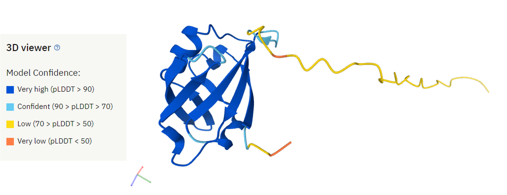

## AlphaFold2 Accuracy Assessment

We can assess the accuracy of the AlphaFold prediction using:

- **Predicted Local Distance Difference Test (pLDDT)**
- **Predicted Alignment Error**

## Predicted Local Distance Difference Test (pLDDT)

- per-residue confidence metric  ranging from 0-100 (100 being the highest confidence)
- Regions below 50 could indicate disordered regions



## Predicted Alignment Error (PAE)

- The Predicted Alignment Error (PAE) gives us an expected distance error based on each residue.
- If we are more confident that the distance between two residues is accurate, then the PAE is lower (darker green). If we are less confident that the distance between two residues is accurate, the PAE is higher (lighter green)


## Navigate To The Cluster

- Now that we have an idea of what these metrics mean, let's try generating these plots for the Cas12a-CWF mutant on the cluster. First navigate to: [https://ondemand.pax.tufts.edu/](https://ondemand.pax.tufts.edu/)

- Log in with your Tufts credentials
- On the top menu bar choose `Clusters->Tufts HPC Shell Access`


- You'll see a welcome message and a bash prompt, for example for user `tutln01`:

```
[tutln01@login001 ~]$
```

- This indicates you are logged in to the login node of the cluster. Please **do not** run any program from the login node.

??? question "Are you logged into OnDemand?"

    - Yes
    - No
    
    
## Starting an Interactive Session

- To run our analyses we will need to move from the login node to a compute node. We can do this by entering:

```bash
srun -p batch --time=3:00:00 -n 2 --mem=4g --reservation=chbe165 --pty bash
```

??? example "Explanation of Commands"

    - `srun`: SLURM command to run a parallel job
    - `-p`: asking for a partition, here we are requesting the batch partition
    - `--time`: time we need here we request 3 hours
    - `-n`:  number of CPUs needed here we requested 2
    - `--mem`:  memory we need here we request 4 Gigabytes
    - `--reservation`: the reservation of compute resources to use here we use the `chbe165` reservation
    - `--pty`: get a pseudo bash terminal
    
!!! warning ""
    
    The `chbe165` reservation will be unavailable a few days after this workshop. This reservation is a temporary reservation for this class. To get on an interactive node outside of this session just remove --reservation=chbe165 from the command!

- When you get a compute node you'll note that your prompt will no longer say login and instead say the name of the node:

```
[tutln01@c1cmp048 ~]$
```

## Set Up For Analysis

- To get our AlphaFold data we will enter:

```bash
cp -r /cluster/tufts/bio/tools/training/cas12a_af2 ./
```

- Now let's go into this folder with the following command:

```bash
cd cas12a_af2 
```

- Given that AlphaFold2 can take anywhere from a few hours to a few days to run - AlphaFold2 predictions have already been generated for the Cas12a-CWF mutants from our study. We will use a script from the [VIB Bioinformatics Core](https://elearning.bits.vib.be/courses/alphafold/lessons/alphafold-on-the-hpc/topic/alphafold-outputs/) to visualize the accuracy of AlphaFold2's predictions. First we will need to load the software needed to run that script:

```bash
module load alphafold/2.1.1
```

- Now we will need to feed our script three arguments:
    
    - `--input_dir` input directory with model files 
    - `--output_dir` output directory to put our plots of model information
    - `--name` optional prefix to add to our file names


```bash
python af2_accuracy_viz.py --input_dir mut2cwf/5XUS_mut2cwf --output_dir ./ --name mut2cwf
```

- Running this will generate two images in your current directory:

    - `mut2cwf_coverage_LDDT.png` - plots of your msa coverage and pLDDT scores per residue per model
    - `mut2cwf_PAE.png` - plots of your predicted alignment error 

- The following is are the pLDDT and PAE scores for the Cas12a-CWF mutant:


- You'll note that for the pLDDT plots, that the multiple sequence alignment is plotted with a bar on the side to tell you how similar those sequences were to your query sequence (in this case each of the Cas12a-CWF mutant)

??? question "Do you see a region in the MSA plot that seems more conserved? How about less conserved?"

??? question "How does this coverage seem to affect the confidence in each residues position in the pLDDT plots? "
