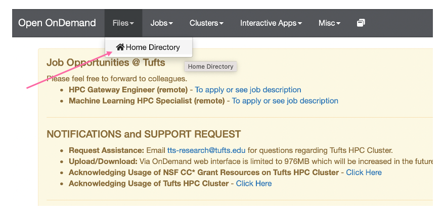

## Cas12a Variant Visualization

- In the previous slide we plotted our MSA alignment, the pLDDT scores, and the predicted alignement error. However, it is also useful to visualize the actual predicted protein structure and compare it to the known structure if there is one. Here we use a software called PyMOL to do just that:


- Here we see that PyMOL takes either the PDB ID or a PDB file and creates a vizualization for us to examine. If you have not done so already please [download PyMOL](https://access.tufts.edu/pymol){:target="_blank" rel="noopener"} and open the app. You should see a window like the follwing:


- Here we have a:
  - **History Window** with log of previous commands
  - **Command Interface** to enter PyMOL commands
  - **List of Objects Loaded** which list of objects/proteins that have been loaded into PyMOL
  - **Visualization Window** to visualize protiens loaded into PyMOL

- Let's try on our data!

## Download AlphaFold Output

- First we will need to download our predicted structure pdb file for the mutant, Cas12a mut2-CWF. To this, go to `Files > Home Directory`:



- Now, click on cas12a_af2 and download the following file, `mut2cwf.pdb`:


## Importing Structures

- To visualize this protein structure in PyMOL, open PyMOL on your computer
- Go to File > Open - then choose your pdb file.
- The file we have loaded is the Cas12a-CWF mutant, let's fetch the structure for the wild type Cas12a protein:

```bash
fetch 5xus
```

- We will now align this structure with the Cas12a-CWF mutant. So in the PyMOL command prompt enter:

```bash
align mut2cwf, 5xus
```

## Viewing/Coloring Structures

- To view one structure at a time, you can use the `disable` command to hide one of the structures:

```bash
disable 5xus
```

- To see this structure again we can simply use the `enable` command:

```bash
enable 5xus
```

- To change the color of our structures we can use the following command:

```bash
color lightblue, 5xus
```

```bash
color salmon, mut2cwf
```

## Visualizing Variants

- Now that we have aligned/colored our structures, let's select residues on the RuvC Domain on the Cas12a mut2-CWF and the Cas12a wild-type:

```bash
select resi 863+952+965+1214 and name CA
```

!!! note 
    Note we are only selecting the alpha carbons so that when we label these residues we only have one label per residue

- To label these residues we can use the following:

```bash
label sele, " %s%s" % (resn,resi)
```

- With these residues selected we can color them to visualize them easier:

```bash
color red, sele
```

- Let's now zoom into this region:

```bash
zoom sele
```

- To capture this image we can go to `File > Export Image As > PNG... > Save PNG image as ...` and enter a name for your image!
- Alternatively, you can take a screen shot and save.


??? question "Can you spot any disordered regions that AlphaFold2 may not have predicted well? Include an image displaying one of these regions. "

??? question "[Ma et al. 2022](https://www.ncbi.nlm.nih.gov/pmc/articles/PMC9825149/) note that the Cas12a mut2-CWF has a more open active site than the wild type Cas12a. Disable the Cas12a mut2-CWF mutant and include an image of the wild type Cas12a. Then enable Cas12a mut2-CWF mutant, disable the wild type Cas12a and include an image of the Cas12a mut2-CWF mutant. Do you agree that the catalytic site appears more open in comparison to the wild type structure (5xus)?"
