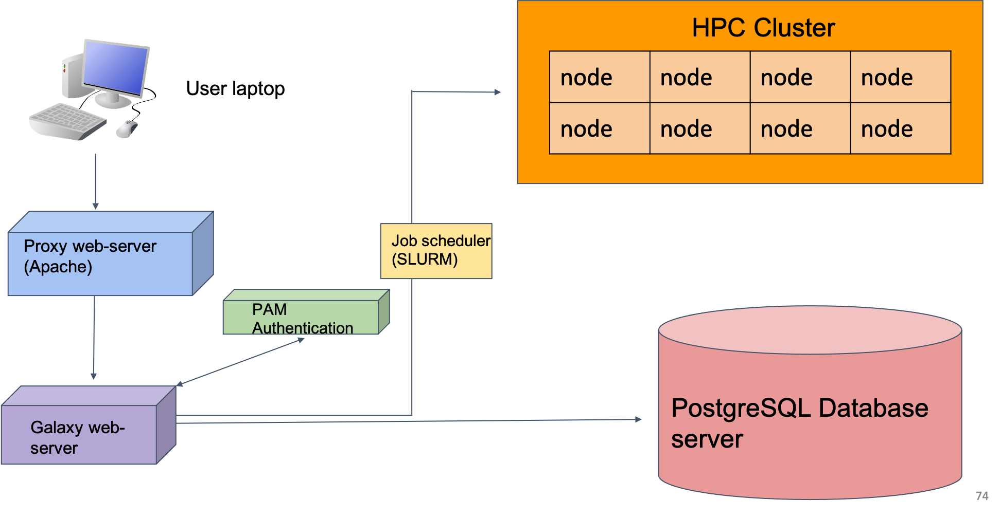
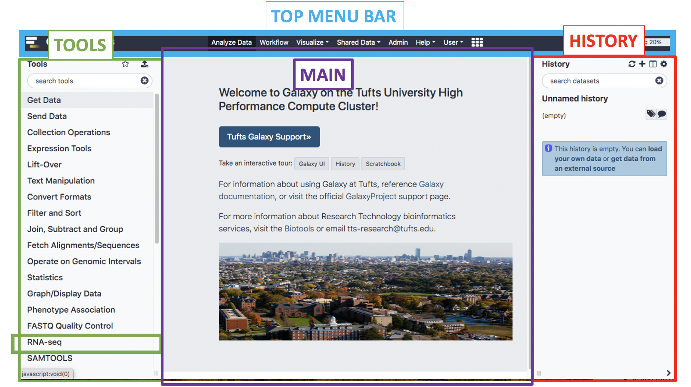
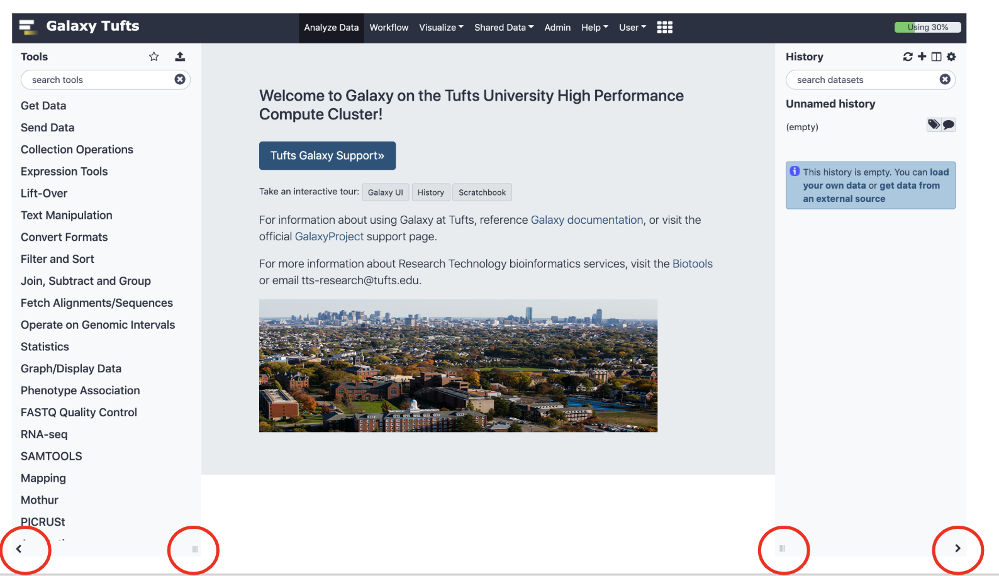
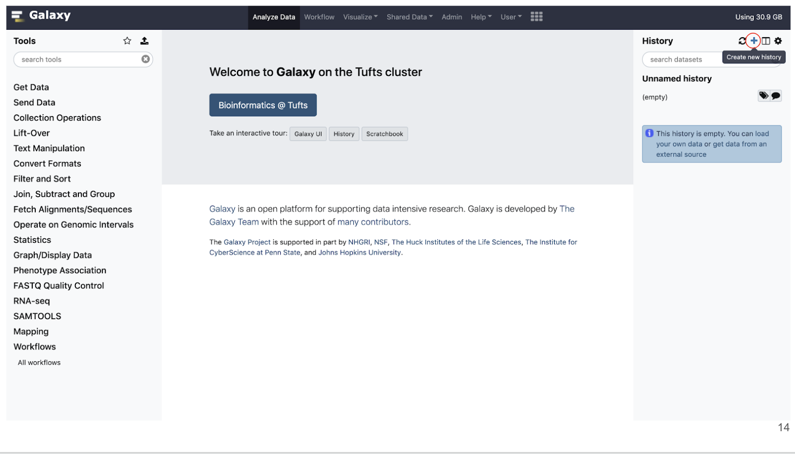
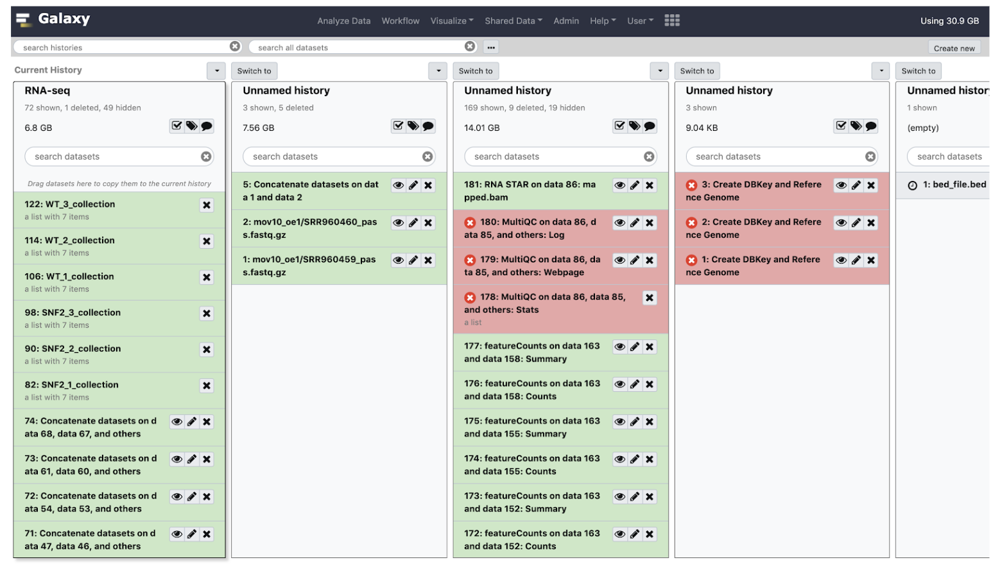
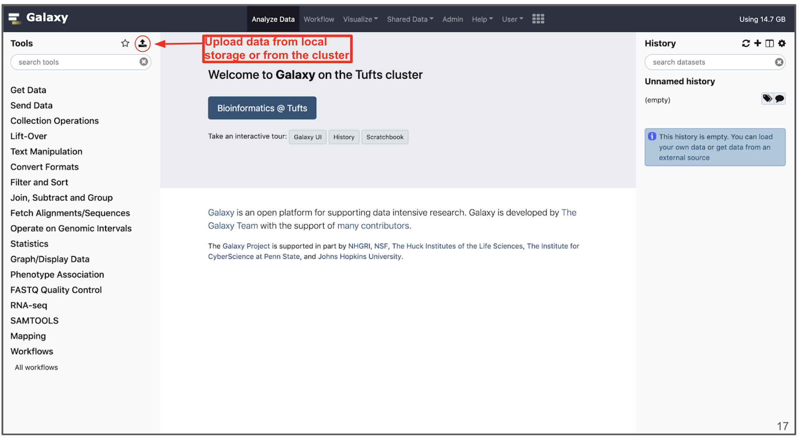
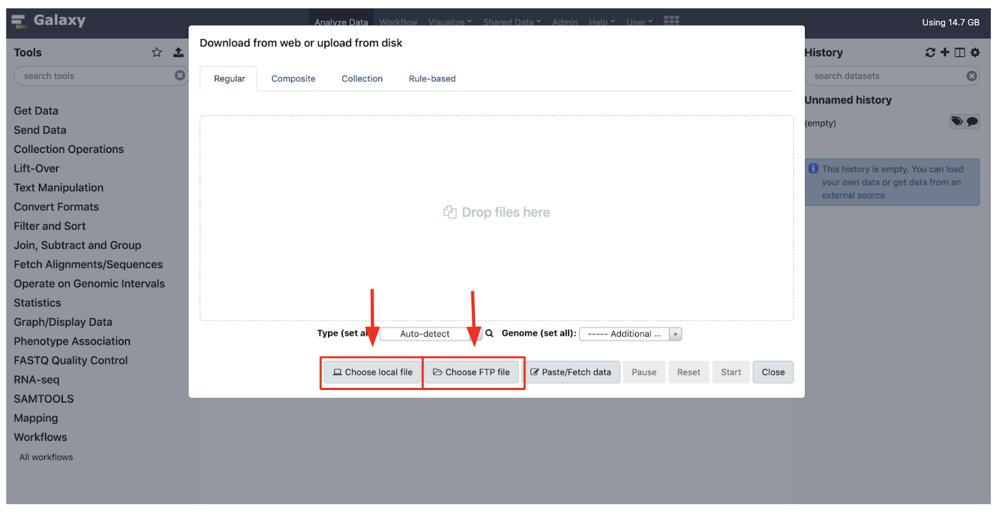
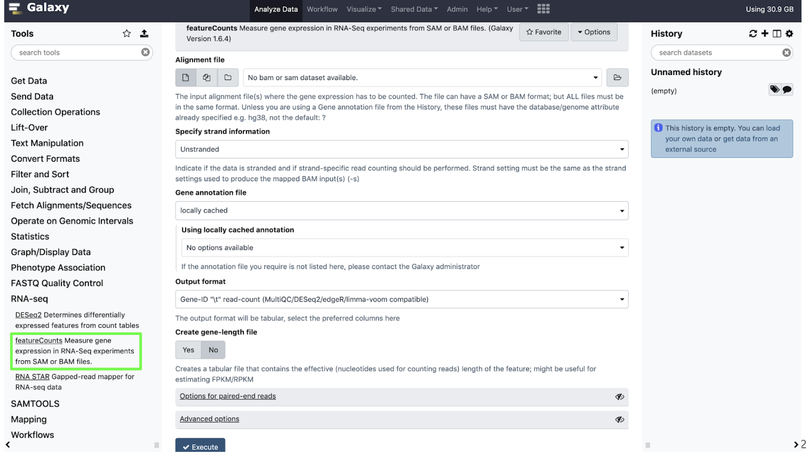

## Introduction to Galaxy

Galaxy is a web-based platform for running data analysis and integration, geared towards bioinformatics.
- Open-source, public servers
- Developed at Penn State, Johns Hopkins, OHSU and Cleveland Clinic with many more outside contributions
- Large and extremely responsive community 

## Galaxy on the Tufts University High Performance Compute (HPC) Cluster

- Our Galaxy server runs on the HPC cluster, storing data on HPC drives and using compute nodes and Slurm scheduler to run user jobs
- In practice, this means that Tufts users have more resources on Tufts' Galaxy compared to public servers
- We also have the ability to install and configure open source and custom tools
- More information on getting access to Tufts Galaxy can be found on the [Research Technology website](https://it.tufts.edu/research-technology/bioinformatics/tufts-galaxy)

## Galaxy UI

- We'll spend some time getting familiar with the Galaxy interface, layout, and key functions
- The Galaxy User Interface has a top menu bar and three panels: Tools, Main, and History

- The panels can be expanded/minimized using the small arrows and dragging the three small lines in the bottom left and right corners of the page
- To get back to the home page click the logo next to **Galaxy Tufts** on the top left of the page or the **Analyze Data** tab on the top of the page

### Histories

- Histories are where a dataset and a set of analysis are stored
- Similar to a "working directory".
- You can have multiple histories under the same account and you can view them all by clicking the **+** as shown below

- Here you can view all your histories, switch to another history, and drag and drop data between histories.

### Uploading Data

- Data can be uploaded to Galaxy in a number of ways by clisking the "Upload" icon on the top of the Tools panel.

- "Choose local File" will select a file from your local computer, and "Choose FTP File" will select from your user drive on the HPC cluster, which has an extension "/cluster/tufts/galaxy/xfer/username" 

### Tools

- On the **Tools** panel, either search by name or click the category that your tool would fall under
- Our tools for today will mostly be stored under the RNA-seq category

- Click the name of the tool you would like to use and the tool menu will appear in the **Main** panel

[Next: Setup](01_Introduction_and_Setup_noqual.md)

