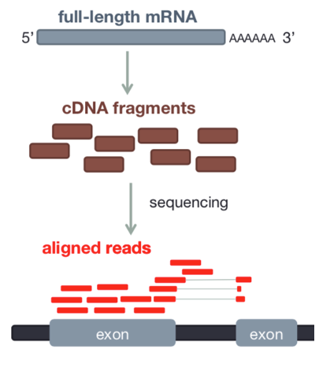

## Read Alignment

- RNAseq data originates from spliced mRNA (no introns)
- When aligning to the genome, our aligner must find a spliced alignment for reads
- We use a tool called STAR (Spliced Transcripts Alignment to a Reference) that has a exon-aware mapping algorithm.

!!! info "[STAR: ultrafast universal RNA-seq aligner](https://www.ncbi.nlm.nih.gov/pmc/articles/PMC3530905/)"

    

## SAM format
STAR produces a file in Sequence Alignment Map (SAM) format or the compressed version BAM.

!!! info "[SAM File Format](https://sites.google.com/a/broadinstitute.org/legacy-gatk-forum-discussions/dictionary/11014-SAM-BAM-CRAM-Mapped-sequence-data-formats)"

    

## Genome Annotation Standards

- STAR can use an annotation file gives the location and structure of genes in order to improve alignment in known splice junctions 
- Annotation is dynamic and there are at least three major sources of annotation 
- The intersection among RefGene, UCSC, and Ensembl annotations shows high overlap. RefGene has the fewest unique genes, while more than 50% of genes in Ensembl are unique. 
- Be consistent with your choice of annotation source! 

!!! info "[A comprehensive evaluation of ensembl, RefSeq, and UCSC annotations in the context of RNA-seq read mapping and gene quantification](https://bmcgenomics.biomedcentral.com/articles/10.1186/s12864-015-1308-8)"

    

## GTF Gene Annotation 

- In order to count genes, we need to know where they are located in the reference sequence
- STAR uses a Gene Transfer Format (GTF) file for gene annotation 

## Import a gene annotation file from a Data Library to be used for feature counting

- Click **Shared Data** on the top menu bar and select **Data Libraries**
- Click on **annotation_files** 
- Select the box next to **hg38_genes.gtf** and **hg38_genes.bed**.
- Click **Export to History** next to the Search bar and choose **as Datasets**
- Click **Import** to add the file to our current history (**rnaseq**)
- Click **Galaxy Tufts** in the top left to return to the homepage

## Align the reads to the human genome using STAR aligner

- In the **Tools** panel search bar, type **STAR**
- Scroll down and select **RNA STAR** under **RNA-seq**
- Under **Single-end or paired-end reads** select **Single-End**
- Under **RNA-Seq FASTQ/FASTA file** click the folder icon and select the trimmed reads **42: Trim Galore! on collection 7: trimmed reads**
- **STAR** gives us the option of using a genome that includes a database of known splice junction locations or providing a gtf file so that STAR can create the database. We’ll select a reference genome on our server that already includes the splice junctions listed in our GTF file. Under **Reference genome with or without an annotation** select **use genome reference with built-in gene-model**.
- Under **Select reference genome** select **hg38-with-genes**.
- Scroll down and click **Execute**
- The result will be three collections, giving the bam, splice junctions and log files for the alignments

## Run MultiQC on the STAR log files to check the result of the alignment

- Follow the steps from the [previous section](./02_Process_raw_reads.md) to run MultiQC except: 
	- Under **Which tool was used generate logs?**  select **STAR**
	- Under **STAR log output** click the folder icon and select the collection **61: RNA STAR on collection 27:log**
- After the job finished, click the eye icon to view the webpage.

!!! question "Question 5: In RNAseq, the percentages of uniquely aligned reads are typically lower than for DNAseq, due to the presence of unremoved ribosomal RNA. These are present in multiple copies throughout the genome and cause reads not to be mapped confidently. RNAseq is expected to be above 75% for an uncontaminated human sample. Is the "% Aligned" above 75% for these samples?" 

## View bam file using JBrowse

- In the **Tools** panel search bar, type **JBrowse** and select **JBrowse genome browser**
- Under **Select a reference genome** select **hg38**

Next we'll add two Track groups, each with an annotation track:

- Under **Track Group** click **+ Insert Track Group**
- Click **+ Insert Annotation Track**
- Select track type **BAM Pileups** and under **BAM Track Data** click the folder icon and select the list **RNA STAR on collection: mapped.bam**
- Scroll down and click **Insert Annotation Track**
- Select track type **GFF/GFF3/BED Features** and under **GFF/GFF3/BED Track Data** select **hg38_genes.bed**.

Finally, run the job:
- Scroll down and click **Execute**.
- Once the job is complete (green) click the eye icon to view the data. 
- In the **Available Tracks** panel select the HIV and Mock samples from 12 hr, as well as the bed file.

- We'll zoom in on one gene **MYC**. To do this, click on the search bar to the left of the **Go** button and type `chr8:127735434-127742951`. 

!!! note
    Note that you can't search by gene name in this tool.
    
- The bam tracks will show the reads that align to the region for each sample. 
- The color will show whether the read aligns to the + or –strand and grey lines show splice regions where a read spans an intron. 
- The gene track at the top called **hg38_genes.bed** will display the gene MYC, by clicking on the gene representation you will be able to see the different feature types (exon, CDS, start_codon, stop_codon):

	
!!! question "Question 6: Which samples appear to show higher expression of MYC, the Mock or HIV?"
	

!!! question "Question 7: How many exons do you think MYC has? Hint: When we aligned our reads we mapped to exons. Do we see distinct blocks of reads and if so how many?"

[Next: Gene Quantification](04_Gene_quantification.md)

[Previous: Process Raw Reads](02_Process_raw_reads.md)
	
