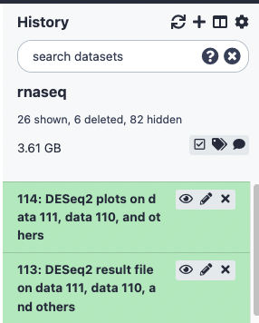

# Testing for Differential Expression using DESeq2

Much of this explanation has been adapted from these two sources:
- [HBC bioinformatics core](https://hbctraining.github.io/DGE_workshop)
- [DESeq2 Vignette](http://www.bioconductor.org/packages/release/bioc/vignettes/DESeq2/inst/doc/DESeq2.html)

The following DESeq2 steps are run all at once in Galaxy.

!!! info "[HBC Differential Gene Expression](https://hbctraining.github.io/DGE_workshop)"

    

## Create separate collections for the counts files for Mock 12 hr and HIV 12 hr.

- In the **Tools** panel search bar, type **Apply Rules**
- Under **Collection Operations** select **Apply Rules**
- In the main panel, under **Input Collection** choose **125:featureCounts on collection 85: Counts**

First, we filter for the samples of interest:
- Under **Rules** click **Edit**
- Click **Filter**, then **Using a Regular Expression**
- Under **Regular Expression?**, type HIV_12 (Do not put any extra spaces following the expression). This is a regular expression which will match any file that contains the string **HIV_12**
- Click **Apply** and the list of files in column A should show two samples:

Galaxy requires that lists have an identifier column
- Click **Rules**, and then **Add/Modify Column Definitions** 
- Click **Add Definition**, then **List Identifier(s)**, select **A**, click Apply
- Click **Save**
- Click **Execute**
- Rename the collection by clicking to expand the collection, then clicking on the title, typing **HIV_12** , and pressing enter.

- Do the same for Mock 12 hour samples, and modify the regular expression appropriately.
- The two collections should appear in the history (you may have to refresh history in order to see the modified names)

## Test for Differential Expression using DESeq2 

- In the **Tools** panel search bar, type **DESeq2** and under **RNA-seq** select **DESeq2** 

DESeq2 will take the count tables that we generated, one per sample, and make a comparison for each gene between two conditions: HIV and Mock.  The term that DESeq2 uses for this condition is "factor" and the ordering of our factor levels will determine how we interpret the resulting expression fold changes. Here, we'll set Factor 1 to *HIV* and Factor 2 to *Mock*. Any resulting upregulated genes, with log2 fold change > 0, can then be interpreted as being upregulated in HIV samples with respect to Mock.

- Under **1: Factor** , specify the factor name **Condition**
- Under **1: Factor Level**, specify the base factor level **HIV**
- Under **Counts file(s)** select the folder icon and select the **HIV_12** collection
- Set the **2: FactorLevel** to **Mock**
- Under **Counts file(s)** select the folder icon and select the **Mock_12** collection
- Scroll down and click **Execute**
- **DESeq2** will produce two output datasets: One containing plots and another containing a results table.

## View and interpret DESeq2 output files

- Results file: View the results table by clicking on the history item **DESeq2 result file on data ... and others** and clicking on the eye icon.

!!! question "Question 9: What are the top two most significant genes? Does the direction of change for gene MYC agree with our observation in Question 6?"

- Plots: View the plots by clicking on the history item **DESeq2 plots on data ... and others** and clicking the eye icon.

!!! question "Question 10: What observations can you make from the PCA plot? Do samples cluster as expected?"

The p-value plot shows a histogram of p-values for all the genes that were examined. P-values give the probability of getting a logFC as extreme as observed if the true logFC = 0 for that gene (null hypothesis).  Random P-values are expected to be uniform, if you have true positives you should see a peak close to zero.

!!! info "[Variance Explained](http://varianceexplained.org/statistics/interpreting-pvalue-histogram/)"

    

!!! question "Question 11: What observation can you make about the pvalue distribution, does it look like there are many true significant results? Note that the published dataset has been downsampled for instructional purposes."

[Previous: Gene quantification](04_Gene_quantification.md)

