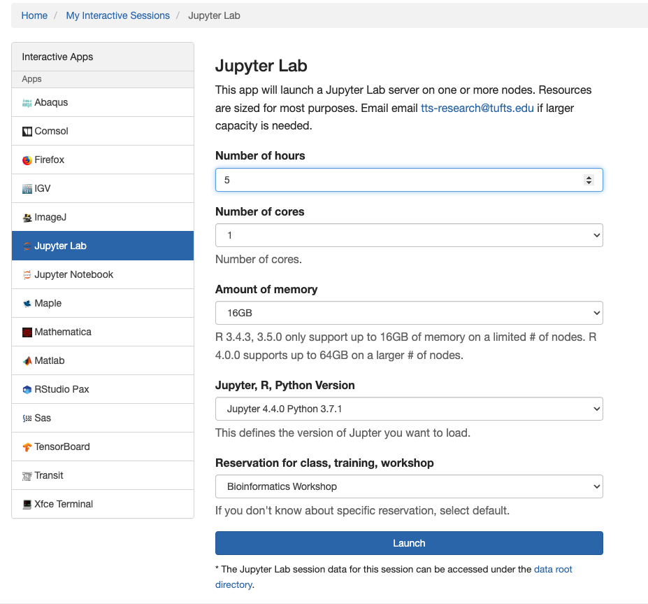
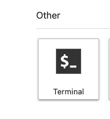

# Finding and Analyzing Metagenomic Data

**Adelaide Rhodes, Ph.D., Senior Bioinformatics Scientist**

**Jason Laird, MSc, Bioinformatics Scientist**

Adapted from the NCBI Tutorial by Cooper Park, Ph.D. (thanks Cooper!)

-----

### Learning Objectives:

* [Introduction](#Introduction)
* [Objective 1 - Searching for SRA Data & Metadata on the NCBI Website](#Objective-1) 
* [Objective 2 - Exploring Taxonomic Composition of SRA reads using STAT](#Objective-2)
* [Objective 3 - Creating a Taxonomic Report using Kraken](#Objective-3)
* [Objective 4 - Compare Kraken and STAT output](#Objective-4)

# Introduction

This workshop, and this Jupyter Notebook, is designed to introduce you to:

* How Metagenomic Sequence Data is stored and manipulated within NCBI
* How to Download a subset of data from the NCBI
* How to Generate a Taxonomic Report using Kraken
* How to Visualize the Kraken data using Krona


## **Case Study**

The case study for this workshop involves a single patient named "Patient B" who was clinically diagnosed with Microbial Keratitis (bacterial infection of the eye's cornea). This disease is typically caused by three species:

- *Pseudomonas aeruginosa*
- *Staphylococcus aureus*
- *Bacillus subtilis*. 

Diagnosis of this disease can be unreliable as it depends on labratory culture tests that are often false-negatives and can take up to 48hrs. 

The authors of the paper used in this case study used metagenomic sequencing of a corneal scraping to characterize potential bacterial contamination of both of Patient B's eyes to pilot a method for diagnosing Microbial Keratitis via sequencing. 

Today, we will use that same sequence data to validate their results and demonstrate how the NCBI tool STAT and Kraken2 provide similar results.

## Navigating to OnDemend

We will be working on the Tufts HPC cluster today! To get there use the following link and log in with your Tufts credentials:

[Tufts OnDemand](https://ondemand.pax.tufts.edu/)

Once you get there we will need to open up Jupyter Notebook to run our code! Navigate to Interactive apps and then scroll down to Jupyter Lab. Enter the following specifications:



Click the Launch button to start your session!

## Copying over the Data

For class today we will be copying over a folder with all the data/scripts we will need for today's exercise. To copy it over we will click on the Terminal button to start a terminal session:



Now enter the following into command line:

```bash
cp -r  /cluster/tufts/bio/tools/training/metagenomeData ./
```

Now on the right hand side of your screen you should see the folder, SOMEFOLDER! Double click on this folder and then double click on `metagenome_exercises.ipynb`. Now you have opened a Jupyter Notebook!

## What is a Jupyter Notebook?

- Jupyter Notebooks are a web-based approach to interactive code. 

- A single notebook (the file you are currently reading) is composed of many "cells" which can contain either text, or code. 

- To navigate between cells, either click on the cell, or use the arrow keys on your keyboard.

- The order of the cells is important. Please do not skip any - the output from a cell higher up on the page may be needed as input for a cell lower down on the page.

- A *text* cell will look like... well... this! 

- A *code* cell will look something like what you see below. 

- To run the code inside a code cell, click on it, then click the "Run" button at the top of the screen. 

- Try it on the code cell below!

```python
#This is a code cell
print('You ran the code cell!')
```

!!! info "output"

    ```
    You ran the code cell!
    ```


If it worked, you should have seen text pop up underneath the cell saying `You ran the code cell!`. 

* `In [1]:` that appeared next to the cell. This tells you the order you have run code cells throughout the notebook. 

* The next time you run a code cell, it will say `In [2]:`, then `In [3]:` and so on... This will help you know if/when code has been run.

* The remainder of the notebook below has been pre-built by the workshop organizer. 

* You will not need to create any new cells, and you will be explicitly told if/when to execute a code cell.

* The code in this workshop is either Bash (i.e., terminal commands) or Python. Bash commands are prefixed with `!` while Python commands are not. 

* If you are not familiar with code, don't feel pressured to interpret it very deeply. Descriptions of each code block will be provided!

----
