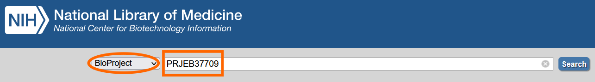
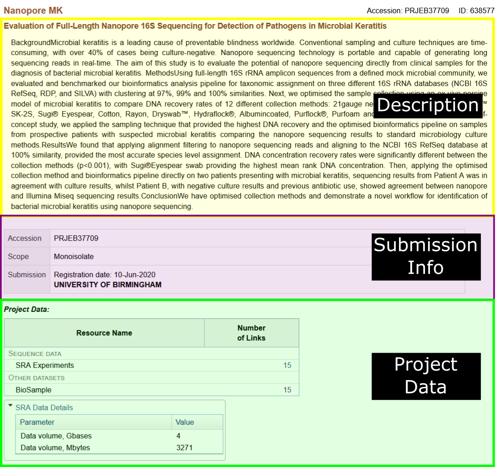
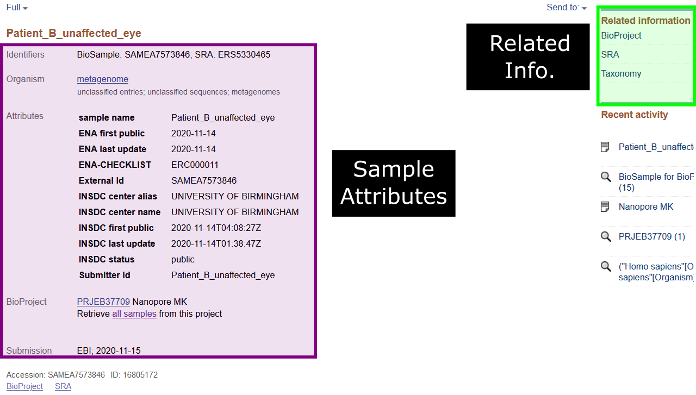
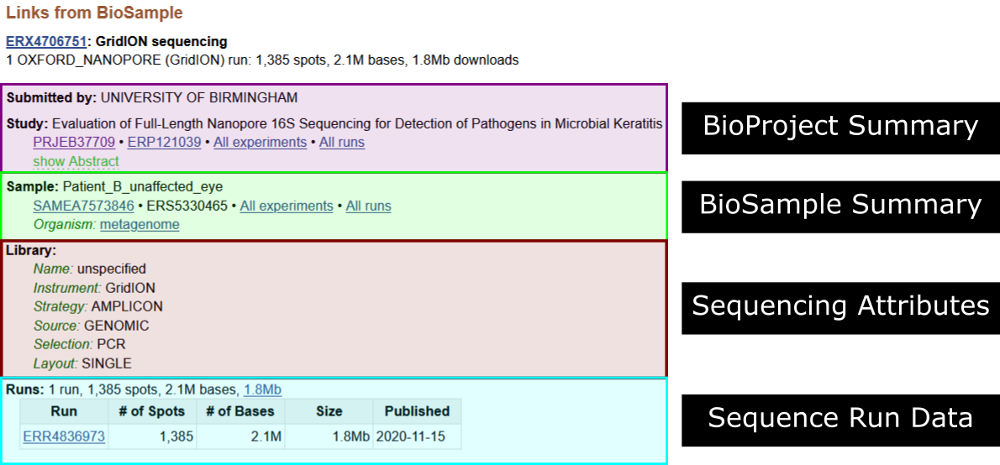
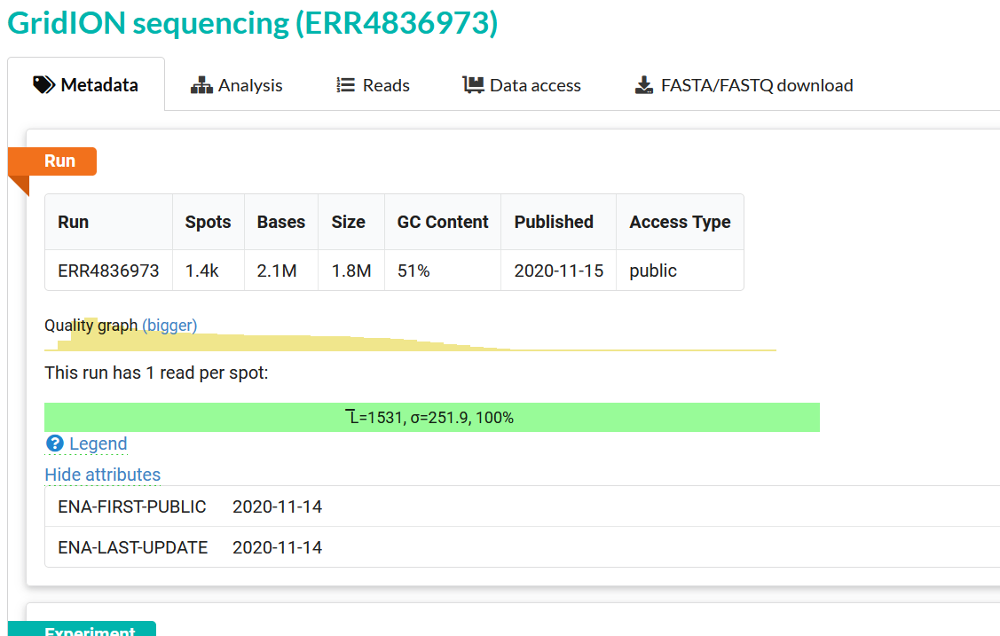
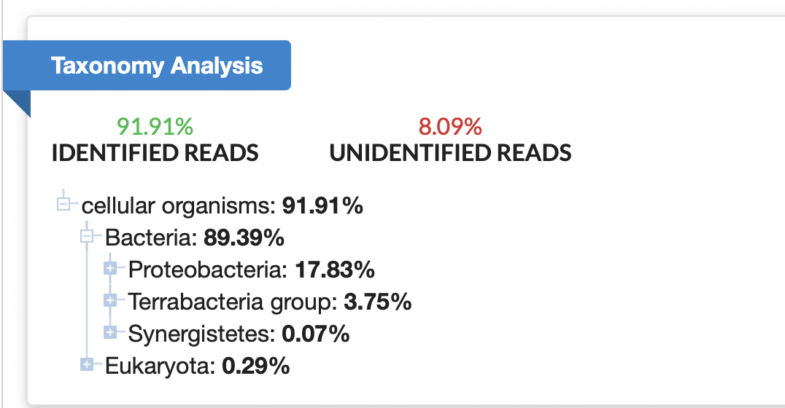
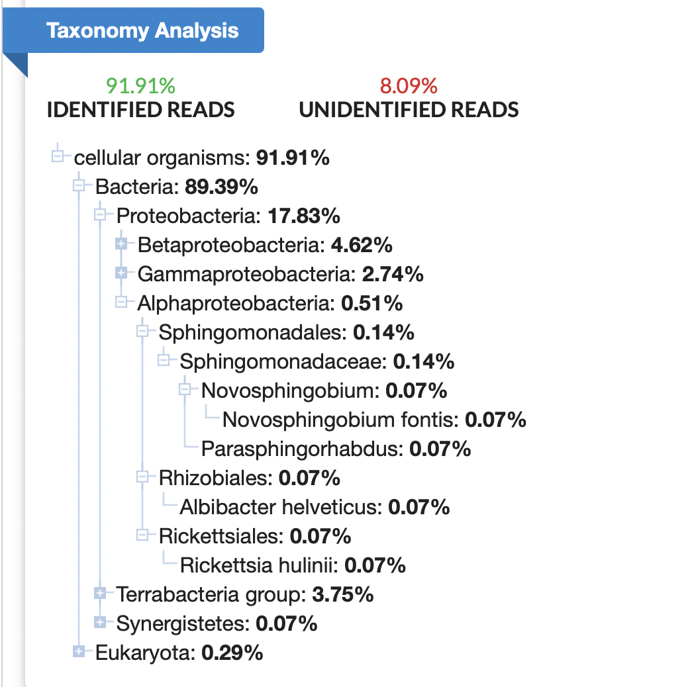

# Objective 1 - Searching for SRA Data & Metadata on the NCBI Website 

## **Objective Goals**

1. Search the NCBI website for SRA sequence data and BioSample metadata
2. Use STAT to gain preliminary insights into sequence read taxonomy distribution

### **Step 1 - Get to NCBI**

Navigate to https://www.ncbi.nlm.nih.gov/

### **Step 2 - Find the BioProject**

Using the search bar at the top of the screen, set the database to `BioProject` and type `PRJEB37709` into the search box to look for today's BioProject.

The BioProject page provides some background about the project including:

    - Description (in this case, it appears to be the abstract from the paper)
    - Submission info (*e.g.*, accession number and submitter information)
    - Associated BioProject data (*e.g.* SRA experiments and BioSamples)

    

### **Step 3 - Find the BioSamples**

Click on the `15` next to the BioSample category in the **Project Data** section. This will show us a list of all BioSamples stored in the BioProject

We are looking for two samples from this list:

[Patient_B_unaffected_eye](https://www.ncbi.nlm.nih.gov/biosample/16805172)

[Patient_B_affected_eye](https://www.ncbi.nlm.nih.gov/biosample/16805169)

So find those two accessions and open their pages in new tabs (or open the links above). We will do the following steps for each sample, but let's start with `Patient_B_unaffected_eye` first.

### **Step 4 - Find the SRA Experiments**

The BioSample page contains all of the metadata associated with where/how the sequence reads were obtained

To get the SRA run accession (where the actual sequence data is stored), click on the `SRA` button in the **Related Information** tab on the right-hand side of the screen.

    

### **Step 5 - Find the SRA Runs**

This new SRA page displays the SRA experiment. This is the metadata associated with how the sequence data was generated (*e.g.* sequencing machine, sequencing type, etc.). At the bottom of the page there is a `Runs` section which shows the sequence run accession. Click on that link.

    

### **Step 6 - Find the Run Statistics**

This page is the SRA Run Browser where we can explore details and statistics about the reads themselves (*e.g.* number of bases, GC content, quality scores, and links back to the parent categories like BioSample and BioProject). This is also where we can see the results from the **STAT** analysis done on the reads.

To see the STAT results, click the `Analysis` tab near the top of the page

       

It is possible to click on the "+" signs within the taxonomic tree to expand the view to show lower taxonomic levels.

       

For example, clicking on the plus sign next to Alphaprotobacteria expands the list.

       

----
