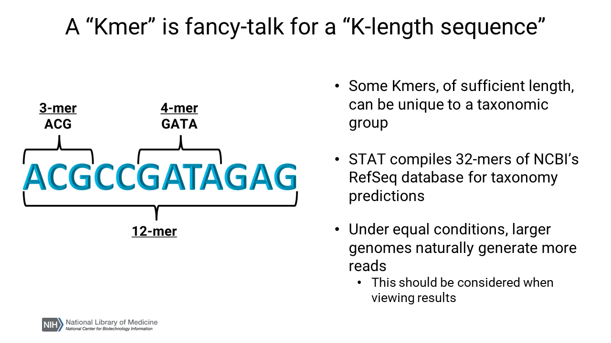

# Objective 2 - Exploring Taxonomic Composition of SRA reads using STAT <a class="anchor" id="Objective-2"></a>

## **Objective Goals**

1. Run the SRA Taxonomy Analysis Tool (STAT) on our two case study samples
2. Identify abundant species in each sample

## **NOTE 1 -** 

- Krona and its supporting software has been preinstalled on our cluster. For more information on how to install Krona on your own machine and how the tool works, please see the documetnation here: https://github.com/marbl/Krona/wiki/KronaTools

## **NOTE 2 -** 

- Currently the only programmatic way to get the STAT data for visualization from SRA is in the cloud. Cloud data access is outside the scope of this workshop so I have provided the data for use today. For information on accessing that data see here: https://www.ncbi.nlm.nih.gov/sra/docs/sra-cloud/

## **Background - SRA and STAT**

On our website, the Analysis page gives a broad overview of the top taxonomic hits for this accession thanks to a program designed by the SRA team called STAT which uses kmers.

<div>
    
</div>

- STAT characterizes taxonomic distribution of reads in every SRA submission.
- Usually measured as a % of reads within a run
- Reads may be mapped to multiple taxa. So, reads are usually assigned to the lowest taxonomic group
    - e.g., two species share a genus so the read is assigned to the genus 
- STAT is relatively conservative in their taxonomic assignment and loses sensitivity as you increase the taxonomic breadth


## **NOTE 3 -** 

STAT contains more conservative in taxonomic assignment assignment (in comparison to programs like Kraken2, which we will discuss in a bit)

However, the data can be a bit awkward for us to navigate on the web when dealing with metagenomic data. Instead, we can employ another tool called **Krona** to visualize this data in a fun and interactive way.

### **Step 1 - Make a Krona Plot**

Run the following block of code to recreate the Krona chart for the `Patient_B_unaffected_eye` sample using the STAT data downloaded from NCBI:

```bash
!/cluster/tufts/bio/tools/conda_envs/kraken/2.1.2/bin/ktImportTaxonomy \
-t 1 -m 3 -k -i \
-o ./results/ERR4836973_unaffected_stat.html -q 2 -t 1 -s 3 ./data/ERR4836973_unaffected_stat.txt
```

### **Step 2 - Explore Krona!**

The following code block will open `B_unaffected_stat.html`:

* This Krona pie-chart is organized so that higher taxonomic groups are in the center of the chart. 
* As you move out towards the edge of the pie-chart, the taxonomic classification will become more specific. 
* You can also click on non-species clades to zoom in on that region of the pie-chart.

#### Try this: 

Try finding and clicking on `Firmicutes` to see the focused list of species present.

1. Use the center of the piechart to navigate back to higher-order clades. If you want the original pie-chart, click on the sample ID in the middle of the pie-chart.

2. Each segment of the Krona pie chart has a `Magnitude` that can be seen in the upper-right corner of the screen. This count is relative to the tool that generated it. 

    **For STAT results the `Magnitude` is the total number of Kmer hits found in the sample for a given SRA sample.**

3. Right click on the highlighted "Taxon:" number and open a new tab or window to find information about the classification.

## Unaffected Eye - STAT Krona Plot

```python
from IPython.display import IFrame
IFrame(src='results/ERR4836973_unaffected_stat.html', width=900, height=600)
```

<iframe src="./krona/ERR4836973_unaffected_stat.html" height="500" width="1000" title="Online Workshops - Upcoming Events"></iframe>

### **Step 3 - Understand the Sample**

Use the navigation skills you've learned for Krona to answer the following questions about this sample. Use the Jupyter Notebook cell below this to write your answers so you can refer back to it later!


## Unaffected Eye Questions

1. What is the total `Magnitude` for the entire unaffected eye sample?

2. What is the total `Magnitude` for just the Bacteria in the sample?

3. There are three species commonly associated with microbial keratitis. Can you find any of them in the sample? If so, what is their Magnitude?

    - Pseudomonas aeruginosa
    - Staphylococcus aureus
    - Bacillus subtilis

#### Hint: the search box will help you to locate these species

### **Step 4 - Do it again for the affected eye!**

Run the following code block to get a local version of the Krona graph for Patient B's affected eye. After this code runs, open the file `B_affected_stat.html` and answer the same questions for this sample:


```bash
!/cluster/tufts/bio/tools/conda_envs/kraken/2.1.2/bin/ktImportTaxonomy \
-t 1 -m 3 -k -i \
-o ./results/ERR4836970_affected_stat.html -q 2 -t 1 -s 3 ./data/ERR4836970_affected_stat.txt
```

**NOTE:** If you see an error that looks like this, don't worry. This error is caused by the mapping file from NCBI being slightly out of date.


## Affected Eye - STAT Krona Plot

```python
from IPython.display import IFrame
IFrame(src='results/ERR4836970_affected_stat.html', width=900, height=600)
```


<iframe src="/krona/ERR4836970_affected_stat.html" height="500" width="1000" title="Online Workshops - Upcoming Events"></iframe>


