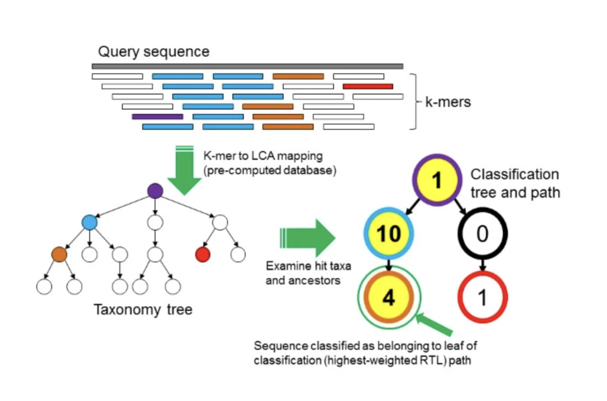

# Objective 3 - Generate Taxonomy from Raw Reads with Kraken2

<a class="anchor" id="Objective-3"></a>

## **Objective Goals**

1. Run Kraken to assign SRA taxonomy against an NCBI database
2. Visualize the Kraken results using Krona

## Kraken2

- Kraken2 is a taxonomic classification system using exact k-mer matches, like STAT.
- This k-mer based approach has very fast classification speeds with high accuracy.
- This approach differs from homology based approaches that try to match sequences to each other and score them based on the number of mismatches, deletions and inserts. 
- Kraken uses the entire kmer composition of the sequence to match it to a database where reference sequences have been broken down into kmer “hashes” or a database of what the kmers look like for a particular organism.


## How does it work?


<div style="text-align:center;">
    
</div>


- To classify a sequence, each k-mer in the sequence is mapped to the lowest common ancestor (LCA) of the genomes that contain that k-mer in a database. 

- The taxa associated with the sequence’s k-mers, as well as the taxa’s ancestors, form a pruned subtree of the general taxonomy tree, which is used for classification. 

- In the classification tree, each node has a weight equal to the number of k-mers in the sequence associated with the node’s taxon. 

- Each root-to-leaf (RTL) path in the classification tree is scored by adding all weights in the path, and the maximal RTL path in the classification tree is the classification path (nodes highlighted in yellow). 

- The leaf of this classification path (the orange, leftmost leaf in the classification tree) is the classification used for the query sequence.


At the core of Kraken is a database that contains records consisting of a k-mer and the LCA of all organisms whose genomes contain that k-mer. This database, built using a user-specified library of genomes, allows a quick lookup of the most specific node in the taxonomic tree that is associated with a given k-mer. 

*Wood, D.E., Salzberg, S.L. Kraken: ultrafast metagenomic sequence classification using exact alignments. Genome Biol 15, R46 (2014). https://doi.org/10.1186/gb-2014-15-3-r46*

### Step 1 - Run Kraken2 On The Affected Eye Sample

- Run the code block below to run Kraken2 on our affected eye sample

```bash
!/cluster/tufts/bio/tools/conda_envs/kraken/2.1.2/bin/kraken2 \
--use-names --threads 4 \
--db /cluster/tufts/bio/tools/training/metagenomics/kraken_virus \
--report results/ERR4836970_affected_kraken_report.txt --quick data/ERR4836970_affected.fastq \
--classified-out results/ERR4836970_affected_classified_sequences.tsv > results/sequences.kraken
```

### Step 2 - Investigate the Affected Eye Sequence Report

- We can open up the sequence report and scroll through the findings. Let's look at the first 10 lines using the bash command "head" with the parameter "-n" which specifies the number of lines to look at.

The columns from left to right are:

|Column Number|Description|
|-|-|
|1|Percentage of fragments covered by the clade rooted at this taxon|
|2|Number of fragments covered by the clade rooted at this taxon|
|3| Number of fragments assigned directly to this taxon|
|4| A rank code, indicating (U)nclassified, (R)oot, (D)omain, (K)ingdom, (P)hylum, (C)lass, (O)rder, (F)amily, (G)enus, or (S)pecies. Taxa that are not at any of these 10 ranks have a rank code that is formed by using the rank code of the closest ancestor rank with a number indicating the distance from that rank. E.g., "G2" is a rank code indicating a taxon is between genus and species and the grandparent taxon is at the genus rank.|
|5| NCBI taxonomic ID number |
|6|Indented scientific name (indented using space, according to the tree structure specified by the taxonomy.)|

- Another option `--use-mpa-style` can be used in conjunction with `--report`. This option provides output in a format similar to MetaPhlAn's output. 

```bash
!head -n 10 results/ERR4836970_affected_kraken_report.txt
```

!!! info "output"

    45.77	189824	189824	U	0	unclassified
    54.23	224908	19	R	1	root
    54.22	224880	4347	R1	131567	  cellular organisms
    33.50	138950	111	D	2759	    Eukaryota
    33.43	138647	0	D1	33154	      Opisthokonta
    33.43	138647	0	K	33208	        Metazoa
    33.43	138647	0	K1	6072	          Eumetazoa
    33.43	138647	0	K2	33213	            Bilateria
    33.43	138647	0	K3	33511	              Deuterostomia
    33.43	138647	0	P	7711	                Chordata
    

### Step 3 - Create the Affected Eye Krona Plot

- Run the code block below to create a Krona plot for our affected eye sample

```bash
!/cluster/tufts/bio/tools/Krona/KronaTools/bin/ktImportTaxonomy \
-t 5 -m 3 -k -i \
-o results/ERR4836970_affected_kraken.html \
results/ERR4836970_affected_kraken_report.txt
```
     
### Affected Eye Kraken2 Krona Plot

```python
from IPython.display import IFrame
display(IFrame(src='results/ERR4836970_affected_kraken.html', width=900, height=600))
```
     
<iframe src="krona/ERR4836970_affected_kraken.html" height="500" width="1000" title="Online Workshops - Upcoming Events"></iframe>

### Step 4 - Run Kraken2 On The Unaffected Eye Sample

- Run the code block below to run Kraken2 on our unaffected eye sample

```bash
!/cluster/tufts/bio/tools/conda_envs/kraken/2.1.2/bin/kraken2 \
--use-names --threads 4 \
--db /cluster/tufts/bio/tools/training/metagenomics/kraken_virus \
--report results/ERR4836973_unaffected_kraken_report.txt --quick data/ERR4836973_unaffected.fastq \
--classified-out results/ERR4836973_unaffected_classified_sequences.tsv > results/sequences.kraken
```

### Step 5 - Investigate the Unaffected Eye Sequence Report

```bash
!head -n 10 results/ERR4836973_unaffected_kraken_report.txt
```

!!! info "output"

    18.05	250	250	U	0	unclassified
    81.95	1135	0	R	1	root
    81.95	1135	104	R1	131567	  cellular organisms
    73.94	1024	488	D	2	    Bacteria
    28.30	392	66	P	1224	      Proteobacteria
    11.12	154	35	C	1236	        Gammaproteobacteria
    5.85	81	25	O	91347	          Enterobacterales
    3.54	49	10	F	543	            Enterobacteriaceae
    1.30	18	0	G	561	              Escherichia
    1.30	18	17	S	562	                Escherichia coli
    
### Step 6 - Create the Unaffected Eye Krona Plot

```bash
!/cluster/tufts/bio/tools/Krona/KronaTools/bin/ktImportTaxonomy \
-t 5 -m 3 -k -i \
-o results/ERR4836973_unaffected_kraken.html \
results/ERR4836973_unaffected_kraken_report.txt
```

### Unaffected Eye Kraken2 Krona Plot

```python
from IPython.display import IFrame
display(IFrame(src='results/ERR4836973_unaffected_kraken.html', width=900, height=600))
```

<iframe src="krona/ERR4836973_unaffected_kraken.html" height="500" width="1000" title="Online Workshops - Upcoming Events"></iframe>

## Kraken2 Questions:

1. Which sample, the affected eye or unaffected eye had a higher percentage of classified sequences?

2. Which sample, the affected eye or unaffected eye had a higher percentage of bacteria?
