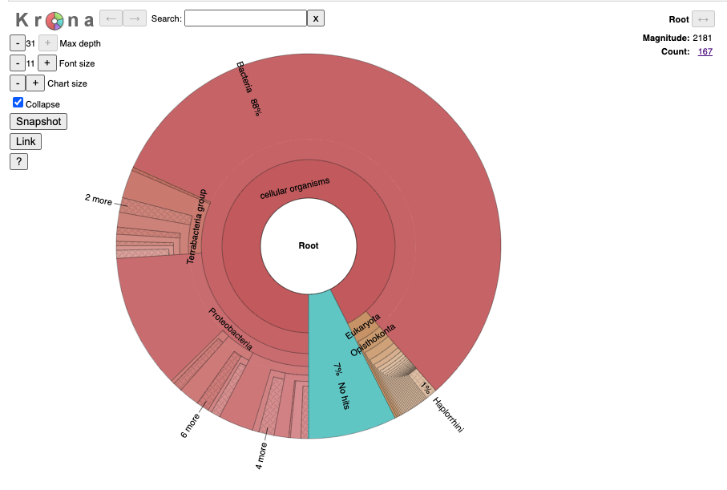
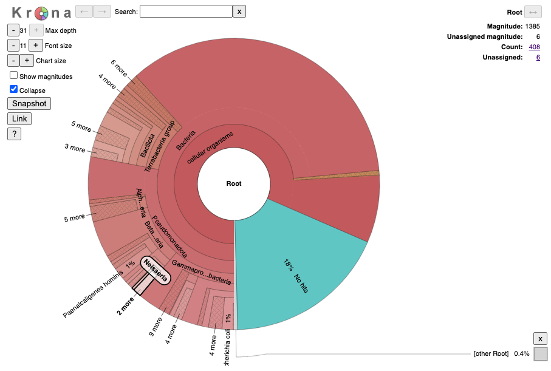
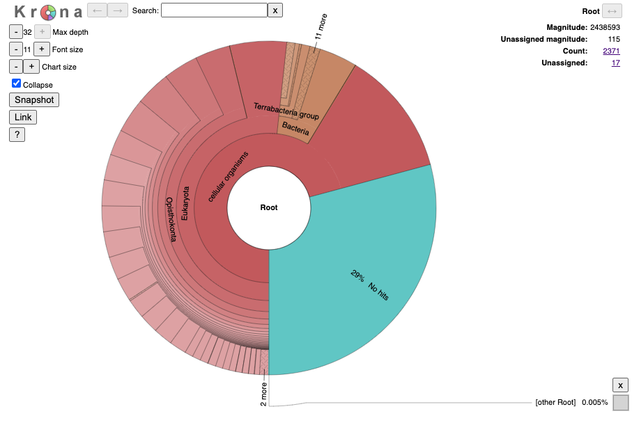
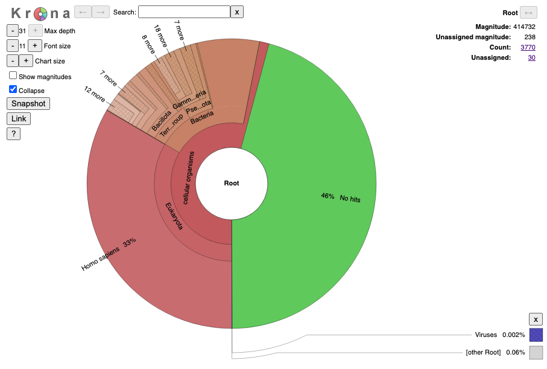

# Objective 4 - Compare STAT and Kraken2 output <a class="anchor" id="Objective-4"></a>

## **Objective Goals:**

1. Compare species distribution from Kraken2 to preliminary list gathered from STAT
2. Understand the influence of the database when classifying taxonomy

### Step 1 - Compare Unaffected Eye STAT v. Kraken2

### Unaffected Eye - STAT Krona Plot

```python
from IPython.display import IFrame
display(IFrame(src='results/ERR4836973_unaffected_stat.html', width=900, height=600))
```




### Unaffected Eye - Kraken2 Krona Plot

```python
from IPython.display import IFrame
display(IFrame(src='results/ERR4836973_unaffected_kraken.html', width=900, height=600))
```





### Affected Eye - STAT Krona Plot

```python
from IPython.display import HTML
display(IFrame(src='results/ERR4836970_affected_stat.html', width=900, height=600))
```




### Affected Eye - Kraken2 Krona Plot

```python
from IPython.display import HTML
display(IFrame(src='results/ERR4836970_affected_kraken.html', width=900, height=600))
```



# Conclusions

This concludes our look on finding and analyzing metagenomic data with NCBI! Let's recap some of the things we covered today:

1. Metagenomic data is stored primarily in the Sequence Read Archive (SRA) database due to the size and nature of the data
2. SRA data is organized into 4 hierarchical layers - BioProject, BioSample, SRA Experiment, and SRA Run. Sequencing data is stored in the SRA run layer.
3. STAT is a tool designed by SRA developers to quickly catalog the taxonomic abundance/distribution of every SRA accession at NCBI using a kmer comparison approach where each kmer match is one count towards the taxa
4. STAT and Kraken2 use a kmer based approach which uses the frequency of kmers in a read to create a hash fingerprint which can help classify a read as counting towards a taxa. However, STAT

## Homework Questions

1. How similar are the species predictions? In particular, how well is the suspected case study culprit, *Bacillus subtilis* represented in each method? What is the *Bacillus subtilis* magnitude in each eye and each method?

2. Does STAT accomplish its goal of being a good "first pass" for an SRA sample to detect contamination and general taxonomic composition?

3. Ultimately, how did each tool do at answering the questions of our case study?
    - "Is the taxonomic distribution of each "cornea" microbiome" different between each eye?"
    - "Do the taxonomic distributions of the eyes match our expectations for healthy and infected eyes?"
