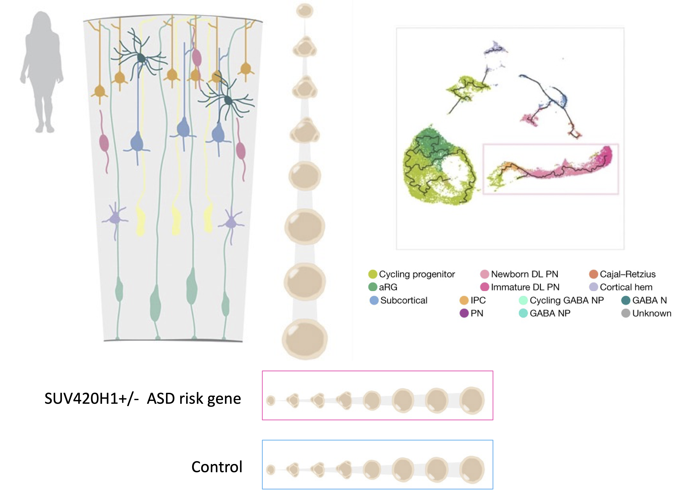
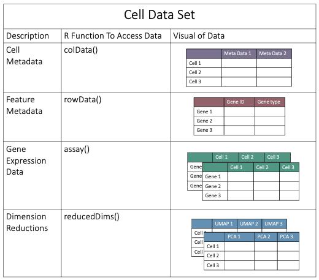

!!! example "Prerequisites"
    - [Request an account](http://research.uit.tufts.edu/) on the Tufts HPC Cluster
        - Note if you signed up for the Introduction to Single-Cell RNA-Seq Time Series and Trajectory Analysis workshop this will have been already taken care of for you!
    - Connect to the [VPN](https://access.tufts.edu/vpn) if off campus
    

## Navigate To The Cluster

Once you have an account and are connected to the VPN/Tufts Network, navigate to the [OnDemand Website](https://ondemand.pax.tufts.edu/){:target="_blank" rel="noopener"} and log in with your tufts credentials. Once you are logged in you'll notice a few navigation options:

!!! info "OnDemand Layout"

    

Click on `Interactive Apps > RStudio Pax` and you will see a form to fill out to request compute resources to use RStudio on the Tufts HPC cluster. We will fill out the form with the following entries:

- `Number of hours` : `5`
- `Number of cores` : `1`
- `Amount of memory` : `16GB`
- `R version` : `4.0.0`
- `Reservation for class, training, workshop` : `Bioinformatics Workshops`
    - **NOTE: This reservation closed on April 26th 2023, use `Default` if running through the materials after that date.**
- `Load Supporting Modules`: `boost/1.63.0-python3 java/1.8.0_60 gsl/2.6`

Click `Launch` and wait until your session is ready. Click `Connect To RStudio Server`, and you will notice a new window will pop up with RStudio. 

??? question "Are you connected to RStudio?"
    - Yes (put up a green check mark in zoom)
    - No (raise hand in zoom)


## Data & Scripts

To copy over the data and scripts we will need for the workshop into our home directory, enter the following command into the console:

```R
file.copy(from="/cluster/tufts/bio/tools/training/trajectory_analysis",to="~/", recursive = TRUE)
```

## Project Setup
Now we are going to use this folder to create a new R project. R projects are great for managing analyses in a portable, self-contained folder. To create an R project from within our `trajectory_analysis` directory we will:

- Go to `File` > `New Project`
- `Existing Directory`
- Browse for the `trajectory_analysis` folder
- Click `Create Project`

Let's navigate to our project in our home directory and open up our workshop script:

- Click on the `Files` tab in the lower right hand Rstudio pane
- Click on the `scripts` folder
- Click on the `trajectory_analysis.Rmd` script

## Today's Data

Today we will be working with data from  [Paulson et al. 2022](https://www.nature.com/articles/s41586-021-04358-6) which found cell-type-specific neurodevelopmental abnormalities that were shared across ASD risk genes. To this end they leveraged organoid single-cell RNA-seq data to investigate these abnormalities:

!!! info "[Paulson et al. 2022](https://www.nature.com/articles/s41586-021-04358-6)"

    
    

## Monocle3 Cell Data Objects

- We will be working with single-cell RNA-seq data in R today. Today, we will be performing trajectory analysis using the R package Monocle3. Monocle3 stores single-cell RNA-seq data as a cell data set object, which has the following structure:

!!! info "Monocle3's Cell Data Set Object"

    
    
## Loading Libraries and Data

Before we analyze our single-cell RNA-Seq data we will need to load the libraries needed for our analysis:

```R
# set the libPath and load the libraries
LIB='/cluster/tufts/hpc/tools/R/4.0.0/'
.libPaths(c("",LIB))
library(monocle3)
library(tidyverse)
```

- Let's start by loading the input matrices we need to create our cell data set object!

```R
# read in cells by gene count matrix
counts <- read.csv("/cluster/tufts/bio/data/projects/2023_02_time_series_scrnaseq/rds/SUV420H1_Mito210_d35_counts.csv", 
                   row.names=1,
                   check.names = F)

head(counts)
```

!!! info "output"

    ```
                  1_AAAGGTACACAGCTGC 1_AAAGGTATCTGCCTGT 1_AACAACCCACACTGGC
    FO538757.2                     0                  1                  0
    AP006222.2                     0                  0                  0
    RP11-206L10.9                  0                  0                  0
    LINC00115                      0                  0                  0
    ```
    
```R
# read in sample meta data
meta <- read.csv( "/cluster/tufts/bio/data/projects/2023_02_time_series_scrnaseq/rds/SUV420H1_Mito210_d35_meta.csv", row.names=1)

head(meta)
```

!!! info "output"

    ```
                       treat         dataset            CellType
    1_AAAGGTACACAGCTGC    wt SUV_Mito210_d35 Cycling Progenitors
    1_AAAGGTATCTGCCTGT    wt SUV_Mito210_d35                 aRG
    1_AACAACCCACACTGGC    wt SUV_Mito210_d35 Cycling Progenitors
    1_AACAAGATCGAAGCAG    wt SUV_Mito210_d35                 aRG
    1_AACAGGGAGGACAGCT    wt SUV_Mito210_d35                 aRG
    1_AACCTGAGTATACGGG    wt SUV_Mito210_d35 Cycling Progenitors
    ```
    
```R
# can optionally list more annotation of genes
gene_meta <- read.csv("/cluster/tufts/bio/data/projects/2023_02_time_series_scrnaseq/rds/SUV420H1_Mito210_d35_genemeta.csv",
                      row.names=1)
head(gene_meta)
```

!!! info "output"

    ```
                  gene_short_name
    FO538757.2         FO538757.2
    AP006222.2         AP006222.2
    RP11-206L10.9   RP11-206L10.9
    LINC00115           LINC00115
    FAM41C                 FAM41C
    RP11-54O7.1       RP11-54O7.1
    ```
    
- Now that we have loaded our gene expression matrix, our meta data, and our gene metadata, we can use these to create the cell data set object!

```R
# note the colnames(counts) must match rownames(meta)

cds <- new_cell_data_set(expression_data = as.matrix(counts),
                         cell_metadata = meta, 
                         gene_metadata = gene_meta)

# let's take a look at our new object!
cds
```

!!! info "output"

    ```
    class: cell_data_set 
    {==dim: 12962 4000==} 
    {==metadata(1):==} cds_version
    {==assays(1):==} counts
    {==rownames(12962): FO538757.2 AP006222.2 ... AC004556.1 AC240274.1==}
    {==rowData names(0):==}
    {==colnames(4000): 1_AAAGGTACACAGCTGC 1_AAAGGTATCTGCCTGT ... 6_TTTGACTGTACCATAC 6_TTTGGTTGTTACGTAC==}
    {==colData names(4): treat dataset CellType Size_Factor==}
    {==reducedDimNames(0):==}
    altExpNames(0):
    ```
    
- Here we will highlight that we have 12962 rows and 4000 columns, our rownames are gene names, our column names are the cell names, we have one assay (`counts`), we have 4 columns of meta data under `colData`, and we have no dimension reductions under `reducedDimNames`.
- Let's investage a few helpful functions that can help access these data:

```R
# access the gene names
rownames(cds)[1:5]
```

!!! info "output"

    ```R
    [1] "FO538757.2"    "AP006222.2"    "RP11-206L10.9" "LINC00115"     "FAM41C" 
    ```

```R
# access the cell names
colnames(cds)[1:5]
```


!!! info "output"

    ```R
    [1] "1_AAAGGTACACAGCTGC" "1_AAAGGTATCTGCCTGT" "1_AACAACCCACACTGGC" "1_AACAAGATCGAAGCAG" "1_AACAGGGAGGACAGCT"
    ```
    
```R
# access the feature data
head(rowData(cds))
```

!!! info "output (Notice we have no gene meta data)"

    ```R
    DataFrame with 6 rows and 0 columns
    ```

```R
# access the meta data
head(colData(cds))
```

!!! info "output"

    ```R
    DataFrame with 6 rows and 4 columns
                             treat         dataset            CellType Size_Factor
                       <character>     <character>         <character>   <numeric>
    1_AAAGGTACACAGCTGC          wt SUV_Mito210_d35 Cycling Progenitors    1.074965
    1_AAAGGTATCTGCCTGT          wt SUV_Mito210_d35                 aRG    0.584379
    1_AACAACCCACACTGGC          wt SUV_Mito210_d35 Cycling Progenitors    1.248093
    1_AACAAGATCGAAGCAG          wt SUV_Mito210_d35                 aRG    1.115985
    1_AACAGGGAGGACAGCT          wt SUV_Mito210_d35                 aRG    0.682049
    1_AACCTGAGTATACGGG          wt SUV_Mito210_d35 Cycling Progenitors    0.997981
    ```

```R
# access the assay data
head(assay(cds)[,1:3])
```

!!! info "output"

    ```R
    6 x 3 sparse Matrix of class "dgCMatrix"
                  1_AAAGGTACACAGCTGC 1_AAAGGTATCTGCCTGT 1_AACAACCCACACTGGC
    FO538757.2                     .                  1                  .
    AP006222.2                     .                  .                  .
    RP11-206L10.9                  .                  .                  .
    LINC00115                      .                  .                  .
    FAM41C                         .                  .                  .
    RP11-54O7.1                    .                  .                  .
    ```

??? question "[What is a dgCMatrix?](https://cran.r-project.org/web/packages/Matrix/Matrix.pdf)"

    a dgCMatrix is a type of sparse, compressed, column-oriented numeric matrix where non-zero elements in each column are sorted into increasing row order. Essentially, this is a way of storing matrices with less memory which is important for single-cell RNA-seq data given so many matrices are generated.
