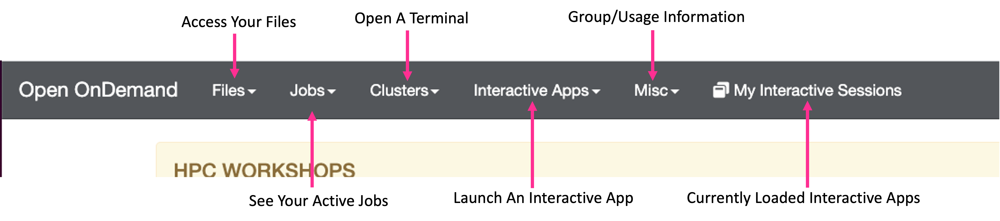

!!! example "Prerequisites"
    - [Request an account](http://research.uit.tufts.edu/) on the Tufts HPC Cluster
        - Note if you signed up for the Introduction to Single-Cell RNA-Seq Time Series and Trajectory Analysis workshop this will have been already taken care of for you!
    - Connect to the [VPN](https://access.tufts.edu/vpn) if off campus
    

## Navigate To The Cluster

Once you have an account and are connected to the VPN/Tufts Network, navigate to the [OnDemand Website](https://ondemand.pax.tufts.edu/){:target="_blank" rel="noopener"} and log in with your tufts credentials. Once you are logged in you'll notice a few navigation options:

!!! info "OnDemand Layout"

    

Click on `Interactive Apps > RStudio Pax` and you will see a form to fill out to request compute resources to use RStudio on the Tufts HPC cluster. We will fill out the form with the following entries:

- `Number of hours` : `5`
- `Number of cores` : `1`
- `Amount of memory` : `16GB`
- `R version` : `4.0.0`
- `Reservation for class, training, workshop` : `Bioinformatics Workshops`---> NOTE: This reservation closed on April 26th 2023, use `Default` if running through the materials after that date.
- `Load Supporting Modules`: `boost/1.63.0-python3 java/1.8.0_60 gsl/2.6`

Click `Launch` and wait until your session is ready. Click `Connect To RStudio Server`, and you will notice a new window will pop up with RStudio. 

??? question "Are you connected to RStudio?"
    - Yes (put up a green check mark in zoom)
    - No (raise hand in zoom)

## Today's Data

Today we will be working with data from  [Paulson et al. 2022](https://www.nature.com/articles/s41586-021-04358-6) which found cell-type-specific neurodevelopmental abnormalities that were shared across ASD risk genes. To this end they leveraged organoid single-cell RNA-seq data to investigate these abnormalities:

!!! info "[Paulson et al. 2022](https://www.nature.com/articles/s41586-021-04358-6)"

    

## Loading Libraries and Data

- We will be working with single-cell RNA-seq data in R today. This data is often stored as a Seurat object if you are performing differential expression testing. To understand how to work with a Seurat object check out our [quick tutorial](0X_seurat_manipulation.md). Today, we will be performing trajectory analysis using the R package Monocle3. Monocle3 stores single-cell RNA-seq data as a cell data set object, which has the following structure:

!!! info "Monocle3's Cell Data Set Object"

    

- Let's start by loading the libraries we need to import and manipulate this object!
