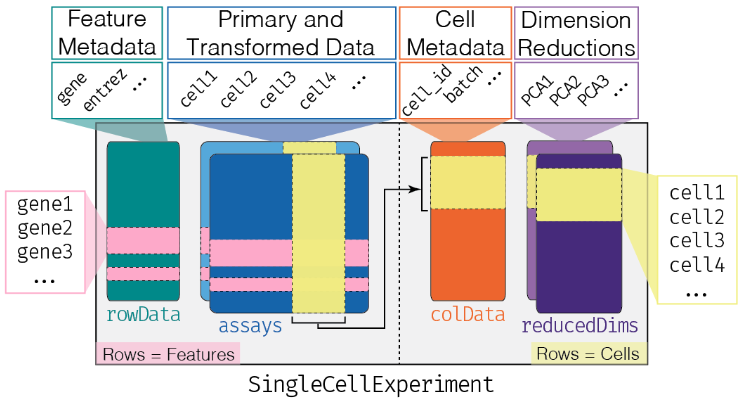

## Setup and Seurat Objects

## Navigate To The Cluster

Once you have an account and are connected to the VPN/Tufts Network, navigate to the [OnDemand Website](https://ondemand.pax.tufts.edu/){:target="_blank" rel="noopener"} and log in with your tufts credentials. Once you are logged in you'll notice a few navigation options:


Click on `Interactive Apps > RStudio Pax` and you will see a form to fill out to request compute resources to use RStudio on the Tufts HPC cluster. We will fill out the form with the following entries:

- `Number of hours` : `3`
- `Number of cores` : `1`
- `Amount of memory` : `16GB`
- `R version` : `4.0.0`
- `Reservation for class, training, workshop` : `Bioinformatics Workshops`---> NOTE: This reservation closed on Nov 9, 2022, use Default if running through the materials after that date.
- `Load Supporting Modules`: `boost/1.63.0-python3 java/1.8.0_60 gsl/2.6`

Click `Launch` and wait until your session is ready. Click `Connect To RStudio Server`, and you will notice a new window will pop up with RStudio. 

??? question "Are you connected to RStudio?"
    - Yes (put up a green check mark in zoom)
    - No (raise hand in zoom)

## Today's Data

Today we will be working with data from  [Paulson et al. 2022](https://www.nature.com/articles/s41586-021-04358-6) which found cell-type-specific neurodevelopmental abnormalities that were shared across ASD risk genes. To this end they leveraged organoid single-cell RNA-seq data to investigate these abnormalities:


This research uncovers cell-type-specific neurodevelopmental abnormalities that are shared across ASD risk genes and are finely modulated by human genomic context, finding convergence in the neurobiological basis of how different risk genes contribute to ASD pathology.

## Loading Libraries and Data

- We will be working with Single-Cell RNA-seq data in R today. This data is often stored as a Seurat object, which has the following structure:



- Let's start by loading the libraries we need to import and manipulate this object!

```R
# --- Load Libraries -----------------------------------------------------------
.libPaths(c("","/cluster/tufts/bio/tools/R/bio_sup"))
library(monocle3)
library(Seurat)
library(SeuratWrappers)
library(patchwork)
library(tidyverse)

# --- Set color palette --------------------------------------------------------

cols = c("#41ae76","#ee8866","#bebada","#bbcc33","#fdb462",
         "#f768a1","#fa9fb5","#77aadd","darkgray",
         "#cc6677","#882255","#225522","#aa4499","#332288",
         "#009988","#5C61FF","#B87ACF")
# --- Load Data ----------------------------------------------------------------

# start with the day 35 seurat object 
asd_d35 <- readRDS("./results/asd_organoids/asd_d35.rds")
```

## Seurat Objects

```R
# --- Explain the Seurat Object ------------------------------------------------

# what is in this Seurat Object?
asd_d35

# gene names
rownames(asd_d35)

# cell names
colnames(asd_d35)

# what assays do I have?
Seurat::Assays(asd_d35)

# how do I access these assays?
GetAssayData(object = asd_d35, 
             assay = "RNA",
             slot = "counts")

# how do I switch the default assay to be used?
DefaultAssay(asd_d35) <- "RNA"

# how do I access the meta data?
head(asd_d35@meta.data)

# how can I access the dimension reductions?
Embeddings(object = asd_d35, reduction = "pca")
Embeddings(object = asd_d35, reduction = "umap")

# How can I visualize my clustering?
DimPlot(object = asd_d35,
        reduction = "umap")

# what are the identities?
Idents(object = asd_d35)

# how can I change the identities to the cell type?
Idents(object = asd_d35) <- asd_d35$CellType

# how can I see if this changed the identities?
DimPlot(object = asd_d35,
        reduction = "umap")

# meta data in umap
FeaturePlot(object = asd_d35,
        reduction = "umap",
        features =c("percent.mito","percent.ribo"))

# genes in umap
FeaturePlot(object = asd_d35,
            reduction = "umap",
            features ="TOP2A")
```
