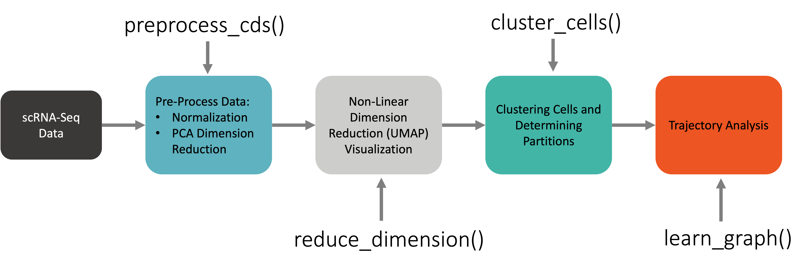
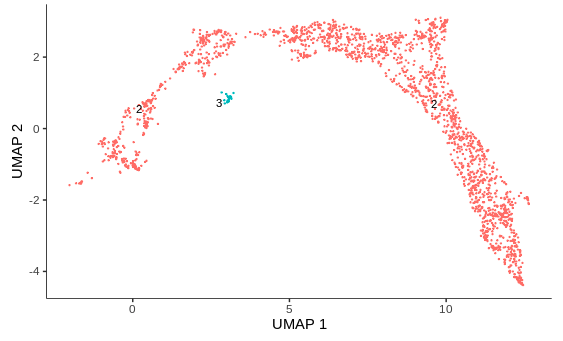

## Running Monocle3

There are typically four main commands when running Monocle3:

!!! info "[Monocle3 Workflow](https://cole-trapnell-lab.github.io/monocle3/docs/getting_started/)"

    

- `preprocess_cds()`: normalizes the data by log and size factor to address depth differences and calculates a lower dimensional space that will be used as the input for further dimensionality reduction like tSNE and UMAP.

??? example "`preprocess_cds()` options"

    - `method` : initial method of dimention reduction - options are  "PCA" and "LSI"
    - `num_dim` : the dimensionality of the reduced space - default is 50
    - `norm_method` : methods of normalizing the expression data - options are "log", "size_only", "none"
    - `use_genes` : when this option is not NULL, only the list of genes provided will be used for dimension reduction - default is NULL
    - `pseudo_count` : amount to increase expression values before normalization and dimensionality reduction. If the value is NULL a pseudo count of 1 is added - default is NULL
    - `scaling` : this will scale each gene before running trajectory reconstruction if set to TRUE - default is TRUE


- `reduce_dimension()`: reduces the dimensionality of the data using algorithms like UMAP or tSNE. Trajectories will be calculated through this space.

??? example "`reduce_dimension()` options"

    - `max_components` : the dimensionality of the reduced space - default is 2
    - `reduction_method` : the method used for dimension reduction - options are "UMAP", "tSNE", "PCA", "LSI", and "Aligned"
    - `preprocess_method` : what preprocess method was used to initially reduce the dimensionality of the gene expression data - default is LSI
    - `umap.metric` : the distance metrice used when calculating the UMAP - default is "cosine"
    - `umap.min_dist` : the minimum distance to be input into the UMAP function - default is 0.1
    - `umap.n_neighbors` : the number of neighbors to use during kNN graph construction - default is 15L
    - `umap.fast_sgd` : option to use Stochastic Gradient Descent when caclulating the UMAP to speed up the computation - default is FALSE
    - `umap.nn_method` : the nearest neighbor method to be used by UMAP - default is "annoy"
    
    
- `cluster_cells()`: clusters the cells using Louvain/Leiden community detection, and returns a cell_data_set with internally stored cluster assignments. These cluster assignments can then be assigned to cell types given that cells in a cluster are likely to be the same cell type as cells of the same type have similar gene expression patterns.

??? example "`cluster_cells()` options"

    - `reduction_method` : The dimensionality reduction method upon which to base clustering - options are "UMAP", "tSNE", "PCA", "LSI", and "Aligned"
    - k : the number of nearest neighbors to use when creating the k nearest neighbor graph for Louvain/Leiden clustering. k is related to the resolution of the clustering result, a bigger k will result in lower resolution and vice versa - default is 20
    - `cluster_method` :  the clustering method to use, if "louvain" is used the resolution paramter is ignored - default is "leiden" 
    - `num_iter` : number of iterations used for Louvain/Leiden clustering - defualt is 2
    - `partition_qval` : q-value cutoff to determine when to partition - default is 0.05
    - `weight` : to determine whether or not to use Jaccard coefficients for two nearest neighbors (based on the overlapping of their kNN) as the weight used for Louvain clustering - default is FALSE
    - `resolution` : controls the resolution of clustering. If NULL, the parameter is determined automatically - default is NULL
    - `random_seed` : used by the random number generator in louvain-igraph package. This argument will be ignored if num_iter is larger than 1 - default is NULL

- `learn_graph()`: constructs the trajectory through clusters in a lower dimensional space to ["learn the sequence of gene expression changes each cell must go through as part of a dynamic biological process"](https://cole-trapnell-lab.github.io/monocle3/docs/trajectories/)

??? example "`learn_graph()` options"

    - `use_partition` : determines whether to use partitions calculated during cluster_cells and therefore to learn disjoint graph in each partition. When use_partition = FALSE, a single graph is learned across all partitions - default is TRUE
    - `close_loop` : determines whether or not to perform an additional run of loop closing after estimating the principal graphs to identify potential loop structure in the data space - default is TRUE
    - `learn_graph_control` = a list of control parameters to be passed to the reversed graph embedding function - default is NULL

Let's start with the pre-processing step:

```R
# preprocess_cds does both 1) normalization and 2) preliminary dimension reduction.  By default 1) gene expression count for each cell is divided by the total counts of that cell, multiplied by a scale factor, and log-transformed. This is done  to address differences in sequencing depths for different cells. 2) PCA is used to calculate a lower dimensional space that will be used as the input for downstream steps like UMAP visualization. 
cds <- preprocess_cds(cds, 
                      num_dim = 30) 

# look at the percentage of variance explained by our principal components
plot_pc_variance_explained(cds)
```


Here we see that the first few PCA components account for about half the variance. Note that adding components helps with explaining the variation in your data, but comes at the cost of increased computational time. Given this is a subsampled data set, this is less of a concern. Now, let's run the reduce dimentions step!

```R
# Note here we are using the results of PCA dimension reduction in the last step and visualizing the results in 2 dimensions.
# umap.fast_sgd=FALSE and cores = 1 are needed for reproducible results 
cds <- reduce_dimension(cds,
                        preprocess_method = 'PCA',
                        umap.fast_sgd=FALSE, 
                        cores = 1)
# let's take another look at our cell data set object
cds
```

!!! info "output"

    ```
    class: cell_data_set 
    dim: 12962 4000 
    metadata(2): cds_version citations
    assays(1): counts
    rownames(12962): FO538757.2 AP006222.2 ... AC004556.1 AC240274.1
    rowData names(1): gene_short_name
    colnames(4000): 1_AAAGGTACACAGCTGC 1_AAAGGTATCTGCCTGT ...
    6_TTTGACTGTACCATAC 6_TTTGGTTGTTACGTAC
    colData names(4): treat dataset CellType Size_Factor
    reducedDimNames(2): PCA UMAP
    altExpNames(0)
    ```
Here we would like to highlight that after running our pipeline, we now have two `reducedDimNames` slots in our object! We can access them with the `reducedDims` function:

```R
# let's examine our new `reducedDimNames` slot!
head(reducedDims(cds)$UMAP)
```

!!! info "output"

    ```R
                            [,1]        [,2]
    1_AAAGGTACACAGCTGC -4.371685 -1.90491864
    1_AAAGGTATCTGCCTGT -9.110986  1.60710314
    1_AACAACCCACACTGGC -8.257574 -0.05704084
    1_AACAAGATCGAAGCAG -6.810462  2.03861049
    1_AACAGGGAGGACAGCT -9.367511  1.91848877
    1_AACCTGAGTATACGGG -9.553589  0.20396432
    ```
To understand why we only ran through the first three steps, we should examine how our cells are distributed in our dimension reduced UMAP plot:

```R
# view the cell types in our UMAP plot
plot_cells(cds,
           color_cells_by = "CellType", 
           show_trajectory_graph = FALSE,
           group_label_size = 3,
           cell_size = 0.5)
```


Grouping cells into clusters is an important step in identifying the cell types represented in your data. Monocle uses a technique called community detection to group cells into cluster and partitions.

```R
# Grouping cells into clusters is an important step in identifying the cell types represented in your data. Monocle uses a technique called community detection to group cells into cluster and partitions.
cds <- cluster_cells(cds, 
                     k = 20,
                     partition_qval = 0.05)

plot_cells(cds,
           color_cells_by = "partition", 
           show_trajectory_graph = FALSE,
           group_label_size = 3,
           cell_size = 0.5)
```


## Subsetting Our Data

Above we can see that we have multiple clusters (usually representing our cells) and multiple partitions (usually representing groups of different cells). When Monocle3 calculates it's trajectory it will typically do so through one of these partitions. So we will subset our data to just grab the partition that contains the Cycling Progenitors, Newborn PNs, and Newborn DL PNs. By doing this we can assess how gene expression changes during cell differentiation from a Cycling Progenitors to a Newborn DL PN:

```R
# when we examine a trajectory in monocle3 it is useful to look at one
# partition as you are examining how gene expression changes between clusters
# in some group
cds_2 = choose_cells(cds)
```

When we go to subset our cells we will choose the following cells:


Now that we subset our cells, let's examine how our UMAP has changed!

```R
# check the subset of cells
plot_cells(cds_2, 
           color_cells_by = "partition",
           show_trajectory_graph = FALSE,
           group_label_size = 3,
           cell_size = 0.5)
```



## Trajectory Analysis

Now that we have subsampled cells moving from Cycling Progenitors to Newborn DL PNs, we will need to re-run the Monocle3 workflow on our data given that our clustering was done on the larger data set.

```R
# re-run the monocle3 workflow on our subset data:
# use the same # of top PCs as used for clustering
cds_2 <- preprocess_cds(cds_2, 
                        num_dim = 20)

# take another look at the variance explained 
plot_pc_variance_explained(cds_2)
```


You'll note again that the first few PCA components explain about half the variance. Here we include fewer PCA components to account for the variance as we reduced the number the of total cells we are examining. We can now move on and apply the reduce_dimensions/cluster_cells functions to our data:

```R
# reduce the dimensions 
cds_2 <- reduce_dimension(cds_2,
                          preprocess_method = 'PCA',
                          umap.fast_sgd=FALSE, 
                          cores = 1)

# force few partitions with partition q-value set higher
cds_2 <- cluster_cells(cds_2, 
                       k = 20,
                       partition_qval = 1)

# do we only have one partition now?
plot_cells(cds_2,
           color_cells_by = "partition", 
           show_trajectory_graph = FALSE,
           group_label_size = 3,
           cell_size = 0.5)
```


Note that in the above plot that all of our cells are now in one partition. This time we will calculate trajectories in our data now that we have a subset of cells in which it makes sense to do so. You will note that we specify two options when we "learn our graph". One being 'use_partition = FALSE' which we will not use as we have already subset our cell population. The other being 'close_loop = TRUE', which we specify as this allows for the trajectory to form loops. This is important if we want to to identify populations of cells with cyclic behavior.

```R
# additionally we will run learn_graph to calculate trajectories on our subset!
cds_2 <- learn_graph(cds_2,
                     use_partition = FALSE,
                     close_loop = TRUE)

# now that we have subset out data, re-run our monocle workflow, and calculated 
# trajectories, let's see where we should set our root node!
plot_cells(cds_2, 
           color_cells_by = "CellType",
           cell_size = 0.5,
           labels_per_group = 0) 
```


We can see that we have a trajectory now connecting the Cylcing Progenitor cells and the Newborn DL PNs!

