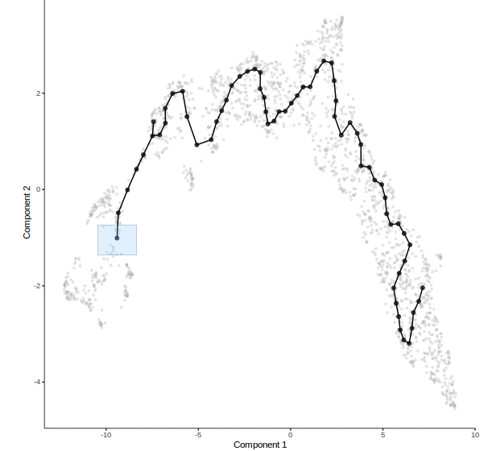
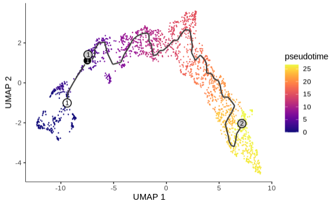
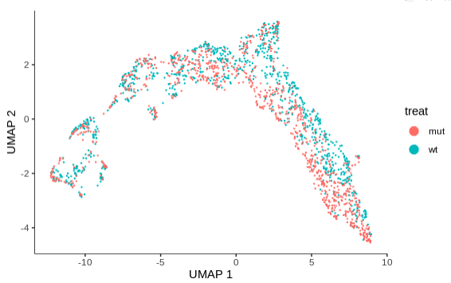
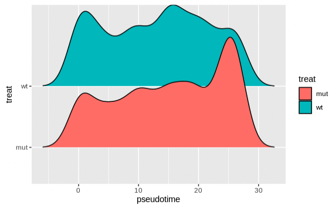
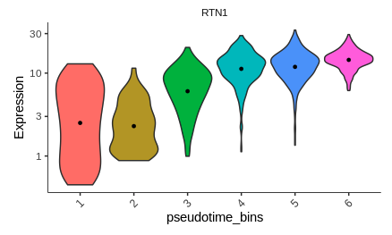
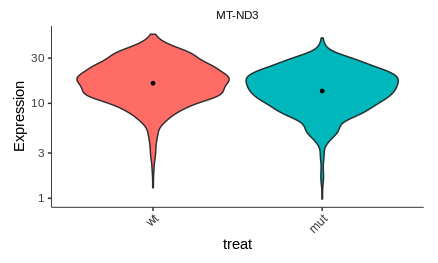

## Pseudotime and Differential Expression

## Pseudotime

Monocle introduced the concept of pseudotime which they define as: ["Pseudotime is a measure of how much progress an individual cell has made through a process such as cell differentiation."](https://cole-trapnell-lab.github.io/monocle3/docs/trajectories/) We will assess "progress" by a cell's differentiation status. So we will manually chose the starting point to be the cycling progenitors: 

```R
# monocle introduced the concept of pseudotime which they define as:
# "Pseudotime is a measure of how much progress an individual cell has made 
# through a process such as cell differentiation."
# we will assess "progress" by a cell's differentiation status. So we will
# manually chose the starting point to be the cycling progenitors
cds_2 = order_cells(cds_2) 
```



Now let's visualize pseudotime in our UMAP plot to understand what is early pseudotime (low values - dark purple) and late pseudotime (high values - yellow):

```R
# plot pseudo time after choosing root nodes 
# (defined as the bottom in the cycling progenitors cell type)
plot_cells(cds_2,
           show_trajectory_graph = T,
           color_cells_by = "pseudotime",
           graph_label_size=3,
           cell_size = 0.5) 
```



## Distribution of Wild-Type and Mutant Cells

[Paulson et al. 2022](https://www.nature.com/articles/s41586-021-04358-6) note that there is a difference in the distribution of Wild-Type and Mutant Cells within this UMAP. Let's try coloring our UMAP plot by the treatment (Wild-Type v. Mutant Cells):

```R
# how are our wild-type and mutant cells distributed in this graph?
plot_cells(cds_2, 
           color_cells_by = "treat", 
           show_trajectory_graph = F, 
           label_cell_groups = F,
           cell_size = 0.5) 
```



Optional: Pseudotime Ridgeplot View

This view can be a bit busy, we can better see the distribution of the number of cells in each condition through pseudotime with a ridge plot like in the paper!

```R
# isolate meta data
cds_meta = colData(cds_2)

# add pseudo-time to meta data
cds_meta$pseudotime = pseudotime(cds_2)

# filter data for where pseudo time is finite
cds_meta = cds_meta[is.finite(cds_meta$pseudotime),]

# plot pseudo-time for cells that assessed for pseudo-time
ggplot(as.data.frame(cds_meta), 
       aes(x=pseudotime,
           y=treat)) + 
  ggridges::geom_density_ridges(aes(fill=treat))  
```



Here we can see that there is a spike in the number of cells in the mutant population at later pseudotime values. 

## Differential Expression

We will now create a model to to assess how genes vary with pseudotime and treatment. However, before we do that we need to factor our variables of interest!

```{r prepare the data frame for modeling}
# create pseudotime bins for visualization later
cds_meta$pseudotime_bins <- as.numeric(
  cut_number(
    cds_meta$pseudotime,
    6))

# factor our treatment variable
cds_meta$treat <- factor(cds_meta$treat, levels=c("wt","mut"))

# swap our meta data back into the cell data set object
colData(cds_2) <- cds_meta
```

Let's run our model to assess genes that vary due to pseudotime and treatment. We then print the column names and the dimensions of the results data frame. Just note that this will take a bit of time to run!

```{r Factor Variables and Perform Differential Expression}

# create a model to assess how genes vary with predictors: pseudotime and treatment 
gene_fits <- fit_models(cds_2, 
                        model_formula_str = "~ pseudotime + treat",
                        cores = 1)

# grab the coefficients table
fit_coefs <- coefficient_table(gene_fits)

colnames(fit_coefs)
dim(fit_coefs)
```

!!! info "output"

    ```
    [1] 38886    14
    ```
Here you will notice that we have 14 columns pertaining to model information and 38886 rows corresponding to terms in those models.

## Filter For Significant Genes

Now that we have a data frame with our model results, we can subset it to grab the columns/rows we need. One popular package to do just this in R is dplyr. Let's use dplyr to select the columns we need:

```{r filter the fit coeficients by column}
# now that we have a data frame with our model results, we can subset it to grab
# the columns/rows we need. One popular package to do just this in R is dplyr
# Let's use dplyr to select the columns we need:
fit_coef_filter <- fit_coefs %>% 
  dplyr::select(c(gene_short_name, term, status, estimate, std_err, p_value, q_value))

dim(fit_coef_filter)
```

!!! info "output"

    ```
    [1] 38886     7
    ```

 You'll note that we now only have 7 columns!
 
```{r filter the fit coeficients by row}
# we can also use dplyr to filter the rows we need
# let's use the filter function to remove lines that correspond to the
# intercept and for genes where the q-value is less than 0.05:
fit_coef_filter <- fit_coef_filter %>%
  dplyr:: filter(term != "(Intercept)" & q_value<0.05) 

dim(fit_coef_filter)
```

!!! info "output"

    ```
    [1] 3964    7
    ```

You'll note that we only have 3964 genes!

```{r view our filtered results data frame}
# view our results data frame to and sort genes by q-value for 
# both genes that vary due to pseudotime and the treatment
view(fit_coef_filter)
```

## Plot Genes That Vary Over Pseudotime/Treatment

```{r Plot Pseudotime Genes}
# example of genes that vary over pseudotime 
# NOTE: After plotting RTN1, try plotting another gene!
cds_subset <- cds_2[rownames(cds_2) %in% c("RTN1"),]

# plot genes that vary over pseudotime
plot_genes_violin(cds_subset, 
                  group_cells_by="pseudotime_bins",
                  ncol=2) +  
  theme(axis.text.x=element_text(angle=45, hjust=1))
```

!!! info "output"

    


Here you can see that as pseudotime increases so does the expression of RTN1. Let's try out a gene that varies due to the treatment effect:

```{r Plot Treatment Genes}
# example of genes that vary as a result of the treatment
# NOTE: After plotting MT-ND3, try plotting another gene!
cds_subset <- cds_2[rownames(cds_2) %in% c("MT-ND3"),]

# plot genes that vary as a result of the treatment
plot_genes_violin(cds_subset, 
                  group_cells_by="treat",
                  label_by_short_name = F) +
  theme(axis.text.x=element_text(angle=45, hjust=1))

```


!!! info "output"

    
    
Here you'll notice that MT-ND3 is slightly upregulated in the Wild-Type when compared to the Mutant! 
