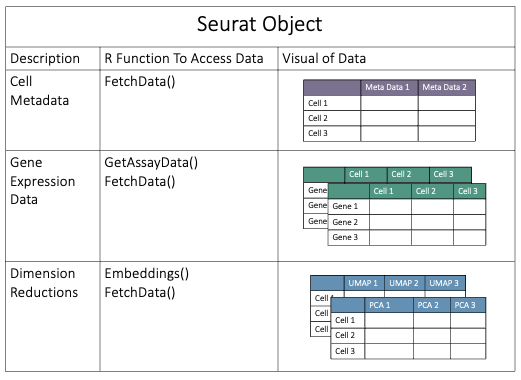

Seurat is a user friendly R package used to analyze single-cell RNA-Seq data. Seurat objects have the following structure:


!!! info "Seurat Objects" 

    

Let's invetstigate some single cell data - first we will need to load the necessary libraries:

```R
# --- Load Libraries -----------------------------------------------------------
LIB='/cluster/tufts/hpc/tools/R/4.0.0/'
.libPaths(c("",LIB))
.libPaths()
library(Seurat)
library(monocle3)
library(clusterProfiler)
library(patchwork)
library(tidyverse)

# --- Load Data ----------------------------------------------------------------

# start with the day 35 seurat object 
seur <- readRDS("./results/asd_organoids/suv420h1_mito210_d35_sub.rds")

```

Now let's see what is in our Seurat object and how we can access our data:

```R

# --- Explain the Seurat Object ------------------------------------------------

# what is in this Seurat Object?
seur

# gene names
rownames(seur)

# cell names
colnames(seur)

# what assays do I have?
Seurat::Assays(seur)

# how do I access these assays?
GetAssayData(object = seur, 
             assay = "RNA",
             slot = "counts")

# how do I switch the default assay to be used?
DefaultAssay(seur) <- "RNA"

# how do I access the meta data?
head(seur@meta.data)

# how can I access the dimension reductions?
Embeddings(object = seur, reduction = "pca")
Embeddings(object = seur, reduction = "umap")

# How can I visualize my clustering?
DimPlot(object = seur,
        reduction = "umap")

# what are the identities?
Idents(object = seur)

# how can I change the identities to the cell type?
Idents(object = seur) <- seur$CellType

# how can I see if this changed the identities?
DimPlot(object = seur,
        reduction = "umap")

# meta data in umap
FeaturePlot(object = seur,
            reduction = "umap",
            features =c("percent.mito","percent.ribo"))

# genes in umap
FeaturePlot(object = seur,
            reduction = "umap",
            features ="TOP2A")

```
