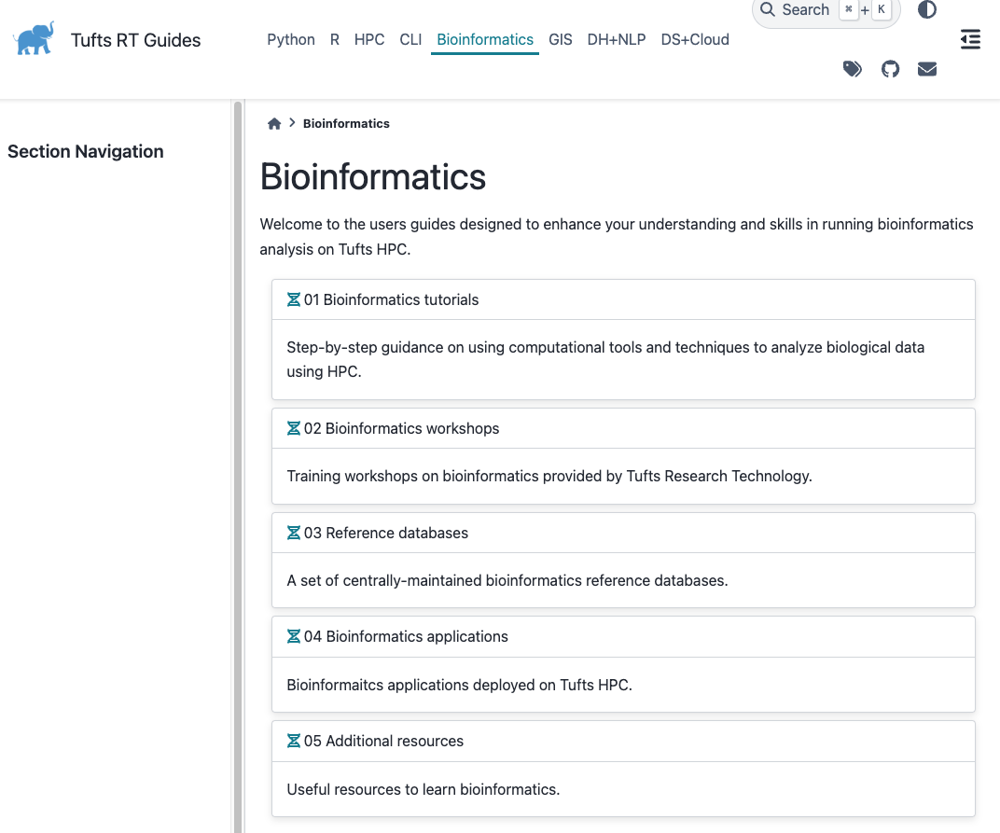
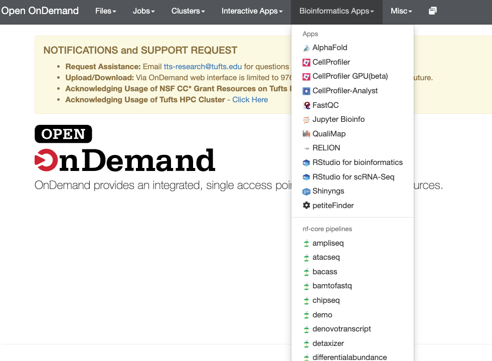
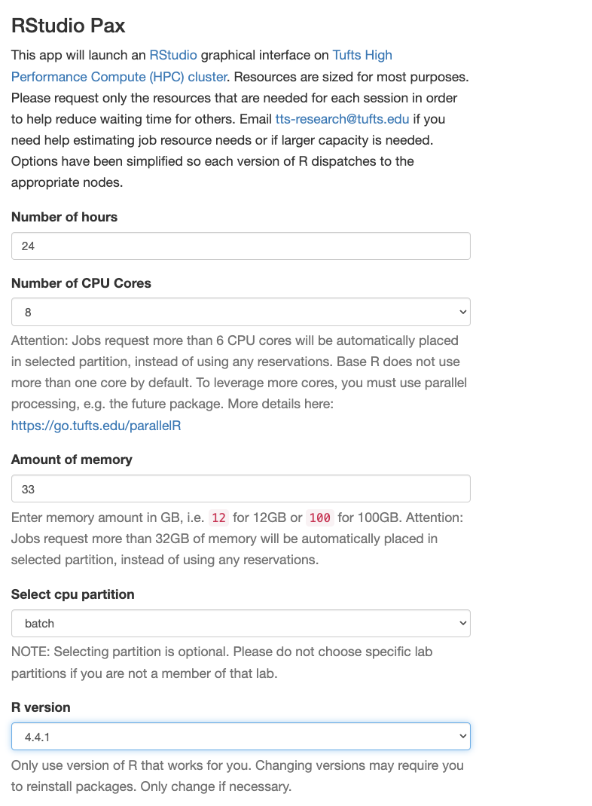

# Tufts Bioinformatics Resources


## Mailing List (E-list)

To stay updated on bioinformatics education, software tools, and workshop notifications, subscribe to our e-list: [best@elist.tufts.edu](https://elist.tufts.edu/sympa/subscribe/best?previous_action=info).

In the future, we will post workshop notifications and resources through this email list.

## Workshops and resources
### New HPC documentation website (In development)
**Coming in November 2024. Stay tuned for updates!**


### Current Workshops, stop updating once our new website is online. 

Bioinformatics workshops provided by TTS Research Technology in 2022, 2023, 2024](https://tuftsdatalab.github.io/tuftsWorkshops/)

### Archived Workshops

[Archived TTS Datalab bioinformatics workshops](https://tuftsdatalab.github.io/Research_Technology_Bioinformatics/)

### Other Workshops

[Bioinformatics workshops provided by Bioinformatics Education and Services at Tufts](https://best-tufts.github.io/bioinformatics_workshops/)

### Website

[Bioinformatics website (Last updated July 2023)](https://it.tufts.edu/bioinformatics) 


**Note: Some materials may be outdated, so always verify the relevance of content before applying it to your projects.**


## Tools on the Cluster

Use `module avail` to check the full list of tools available on the cluster. Below are some commonly used tools:

```
   abcreg/0.1.0                         kallisto/0.48.0                     (D)    orthofinder/2.5.5          
   abyss/2.3.7                          kneaddata/0.12.0                           pandaseq/2.11
   alphafold/2.3.0                      kraken2/2.1.3                              parabricks/4.0.0-1
   alphafold/2.3.1                      krakentools/1.2                            parabricks/4.2.1-1         
   alphafold/2.3.2                      macs2/2.2.7.1                        
   amplify/2.0.0                        macs3/3.0.0a6                              pepper_deepvariant/r0.8    
   angsd/0.939                          masurca/4.0.9                              petitefinder/cpu
   angsd/0.940                   (D)    masurca/4.1.0                       (D)    picard/2.25.1
   bakta/1.9.3                          medaka/1.11.1                              picard/2.26.10              
   bbmap/38.93                          megahit/1.2.9                              plink/1.90b6.21            
   bbmap/38.96                   (D)    meme/5.5.5                                 plink2/2.00a2.3
   bbtools/39.00                        metaphlan/4.0.2                            polypolish/0.5.0
   bcftools/1.13                        metaphlan/4.0.6                     (D)    preseq/3.2.0
   bcftools/1.14                        miniasm/0.3_r179                           prokka/1.14.6
   bcftools/1.17                        minimap2/2.26                       (D)    qiime2/2023.2
   bcftools/1.20                 (D)    minipolish/0.1.3                           qiime2/2023.5
   beast2/2.6.3                         mirdeep2/2.0.1.3                           qiime2/2023.7
   beast2/2.6.4                         mirge3/0.1.4                               qiime2/2023.9
   beast2/2.6.6                  (D)    mothur/1.46.0                              qiime2/2024.2             
   ... ...
 
```

### A few tips

1. Before installing your own tools, check if they are already available on the cluster using the `module avail` command.

2. Always be aware of the software versions, especially when using scripts from colleagues.

3. For less common tools, consider installing them yourself to ensure you have full control over the version and availability.

   **We will cover how to install tools from source code in our upcoming workshop. If you need to install a tool not commonly used, it's best to do it yourself to avoid issues with maintenance. Stay tuned for a detailed guide!**


## Open OnDemand APPs

You can access Open OnDemand through [this link]( https://ondemand.pax.tufts.edu/ )


### Bioinformatics Apps

We offer a wide range of bioinformatics tools as apps, including `AlphaFold` and `CellProfiler`. Additionally, 31 nf-core pipelines are available as apps for ease of use, with the most popular being nf-core/rnaseq, which we will demonstrate in our final workshop.



### RStudio and Shinyngs Apps

RStudio Pax, use R/4.4.1 which has the most comprehensive packages installed (1300+). 



**We will demenstrate how to install packages in our next workshop**

RStudio is available on Open OnDemand, with different versions tailored for specific tasks. For example, in `RStudio for scRNA-Seq`, the most commonly used packages for scRNA-Seq analysis are pre-installed to help streamline your workflow.

**Do not copy lib.path()**
**Verify the R version before you need to define lib.path()**

To install packages, just use the default $HOME position. 

### Other Apps

We also provide other applications like `Jupyter Bioinfo`, `JupyterLab`, `Jupyter Notebook`, `IGV`, and `Galaxy` to support your daily research activities.


## nf-core pipelines
Use `module avail nf-core` to get the list of nf-core pipelines deployed on cluster
### modules
```
   nf-core-ampliseq/2.8.0                     nf-core-nanostring/1.3.0      (D)
   nf-core-ampliseq/2.9.0                     nf-core-pairgenomealign/1.0.0
   nf-core-ampliseq/2.10.0                    nf-core-pangenome/1.1.0
   nf-core-ampliseq/2.11.0             (D)    nf-core-pangenome/1.1.1
   nf-core-atacseq/2.1.2                      nf-core-pangenome/1.1.2       (D)
   nf-core-bacass/2.2.0                       nf-core-proteinfold/1.1.0
   nf-core-bacass/2.3.1                (D)    nf-core-raredisease/2.0.1
   nf-core-bamtofastq/2.1.1                   nf-core-rnafusion/3.0.1
   nf-core-chipseq/2.0.0                      nf-core-rnafusion/3.0.2       (D)
   nf-core-denovotranscript/1.0.0             nf-core-rnaseq/3.14.0
   nf-core-detaxizer/1.0.0                    nf-core-rnasplice/1.0.2
   nf-core-differentialabundance/1.4.0        nf-core-rnasplice/1.0.3
   nf-core-differentialabundance/1.5.0 (D)    nf-core-rnasplice/1.0.4       (D)
   nf-core-eager/2.5.1                        nf-core-sarek/3.4.0
   nf-core-fetchngs/1.11.0                    nf-core-sarek/3.4.1
   nf-core-fetchngs/1.12.0             (D)    nf-core-sarek/3.4.3
   nf-core-funcscan/1.1.4                     nf-core-sarek/3.4.4           (D)
   nf-core-funcscan/1.1.5              (D)    nf-core-scrnaseq/2.5.1
   nf-core-hic/2.1.0                          nf-core-scrnaseq/2.7.0
   nf-core-mag/2.5.2                          nf-core-scrnaseq/2.7.1        (D)
   nf-core-mag/2.5.4                          nf-core-smrnaseq/2.3.0
   nf-core-mag/3.0.0                          nf-core-smrnaseq/2.3.1        (D)
   nf-core-mag/3.0.2                   (D)    nf-core-taxprofiler/1.1.5
   nf-core-metatdenovo/1.0.0                  nf-core-taxprofiler/1.1.6
   nf-core-metatdenovo/1.0.1           (D)    nf-core-taxprofiler/1.1.7
   nf-core-methylseq/2.6.0                    nf-core-taxprofiler/1.1.8     (D)
   nf-core-nanoseq/3.1.0                      nf-core-viralrecon/2.6.0
   nf-core-nanostring/1.2.1
```

### Open OnDemand apps


## Contact Us

We are part of the [TTS Research Technology team]( https://it.tufts.edu/research-technology-team). Our services are not limited to bioinformatics; we also support data science, statistics, and research data management.

For consultations, please submit a ticket to [tts-research@tufts.edu](mailto:tts-research@tufts.edu).

For more details, visit our page: [Research Technology Consulting Services](https://it.tufts.edu/research-technology/research-technology-consulting-services).


