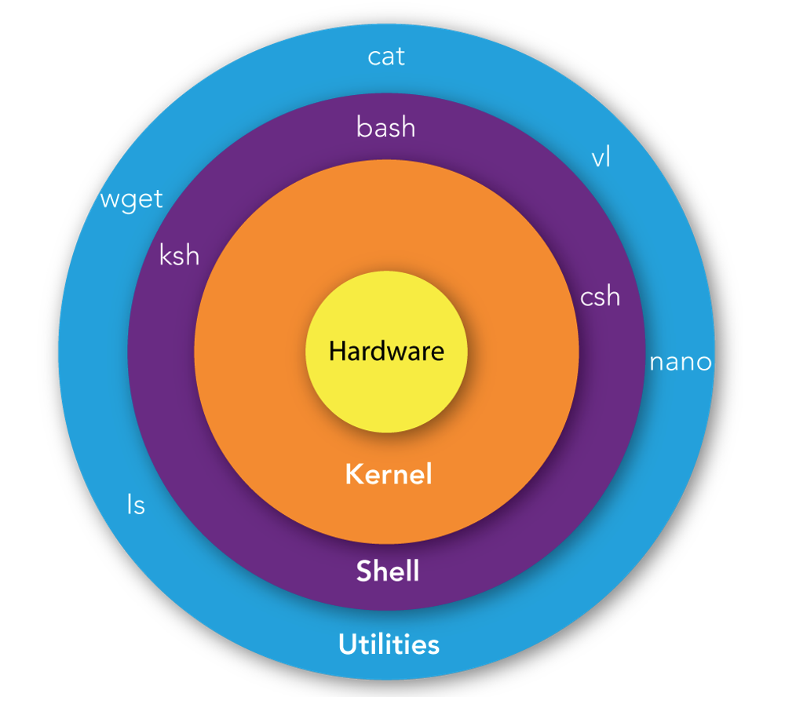

# Introduction to Linux/Unix 

## What is Unix?

Unix is a powerful, multiuser, multitasking operating system that was originally developed in the 1960s and 1970s at **Bell Labs** by **Ken Thompson**, **Dennis Ritchie**, and others. It has since become one of the most influential operating systems in the history of computing, serving as the foundation for many modern operating systems, including Linux, macOS, and various BSDs. **Dennis Ritchie** is also the creator of C. 

  

  

## Key features
- **Multiuser**: Unix allows multiple users to access the system simultaneously, each with their own environment, files, and processes.
- **Multitasking**:  Unix is capable of running multiple processes at the same time. This means that it can handle several tasks concurrently, like running applications, performing background tasks, and processing commands.
- **Hierarchical File System**: Unix uses a hierarchical file system structure, where files are organized in directories (folders), starting from a root directory (`/`). 
- **Simple and Consistent Interface:** Unix provides a command-line interface (CLI) where users interact with the system by typing commands. **The Unix philosophy emphasizes small, simple, and modular commands that can be combined in scripts to perform complex tasks**.

## What is Linux?

Linux is a free, open-source, and Unix-like operating system kernel that was originally created by **Linus Torvalds** in 1991. Over time, Linux has grown into a full-fledged operating system used worldwide across various types of devices, from servers and desktop computers to smartphones and embedded systems.

  

  

**Popular Linux Distributions:**

​	•	**Ubuntu:** A user-friendly distribution popular for desktop and server use, based on Debian.

​	•	**Fedora:** A cutting-edge distribution often used by developers and those who want the latest features.

​	•	**Debian:** Known for its stability and extensive software repositories, often used in server environments.

​	•	**CentOS/AlmaLinux/Rocky Linux:** Enterprise-grade distributions derived from Red Hat Enterprise Linux (RHEL).

​	•	**Arch Linux:** A rolling release distribution known for its simplicity and customization, aimed at advanced users.

​	•	**Kali Linux:** A distribution designed for penetration testing and security research.

## Shell

**Shell** is like a translator and bridge between you and the operating system's core, the **kernel**. It takes the commands you type and interprets them, telling the kernel what actions to perform. 

[Previous: Overview ](00_overview.md)                                                                    

[Next: Files and File system](02_files.md)

