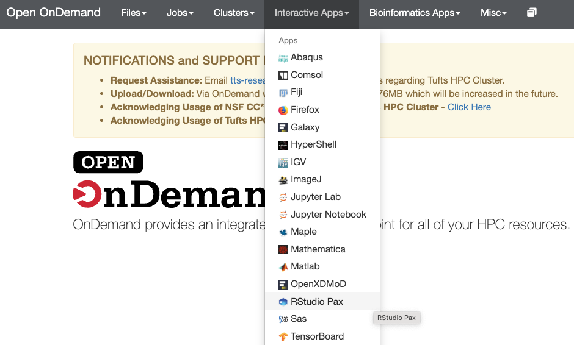

# R package installation


## Objectives

* Learn how to run R efficiently on Tufts HPC using both graphical and command-line interfaces.

* Understand R package management, including installation and configuration on the HPC environment.

* Develop skills to run R scripts in batch mode, submit jobs to the queue, and manage multiple jobs effectively.

## How to run R on Tufts HPC

### 1. Open OnDemand Rstudio app

 1.1 Log in to Open OnDemand with your UTLN

https://ondemand.pax.tufts.edu/

1.2 You will see `RStudio Pax` under `Interactive Apps` and other topic-specific Rstudio apps under `Bioinformatics Apps`

1.3 Fill in the parameters according to your needs. You can start with default value. 

1.4 Launch the job.  




### 2. Command line interface 

2.1 Make sure you are on the compute mode

```
srun -p interactive -n 1 --time=02:00:00 --mem 4g --pty bash
```

2.2 Load R modules

```
module load R/4.4.1
```

2.3 Launch R interactive session

```
R
```


## R package installation

### Pre-installed R packages

To provide convenience to users, we pre-installed many commonly used R packages used in bioinformatics analysis. Before you try to install packages, load the module for R, start R and check if the package is already installed. 

```
library(packageName)
```

### Get the list of installed R packages

```
installed.packages()
```

### Install R packages

```
install.packages("packageName")
```

**Rstudio** 


### .libPaths()

This shows the folders where the packages are installed. 

```
> .libPaths()
[1] "/home/user/R/x86_64-pc-linux-gnu-library/4.4" # Personal library
[2] "/usr/local/lib/R/site-library"                # System-wide library
[3] "/usr/lib/R/library"                           # Default R library

```


You can change the libpath to folder under lab storage or research projects. 

```
.libPaths("your_path_to_install_packages")
```

**For R/4.4.1, try not to change libpath, just install to your default $HOME directory. **


### R modules 

#### r base

```
 R/4.0.0 
 R/4.1.1 
 R/4.3.0 
 R/4.4.0
 R/4.4.1    # Recommend to use this version
```

#### r-bioinformatics

```
$ module av r-bioinformatics

------- /cluster/tufts/biocontainers/modules ---------------
   r-bioinformatics/4.3.2    r-bioinformatics/4.4.0 (D)
  Where:
   D:  Default Module
```

#### r-scrnaseq

```
$ module av r-scrnaseq

------- /cluster/tufts/biocontainers/modules -----------------------------
   r-scrnaseq/4.2.3    r-scrnaseq/4.3.1    r-scrnaseq/4.3.2    r-scrnaseq/4.4.0 (D)

  Where:
   D:  Default Module
```


!!! note "TIPS"

    For new projects, it's recommended to use the latest version, R/4.4.1, as it comes with the most comprehensive set of installed packages (1300+).
    
    For older scripts, either those you created some time ago or inherited from a colleague, be mindful of the R version and `libPaths()` used in those scripts. Do not run it without paying attention to the version. 


## Bioconductor

[Bioconductor](https://bioconductor.org/) is both an open source project and repository for R packages related to the analysis of biological data, primarily bioinformatics and computational biology, and as such it is a great place to search for -omics packages and pipelines. 

**Do not run the belew code to install bioconductor core packages**

We have pre-installed bioconductor core packages for users. 

```
if (!require("BiocManager", quietly = TRUE))
  install.packages("BiocManager")
BiocManager::install(version = "3.xx")
```

### Installation with BiocManager

To install specific bioconductor packages, use `BiocManager` to install. 

Ex: Let's install [adverSCarial](https://www.bioconductor.org/packages/release/bioc/html/adverSCarial.html) 

```
BiocManager::install("adverSCarial")
```


## devtools

**devtools** is an R package designed to simplify the process of developing, testing, and installing R packages from various sources.

`devtools` has been pre-installed in our R modules. You can load it to install packages require it. 

```
library(devtools)
```

**Installing Packages from GitHub** 

Ex: Install an R package [STew](https://github.com/fanzhanglab/STew) used to jointly characterize the gene expression variation and spatial information.

```
.libPaths("/home/user/R/x86_64-pc-linux-gnu-library/4.4")
devtools::install_github("fanzhanglab/STew")
```

Notice that for many R package, especially those process scRNA-Seq or spatial transcriptomics data, it often require dependencies or version-specific packages. 

[Previous: Souce](01_source.md)

[Next: Conda](03_conda.md)
