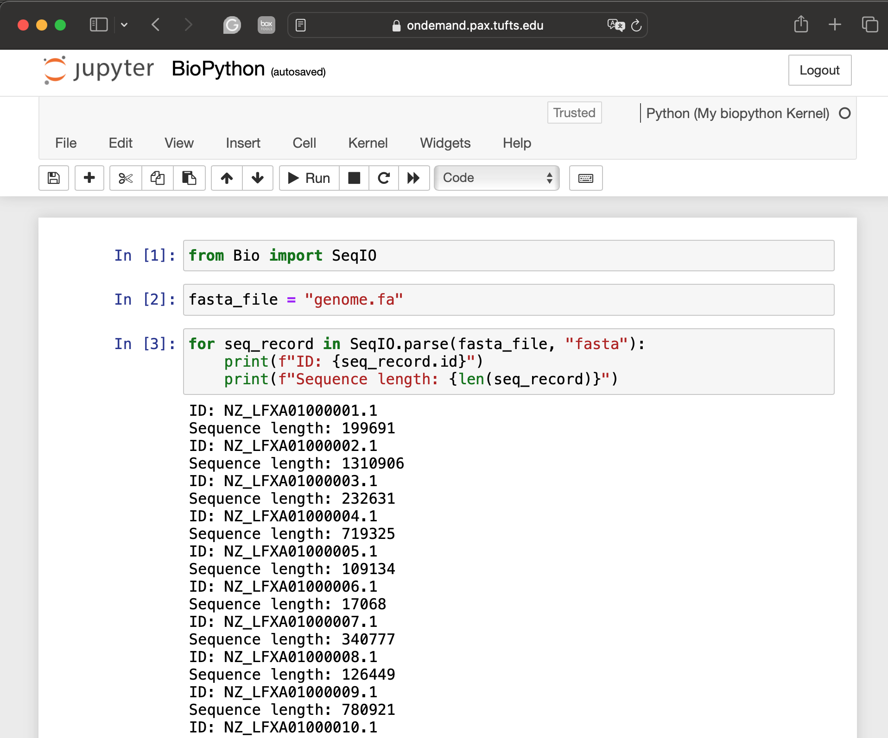
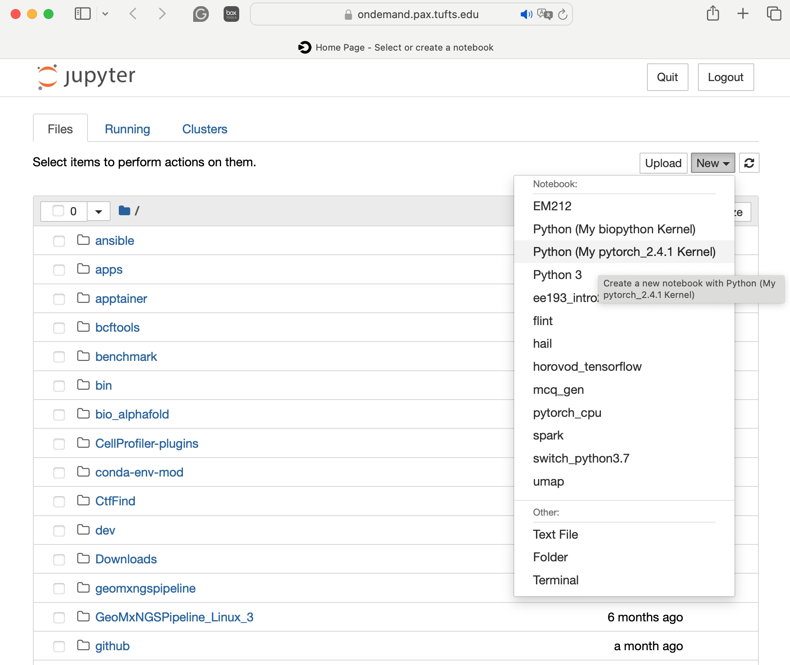
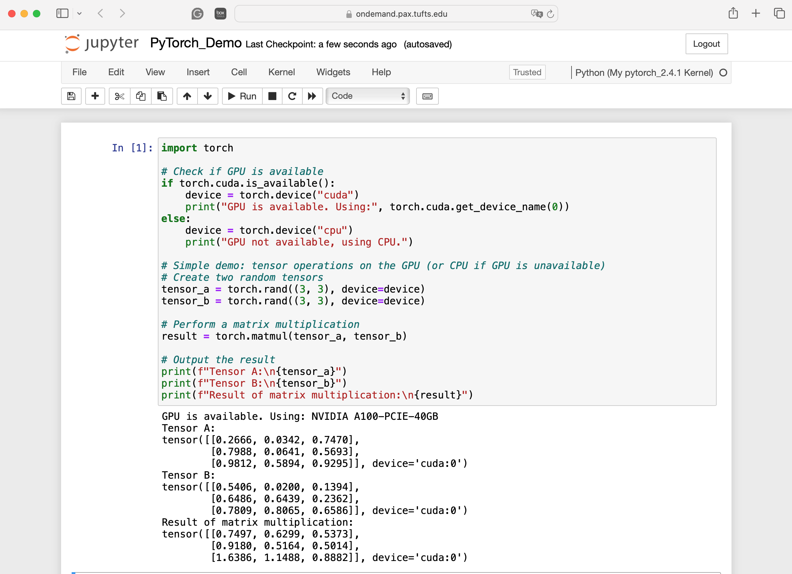

# Simplying Conda Environment Management with conda-env-mod

Author/Presenter: [Yucheng Zhang](https://github.com/zhan4429), Bioinformatics Engineer, TTS Research Technology


## Introduction
`conda-env-mod` is a tool for simplifying Python package installation on HPC clusters. **It can be used in the installation and management of not only Python packages but also packages that support Conda install**.

Due to limited user-level permissions on managed clusters, installing and maintaining Python packages becomes a challenging task for novice users. 

`conda-env-mod` was developed by Amiya Maji from Rosen Center for Advanced Computing ([RCAC](https://www.rcac.purdue.edu/)) at Purdue University to use Anaconda environments and environment modules (Lmod) to simplify this process. Souce code of `conda-env-mod` is available at its [guide repo](https://github.com/amaji/conda-env-mod).

## General steps
There are three simple steps to install and use packages using `conda-env-mod`:

1. Create an conda environment using `conda-env-mod`. During the process, the script automatically creates module file for using the environment.
2. Load the module generated by `conda-env-mod`. By default modules are generated in `$HOME/privatemodules`. 
3. Now use `conda` or `pip` to install your packages. Once the installation is complete, you can directly use them in your script.  ***No need to run `conda init` or `conda activate`***.

## Benefits


- Automating environment creation and configuration reduces mistakes
- Module files enable easy sharing of conda environments
- Automatic kernel creation allows environments to be used in Jupyter notebook/lab.

## Usage
```
conda-env-mod <subcommand> <required argument> [optional argument(s)]
```

### Subcommands
- **create**: Create an environment. Must specify env_name or env_path.
- **delete**: Delete an existing environment.  Must specify env_name or env_path.
- **module**: Create a module file for an existing environment.  Must specify env_name or env_path.
- **kernel**: Create a Jupyter kernel for an existing environment.  Must specify env_name or env_path.
- **help**:   Display brief usage information.

## Workflow
### Step1: Load anaconda or miniforge
To use `conda-env-mod` , users must load one of the anaconda or miniforge modules first.

```
$ module avail anaconda

--------------------- /opt/shared/Modules/modulefiles-rhel6 ------------------------------------------
   anaconda/2  anaconda/3

-------------------- /cluster/tufts/hpc/tools/module --------------------------------------------------
anaconda/bio35  anaconda/2020.02   anaconda/2021.05   anaconda/2021.11   anaconda/2023.07.tuftsai   anaconda/2024.06-py312 (D)


$ module load anaconda/2024.06-py312
```
!!! note "Anaconda updated its terms of service([TOS](https://www.anaconda.com/blog/anaconda-commercial-edition-faq))"

      We clarified our definition of commercial usage in our Terms of Service in an update on Sept. 30, 2020. The new       language states that use by individual hobbyists, students, universities, non-profit organizations, or businesses with less than 200 employees is allowed, and all other usage is considered commercial and thus requires a business relationship with Anaconda.

Due to this updated TOS, it's likely we will have to uninstall anaconda from Tufts HPC and other Tufts-owned computers, and migrate to miniforge. Right now, we are sitting tight to see whether Anaconda Inc. will make some updates. In the meantime, you can still use anaconda, butI do recommend users to use miniforge instead. 

```
$ module avail miniforge
 ----------------------/cluster/tufts/hpc/tools/module-----------------------
   miniforge/24.3.0-py310    miniforge/24.7.1-py312 (D)

$ module load miniforge/24.7.1-py312
```

### Step2: Load conda-env-mod
```
$ module load conda-env-mod
```

### Step 3: Create a conda environment
Users can use the `conda-env-mod`  to create an empty conda environment. It needs either a name or a path for the desired environment. After the environment is created, it generates a module file for using it in future. Detailed instructions for using `conda-env-mod` can be found with the command `conda-env-mod --help`.

#### Create a conda environment with -n
To create a new Conda environment named `myenv`, you can use the following command:
```shell-session
$ conda-env-mod create -n myenv
```
#### Create a conda environment with -p
This will create a conda environment to a custom directory. 

```shell-session
$ conda-env-mod create -p /cluster/tufts/mylab/$USER/condaenv/myenv
```

Once the conda-env-mod finishes creating the environment, you will see information similar to below:
```
Please make sure you initialize conda separately.
+---------------------------------------------------------------+
| To use this environment, load the following modules:          |
|     module load use.own                                       |
|     module load conda-env/myenv-py3.12.5                      |
| (then standard 'conda install' / 'pip install' / run scripts) |
+---------------------------------------------------------------+
```

By default, modulefiles are stored in `$HOME/privatemodules/conda-env`. You can load the module by:
```
$ module load use.own
$ module load conda-env/myenv-py3.12.5
$ conda install XXX
$ pip install XXX
$ module unload conda-env/myenv-py3.12.5
```

#### Create a conda environment as well as jupyter kernel
You just need to add `--jupyter` when you run `conda-env-mod create -n` or `conda-env-mod create -p`.
```
$ conda-env-mod create -n myenv --jupyter
$ conda-env-mod create -p /cluster/tufts/mylab/$USER/condaenv/myenv --jupyter
```

## Create and manage shared conda environments for the group
Users can create conda environments in lab's project folder, and share them with the whole group.
### The PI or lab manager
##### Create conda environment(once)
```
$ module purge
$ module load anaconda # module load miniforge
$ module load conda-env-mod
$ conda-env-mod create -p /cluster/tufts/mylab/apps/mypackage -m /cluster/tufts/mylab/modules --jupyter
```
In the example code, `mylab` is my group name. I created two folders `apps` and `modules` to store packages installations, and module files, respectively.

`--jupyter` is only needed if you plan to use the conda environment on jupyter notebook/lab. 

#### Install packages into the environment
```
$ module use /cluster/tufts/mylab/modules
$ module load conda-env/mypackage-py3.12.5
$ conda install  .......                     
$ pip install ...
```

#### Confirm the access permissions
To allow all group members to use the newly built environment, PI or lab managers need to confirm the group has read and execute permissions to the conda environments and modulefile folder. 
If permissions are not correctly set up, they can be modified by:

```
$ chmod -R g=rx /cluster/tufts/mylab/apps
$ chmod -R g=rx /cluster/tufts/mylab/modules 
```

- `-R` stands for **recursive**. It allows you to apply the permission change to directories and all of their contents, including subdirectories and files.
- `g=rx` means the group members can read and execute files and directories, but not modify them (**no write permission**).

### Group members
Once the conda environment has been created, all members can start using the environment simply by loading the corresponding module:
```
$ module use /cluster/tufts/mylab/modules
$ module load conda-env/mypackage-py3.12.5
$ python my_script.py .....
```
### Jupyter notebook/lab
To use the conda environment in Jupyter notebook/lab, each lab member will need to create his/her own Jupyter kernel (once). This is because Jupyter kernels are private to individuals. By default, Jupyter will only search for kernels in users' `$HOME/.local/share/jupyter/kernels`.

```
$ module load miniforge # or module load anaconda
$ module load conda-env-mod
$ conda-env-mod kernel -p /cluster/tufts/mylab/apps/mypackage
```

## Conda enivronment for the class
The instructor can follow a similar process to create conda environment and install packages that can be used by all students. 


## Examples
### Example 1: Create a Biopython conda environment for yourself
#### Create conda environment, modulefile, and jupyter kernel
```
$ module load miniforge/24.7.1-py312
$ module load conda-env-mod
$ conda-env-mod create -n biopython --jupyter
```

#### Load module and install packages
```
$ module load use.own
$ module load conda-env/biopython-py3.12.5
$ conda install -c bioconda biopython
```

#### Using biopython in command line or scripts
```
$ which python
/cluster/tufts/yzhang85/conda/condaenv/biopython/bin/python
$ python
Python 3.12.5 | packaged by conda-forge | (main, Aug  8 2024, 18:36:51) [GCC 12.4.0] on linux
Type "help", "copyright", "credits" or "license" for more information.
>>> from Bio import SeqIO
>>> fasta_file = "genome.fa"
>>> for seq_record in SeqIO.parse(fasta_file, "fasta"):
...     print(f"ID: {seq_record.id}")
...     print(f"Sequence length: {len(seq_record)}")
... 
ID: NZ_LFXA01000001.1
Sequence length: 199691
ID: NZ_LFXA01000002.1
Sequence length: 1310906
ID: NZ_LFXA01000003.1
Sequence length: 232631
ID: NZ_LFXA01000004.1
Sequence length: 719325
ID: NZ_LFXA01000005.1
Sequence length: 109134
ID: NZ_LFXA01000006.1
Sequence length: 17068
ID: NZ_LFXA01000007.1
Sequence length: 340777
ID: NZ_LFXA01000008.1
Sequence length: 126449
```

#### Using biopython as a jupyter kernel in jupyter notebook/lab on Open OnDemand


### Example 2: RNAseq environment for the lab
#### Load required modules
Users can choose either anaconda or miniforge. 
```
$ module load miniforge/24.7.1-py312 
$ module load conda-env-mod
```
#### Create conda environment
```
$ conda-env-mod create -p /cluster/tufts/rt/shared/apps/rnaseq -m /cluster/tufts/rt/shared/modules
```

After the installation completes, you will see the below instructions about how to use the environment and module:

```
+---------------------------------------------------------------+
| To use this environment, load the following modules:          |
|     module use /cluster/tufts/rt/shared/modules               |
|     module load conda-env/rnaseq-py3.12.5                     |
| (then standard 'conda install' / 'pip install' / run scripts) |
+---------------------------------------------------------------+
Your environment "rnaseq" was created successfully.
```
#### Load the module and install applications for RNAseq analysis
```
$ module use /cluster/tufts/rt/shared/modules
$ module load conda-env/rnaseq-py3.12.5 
$ conda install -c bioconda star samtools fastqc trim-galore salmon 
```

### Example 3: PyTorch for the lab
#### Load required modules
```
$ module load miniforge/24.7.1-py312 
$ module load conda-env-mod
```
#### Create conda environment
```
$ conda-env-mod create -p /cluster/tufts/rt/shared/apps/pytorch_2.4.1 -m /cluster/tufts/rt/shared/modules --jupyter
```
Since PyTorch is a python package, running it using Jupyter notebook/lab is convenient. That's why `--jupyter` is used. 

#### Install PyTorch
```
$ module use /cluster/tufts/rt/shared/modules 
$ module load conda-env/pytorch_2.4.1-py3.12.5  
$ pip3 install torch torchvision torchaudio
```
#### Running the kernel in Jupyter Notebook on Open OnDemand 
When you open Jupyter notebook/lab, you can see the PyTorch kernel `My pytorch_2.4.1 Kernel`. 


Let's try to use the PyTorch package to run a simple analysis. You can see that it successfully run on Jupyter notebook with Nvidia A100 GPU.



#### Sharing with other members in my group 
If other members from the group also want to run pytorch inside Jupyter, they only need to create their own kernel files:
```
$ module load miniforge # or module load anaconda
$ module load conda-env-mod
$ conda-env-mod kernel -p /cluster/tufts/rt/shared/apps/pytorch_2.4.1
```

[Previous: Conda](03_conda.md)