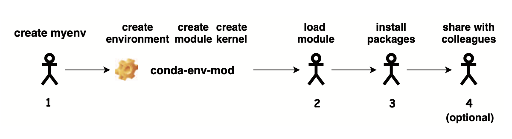

# conda-env-mod

## Introduction
`conda-env-mod` is a tool for simplifying Python package installation on HPC clusters. 

Due to limited user-level permissions on managed clusters, installing and maintaining Python packages becomes a challenging task for novice users. 

`conda-env-mod` was developed by Amiya Maji from Rosen Center for Advanced Computing (RCAC) at Purdue University to use Anaconda environments and environment modules (Lmod) to simplify this process. 

There are three simple steps to install and use python packages using `conda-env-mod`:
1. Create an Anaconda environment using `conda-env-mod`. During the process, the script automatically creates module file for using the environment.
2. Load the module generated by `conda-env-mod`. By default modules are generated in `$HOME/privatemodules`. 
3. Now use `conda` or `pip` to install your Python package. Once the installation finishes, you can directly `import` it in your script.  ***No need to run `conda init` or `conda activate`***.

## Benefits


- Automating environment creation and configuration reduces mistakes
- Module files enable sharing of conda environments
- Automatic kernel creation allows environments to be used in Jupyter notebooks

## Usage
```
conda-env-mod <subcommand> <required argument> [optional argument(s)]
```

### Subcommands
- **create**: Create an environment.  Must specify env_name or env_path.
- **delete**: Delete an existing environment.  Must specify env_name or env_path.
- **module**: Create a module file for an existing environment.  Must specify env_name or env_path.
- **kernel**: Create a Jupyter kernel for an existing environment.  Must specify env_name or env_path.
- **help**:   Display brief usage information.

### Step1: Load modules

To use `conda-env-mod` , users must load one of the anaconda modules first.


```
$ module avail anaconda

--------------------- /opt/shared/Modules/modulefiles-rhel6 ------------------------------------------
   anaconda/2  anaconda/3

-------------------- /cluster/tufts/hpc/tools/module --------------------------------------------------
anaconda/bio35  anaconda/2020.02   anaconda/2021.05   anaconda/2021.11   anaconda/2023.07.tuftsai   anaconda/2024.06-py312 (D)

$ module load anaconda/2024.06-py312
$ module load conda-env-mod
```

### Step 2: Create a conda environment

Users can use the `conda-env-mod`  to create an empty conda environment. It needs either a name or a path for the desired environment. After the environment is created, it generates a module file for using it in future. Detailed instructions for using `conda-env-mod` can be found with the command `conda-env-mod --help`.


#### Create a conda environment with -n

```shell-session
$ conda-env-mod create -n myenv
```


#### Create a conda environment with -p

This will create a conda environment to a custom directory. 

```shell-session
$ conda-env-mod create -p /cluster/tufts/mylab/$USER/condaenv/myenv
```