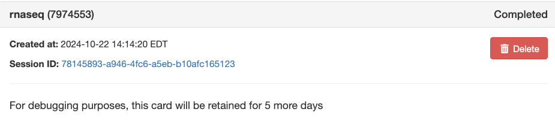

# Running nf-core/rnaseq pipeline on Tufts HPC

Author: Shirley Li

Email: xue.li37@tufts.edu

## Introduction to nf-core/rnaseq 

[nf-core/rnaseq](https://nf-co.re/rnaseq/3.16.0/) is a bioinformatics pipeline that can be used to analyse RNA sequencing data obtained from organisms with a reference genome and annotation. It takes a samplesheet and FASTQ files as input, performs quality control (QC), trimming and (pseudo-)alignment, and produces a gene expression matrix and extensive QC report.


## Create the working directory


```
mkdir -p /cluster/tufts/workshop/demo/rnaseq  
# Change the working directory to your own, DO NOT USE home directory
```


## Prepare Input files

- fastq files: `/cluster/tufts/workshop/demo/rnaseq/input/fastq/`

  ```
  -rw-r--r-- 1 xli37 workshop 3.6G Oct 22 13:39 SRX1693954_SRR3362664_2.fastq.gz
  -rw-r--r-- 1 xli37 workshop 3.7G Oct 22 13:39 SRX1693954_SRR3362664_1.fastq.gz
  -rw-r--r-- 1 xli37 workshop 3.6G Oct 22 13:41 SRX1693953_SRR3362663_2.fastq.gz
  -rw-r--r-- 1 xli37 workshop 3.8G Oct 22 13:41 SRX1693953_SRR3362663_1.fastq.gz
  -rw-r--r-- 1 xli37 workshop 3.4G Oct 22 13:42 SRX1693951_SRR3362661_2.fastq.gz
  -rw-r--r-- 1 xli37 workshop 3.5G Oct 22 13:42 SRX1693951_SRR3362661_1.fastq.gz
  -rw-r--r-- 1 xli37 workshop 4.1G Oct 22 13:44 SRX1693952_SRR3362662_1.fastq.gz
  -rw-r--r-- 1 xli37 workshop 4.0G Oct 22 13:44 SRX1693952_SRR3362662_2.fastq.gz
  -rw-r--r-- 1 xli37 workshop 4.2G Oct 22 13:46 SRX1693956_SRR3362666_2.fastq.gz
  -rw-r--r-- 1 xli37 workshop 4.3G Oct 22 13:46 SRX1693956_SRR3362666_1.fastq.gz
  -rw-r--r-- 1 xli37 workshop 4.5G Oct 22 13:46 SRX1693955_SRR3362665_1.fastq.gz
  -rw-r--r-- 1 xli37 workshop 4.3G Oct 22 13:46 SRX1693955_SRR3362665_2.fastq.gz
  ```

  The raw fastq files were downloaded using `fetchngs` pipeline, you can refer to the our [previous workshop material](https://tuftsdatalab.github.io/tuftsWorkshops/2024_workshops/nfcore_rnaseq_sp24/01_fetchngs/) to learn the details. 


For conducting RNAseq analysis, we also need the reference genome `fasta` file and `gtf` annotation file. Since these are human samples, we require the human reference genome. We can obtain the human reference genome from public databases such as [Ensembl](https://useast.ensembl.org/Homo_sapiens/Info/Index) or [UCSC genome browser](https://hgdownload.soe.ucsc.edu/goldenPath/hg38/bigZips/genes/).


- reference genome: fastq file (We do not need to download it locally)

  ```
  https://ftp.ensembl.org/pub/release-111/fasta/homo_sapiens/dna/Homo_sapiens.GRCh38.dna.primary_assembly.fa.gz
  ```

- reference genome annotation: gtf file

  ```
  https://ftp.ensembl.org/pub/release-111/gtf/homo_sapiens/Homo_sapiens.GRCh38.111.gtf.gz
  ```

!!! note "No need to download reference files locally"

    Many bioinformatics tools and workflows allow for cloud-based or remote server access, which can pull data directly from URLs like the Ensembl FTP site. This is especially useful when you have limited local storage or want to ensure you're always using the most updated version.
    
    **Adjust it to other organisms or different versions as needed for your analysis.**

## Prepare the input samplesheet

Let's create a `samplesheet.csv` to store the input sample information. 

There are two ways to create this file. 

1. Manually create and edit the file on Open OnDemand. 
2. Use [VI editor](https://www.redhat.com/sysadmin/introduction-vi-editor) to create and edit the file on command-line interface. 


Once your created this file, use `cat` to check the contents. Please remember the path where the samplesheet is stored, you will need this as input for nf-core/rnaseq pipeline. 

```
cat /cluster/tufts/workshop/demo/rnaseq/samplesheet.csv
```

```
sample,fastq_1,fastq_2,strandedness
GFPkd_1,/cluster/tufts/workshop/demo/rnaseq/input/fastq/SRX1693954_SRR3362664_1.fastq.gz,/cluster/tufts/workshop/demo/rnaseq/input/fastq/SRX1693954_SRR3362664_2.fastq.gz,auto
GFPkd_2,/cluster/tufts/workshop/demo/rnaseq/input/fastq/SRX1693953_SRR3362663_1.fastq.gz,/cluster/tufts/workshop/demo/rnaseq/input/fastq/SRX1693953_SRR3362663_2.fastq.gz,auto
GFPkd_3,/cluster/tufts/workshop/demo/rnaseq/input/fastq/SRX1693951_SRR3362661_1.fastq.gz,/cluster/tufts/workshop/demo/rnaseq/input/fastq/SRX1693951_SRR3362661_2.fastq.gz,auto
PRMT5kd_1,/cluster/tufts/workshop/demo/rnaseq/input/fastq/SRX1693952_SRR3362662_1.fastq.gz,/cluster/tufts/workshop/demo/rnaseq/input/fastq/SRX1693952_SRR3362662_2.fastq.gz,auto
PRMT5kd_2,/cluster/tufts/workshop/demo/rnaseq/input/fastq/SRX1693956_SRR3362666_1.fastq.gz,/cluster/tufts/workshop/demo/rnaseq/input/fastq/SRX1693956_SRR3362666_2.fastq.gz,auto
PRMT5kd_3,/cluster/tufts/workshop/demo/rnaseq/input/fastq/SRX1693955_SRR3362665_1.fastq.gz,/cluster/tufts/workshop/demo/rnaseq/input/fastq/SRX1693955_SRR3362665_2.fastq.gz,auto
```


## nf-core/rnaseq on Open OnDemand


### Open OnDemand Arguments

- Number of hours: 24

- Select cpu partition: batch

- Reservation for class, training, workshop: Default

- Version: 3.16.0

- Working Directory: `/cluster/tufts/workshop/demo/rnaseq/` 

- outdir: `/cluster/tufts/workshop/demo/rnaseq/out/` 

- input: `/cluster/tufts/workshop/demo/rnaseq/samplesheet.csv`

- multiqc_title: PRMT5kd vs. GFPkd

- iGenomes: None                                # We do not recommend to use iGenomes, they are outdated. 

- fasta: https://ftp.ensembl.org/pub/release-111/fasta/homo_sapiens/dna/Homo_sapiens.GRCh38.dna.primary_assembly.fa.gz

- gtf: https://ftp.ensembl.org/pub/release-111/gtf/homo_sapiens/Homo_sapiens.GRCh38.111.gtf.gz

- trimmer: trimgalore

- aligner: star_salmon

- save_reference: true

- skip_umi_extract: true

- skip_pseudo_alignment: true

- skip_stringtie: true

  
Monitor job status       
Click session ID and then view `output.log` file


```
Script starting...
Generating connection YAML file...
This is a fresh run
You are not using Nextflow Tower

Currently Loaded Modules:
  1) java/15.0.2        3) squashfs/4.4        5) nf-core/2.14.1
  2) nextflow/23.10.0   4) singularity/3.8.4

 

nextflow run /cluster/tufts/biocontainers/nf-core/pipelines/nf-core-rnaseq/3.16.0/3_16_0 -params-file nf-params.json -profile tufts --partition batch
Nextflow 24.04.4 is available - Please consider updating your version to it
N E X T F L O W  ~  version 23.10.0
Launching `/cluster/tufts/biocontainers/nf-core/pipelines/nf-core-rnaseq/3.16.0/3_16_0/main.nf` [deadly_knuth] DSL2 - revision: f68f604b04
WARN: Access to undefined parameter `monochromeLogs` -- Initialise it to a default value eg. `params.monochromeLogs = some_value`


------------------------------------------------------
                                        ,--./,-.
        ___     __   __   __   ___     /,-._.--~'
  |\ | |__  __ /  ` /  \ |__) |__         }  {
  | \| |       \__, \__/ |  \ |___     \`-._,-`-,
                                        `._,._,'
  nf-core/rnaseq v3.16.0
------------------------------------------------------
Core Nextflow options
  runName                   : deadly_knuth
  containerEngine           : singularity
  launchDir                 : /cluster/tufts/workshop/demo/rnaseq
  workDir                   : /cluster/tufts/workshop/demo/rnaseq/work
  projectDir                : /cluster/tufts/biocontainers/nf-core/pipelines/nf-core-rnaseq/3.16.0/3_16_0
  userName                  : xli37
  profile                   : tufts
  configFiles               : 

Input/output options
  input                     : /cluster/tufts/workshop/demo/rnaseq/samplesheet.csv
  outdir                    : /cluster/tufts/workshop/demo/rnaseq/out/
  multiqc_title             : PRMT5kd_vs_GFPkd

Reference genome options
  fasta                     : https://ftp.ensembl.org/pub/release-111/fasta/homo_sapiens/dna/Homo_sapiens.GRCh38.dna.primary_assembly.fa.gz
  gtf                       : https://ftp.ensembl.org/pub/release-111/gtf/homo_sapiens/Homo_sapiens.GRCh38.111.gtf.gz
  igenomes_base             : /cluster/tufts/biocontainers/datasets/igenomes/

UMI options
  umitools_grouping_method  : unique

Alignment options
  min_mapped_reads          : 5

Optional outputs
  save_reference            : true

Process skipping options
  skip_umi_extract          : true
  skip_pseudo_alignment     : true
  skip_stringtie            : true

Institutional config options
  custom_config_base        : /cluster/tufts/biocontainers/nf-core/pipelines/nf-core-rnaseq/3.16.0/3_16_0/../configs/
  config_profile_description: The Tufts University HPC cluster profile provided by nf-core/configs.
  config_profile_contact    : Yucheng Zhang
  config_profile_url        : https://it.tufts.edu/high-performance-computing

Max job request options
  max_cpus                  : 72
  max_memory                : 120 GB
  max_time                  : 7d

!! Only displaying parameters that differ from the pipeline defaults !!
------------------------------------------------------
If you use nf-core/rnaseq for your analysis please cite:

* The pipeline
  https://doi.org/10.5281/zenodo.1400710

* The nf-core framework
  https://doi.org/10.1038/s41587-020-0439-x

* Software dependencies
  https://github.com/nf-core/rnaseq/blob/master/CITATIONS.md
------------------------------------------------------
WARN: The following invalid input values have been detected:

* --partition: batch
* --config_profile_contact_github: @zhan4429
* --config_profile_contact_email: Yucheng.Zhang@tufts.edu


[-        ] process > NFCORE_RNASEQ:PREPARE_GENOM... -

[-        ] process > NFCORE_RNASEQ:PREPARE_GENOM... -
[-        ] process > NFCORE_RNASEQ:PREPARE_GENOM... -
[-        ] process > NFCORE_RNASEQ:PREPARE_GENOM... -
[-        ] process > NFCORE_RNASEQ:PREPARE_GENOM... -

[-        ] process > NFCORE_RNASEQ:PREPARE_GENOM... -
[-        ] process > NFCORE_RNASEQ:PREPARE_GENOM... -
[-        ] process > NFCORE_RNASEQ:PREPARE_GENOM... -
[-        ] process > NFCORE_RNASEQ:PREPARE_GENOM... -
[-        ] process > NFCORE_RNASEQ:PREPARE_GENOM... -
[-        ] process > NFCORE_RNASEQ:PREPARE_GENOM... -
[-        ] process > NFCORE_RNASEQ:PREPARE_GENOM... -
[-        ] process > NFCORE_RNASEQ:RNASEQ:FASTQ_... -
[-        ] process > NFCORE_RNASEQ:RNASEQ:FASTQ_... -
[-        ] process > NFCORE_RNASEQ:RNASEQ:FASTQ_... -


.
.
.

[64/9877b8] process > NFCORE_RNASEQ:RNASEQ:QUANTI... [100%] 1 of 1 ✔
[75/ba92e4] process > NFCORE_RNASEQ:RNASEQ:QUANTI... [100%] 1 of 1 ✔
[d2/6912c4] process > NFCORE_RNASEQ:RNASEQ:QUANTI... [100%] 1 of 1 ✔
[16/06771e] process > NFCORE_RNASEQ:RNASEQ:QUANTI... [100%] 1 of 1 ✔
[28/384ace] process > NFCORE_RNASEQ:RNASEQ:DESEQ2... [100%] 1 of 1 ✔
[8f/c84523] process > NFCORE_RNASEQ:RNASEQ:BAM_MA... [100%] 6 of 6 ✔
[d2/ed264c] process > NFCORE_RNASEQ:RNASEQ:BAM_MA... [100%] 6 of 6 ✔
[e6/6724f5] process > NFCORE_RNASEQ:RNASEQ:BAM_MA... [100%] 6 of 6 ✔
[d8/656f2c] process > NFCORE_RNASEQ:RNASEQ:BAM_MA... [100%] 6 of 6 ✔
[85/b2e2de] process > NFCORE_RNASEQ:RNASEQ:BAM_MA... [100%] 6 of 6 ✔
[d6/66075d] process > NFCORE_RNASEQ:RNASEQ:SUBREA... [100%] 6 of 6 ✔
[40/754888] process > NFCORE_RNASEQ:RNASEQ:MULTIQ... [100%] 6 of 6 ✔
[26/3aa9ff] process > NFCORE_RNASEQ:RNASEQ:BEDTOO... [100%] 6 of 6 ✔
[ec/03ad32] process > NFCORE_RNASEQ:RNASEQ:BEDTOO... [100%] 6 of 6 ✔
[cd/237c01] process > NFCORE_RNASEQ:RNASEQ:BEDGRA... [100%] 6 of 6 ✔
[0a/60f7b2] process > NFCORE_RNASEQ:RNASEQ:BEDGRA... [100%] 6 of 6 ✔
[83/5dc39e] process > NFCORE_RNASEQ:RNASEQ:BEDGRA... [100%] 6 of 6 ✔
[c2/1382f2] process > NFCORE_RNASEQ:RNASEQ:BEDGRA... [100%] 6 of 6 ✔
[79/856cc8] process > NFCORE_RNASEQ:RNASEQ:QUALIM... [100%] 6 of 6 ✔
[a6/749287] process > NFCORE_RNASEQ:RNASEQ:DUPRAD... [100%] 6 of 6 ✔
[21/bbeca0] process > NFCORE_RNASEQ:RNASEQ:BAM_RS... [100%] 6 of 6 ✔
[98/6266fd] process > NFCORE_RNASEQ:RNASEQ:BAM_RS... [100%] 6 of 6 ✔
[bc/8c3167] process > NFCORE_RNASEQ:RNASEQ:BAM_RS... [100%] 6 of 6 ✔
[01/736952] process > NFCORE_RNASEQ:RNASEQ:BAM_RS... [100%] 6 of 6 ✔
[a0/511c10] process > NFCORE_RNASEQ:RNASEQ:BAM_RS... [100%] 6 of 6 ✔
[33/979a09] process > NFCORE_RNASEQ:RNASEQ:BAM_RS... [100%] 6 of 6 ✔
[71/9d4406] process > NFCORE_RNASEQ:RNASEQ:BAM_RS... [100%] 6 of 6 ✔
[fc/54e093] process > NFCORE_RNASEQ:RNASEQ:MULTIQ... [100%] 1 of 1 ✔
-[nf-core/rnaseq] Pipeline completed successfully -
Completed at: 22-Oct-2024 17:20:09
Duration    : 3h 5m 33s
CPU hours   : 136.4
Succeeded   : 214


Cleaning up...
```

## nf-core/rnaseq on the command line interface

If you prefer to run the pipelines using the command line interface, you can submit a slurm jobscript with the following code.

#### Run the pipeline using `nextflow run`. 

```
#!/bin/bash
#SBATCH --time=24:00:00
#SBATCH -p batch
#SBATCH -N 1
#SBATCH -n 1
#SBATCH -c 2
#SBATCH --output=MyJob.%j.%N.out
#SBATCH --error=MyJob.%j.%N.err
#SBATCH --mail-type=ALL
#SBATCH --mail-user=utln@tufts.edu

module load nf-core
export NXF_SINGULARITY_CACHEDIR=/cluster/tufts/biocontainers/nf-core/singularity-images

nextflow run /cluster/tufts/biocontainers/nf-core/pipelines/nf-core-rnaseq/3.16.0/3_16_0
  -profile tufts \
  --input  /cluster/tufts/workshop/demo/rnaseq/samplesheet.csv \
  --outdir /cluster/tufts/workshop/demo/rnaseq/out/ \
  --gtf "https://ftp.ensembl.org/pub/release-111/gtf/homo_sapiens/Homo_sapiens.GRCh38.111.gtf.gz" \
  --fasta "https://ftp.ensembl.org/pub/release-111/fasta/homo_sapiens/dna/Homo_sapiens.GRCh38.dna.primary_assembly.fa.gz" \
  --extra_trimgalore_args "-q 35 --paired" \
  --skip_pseudo_alignment \
  --save_reference
```

#### Run the pipeline using our modules.

```
#!/bin/bash
#SBATCH --time=24:00:00
#SBATCH -p batch
#SBATCH -N 1
#SBATCH -n 1
#SBATCH -c 2
#SBATCH --output=MyJob.%j.%N.out
#SBATCH --error=MyJob.%j.%N.err
#SBATCH --mail-type=ALL
#SBATCH --mail-user=utln@tufts.edu

module load nf-core-rnaseq/3.16.0
rnaseq -profile tufts \
  --input  /cluster/tufts/workshop/demo/rnaseq/samplesheet.csv \
  --outdir /cluster/tufts/workshop/demo/rnaseq/out/ \
  --gtf "https://ftp.ensembl.org/pub/release-111/gtf/homo_sapiens/Homo_sapiens.GRCh38.111.gtf.gz" \
  --fasta "https://ftp.ensembl.org/pub/release-111/fasta/homo_sapiens/dna/Homo_sapiens.GRCh38.dna.primary_assembly.fa.gz" \
  --extra_trimgalore_args "-q 35 --paired" \
  --skip_pseudo_alignment \
  --save_reference
```


## Nextflow clean

### Clean the work

You can clean the `work` directory, by mannualy run

```
rm -rf work
```


## Next Step

For differential abundance analysis, please refer to our previous tutorial on [nf-core/differentialabundance pipeline](https://tuftsdatalab.github.io/tuftsWorkshops/2024_workshops/nfcore_rnaseq_sp24/03_differentialabundance/). 
