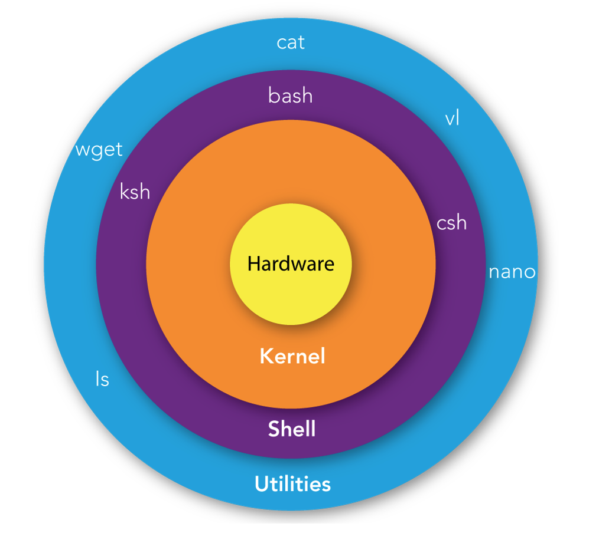

# Introduction to Linux/Unix 

## What is Unix?

Unix is a powerful, multiuser, multitasking operating system that was originally developed in the 1960s and 1970s at **Bell Labs** by **Ken Thompson**, **Dennis Ritchie**, and others. It has since become one of the most influential operating systems in the history of computing, serving as the foundation for many modern operating systems, including Linux, macOS, and various BSDs.


**Dennis Ritchie** is also the creator of C. 


## Key features

- **Multiuser**: Unix allows multiple users to access the system simultaneously, each with their own environment, files, and processes.
- **Multitasking**:  Unix is capable of running multiple processes at the same time. This means that it can handle several tasks concurrently, like running applications, performing background tasks, and processing commands.
- **Hierarchical File System**: Unix uses a hierarchical file system structure, where files are organized in directories (folders), starting from a root directory (/). 
- **Simple and Consistent Interface:** Unix provides a command-line interface (CLI) where users interact with the system by typing commands. The Unix philosophy emphasizes small, simple, and modular commands that can be combined in scripts to perform complex tasks.

## What is Linux?

Linux is a free, open-source, and Unix-like operating system kernel that was originally created by **Linus Torvalds** in 1991. Over time, Linux has grown into a full-fledged operating system used worldwide across various types of devices, from servers and desktop computers to smartphones and embedded systems.


**Popular Linux Distributions:**


​	•	**Ubuntu:** A user-friendly distribution popular for desktop and server use, based on Debian.

​	•	**Fedora:** A cutting-edge distribution often used by developers and those who want the latest features.

​	•	**Debian:** Known for its stability and extensive software repositories, often used in server environments.

​	•	**CentOS/AlmaLinux/Rocky Linux:** Enterprise-grade distributions derived from Red Hat Enterprise Linux (RHEL).

​	•	**Arch Linux:** A rolling release distribution known for its simplicity and customization, aimed at advanced users.

​	•	**Kali Linux:** A distribution designed for penetration testing and security research.

## Shell

**Shell** is like a translator and bridge between you and the operating system's core, the **kernel**. It takes the commands you type and interprets them, telling the kernel what actions to perform. 




## Everything is a file

**A file is an addressable location that contains some data which can take many forms.**

- Text data 

- Binary/Image data

**Files have associated meta-data** 

- Owner

- Group

- Timestamps

- Permission

- Read(r)

- Write (w)

- Execute(x)

### File permissions


### File names

- **Case-sensitive:** "myfile.txt" is different from "MyFile.txt".

- **Hidden files**: Filenames starting with a dot (.) are hidden by default.

- **File extensions:** Not mandatory, but using them helps identify file types.

- **Spaces**: Allowed but not recommended, use `_` or `–` instead.

#### Best practices of file names

- Keep names descriptive and concise.

- Use **lowercase** for consistency.

- Avoid special characters unless necessary.

- Stick to alphanumeric characters, underscores, and hyphens.


### File organization

Everything is mounted to the root directory 

Files are referred to by their location called the **path** 

- Absolute Path (From the root) 
  - /cluster/tufts/pi01/user01

- Relative Path (From my current location)
  - user01/file01


## Must-known Linux/Unix tools

###  **File and Directory Management**

#### pwd: print the current working directory

```
[yzhang85@login-prod-02 ~]$ pwd
/cluster/home/yzhang85
[yzhang85@login-prod-02 ~]$ cd /cluster/tufts/rt/yzhang85/
[yzhang85@login-prod-02 yzhang85]$ pwd
/cluster/tufts/rt/yzhang85
```

#### cd: change directory

Usage: cd [directory]

If a directory is not supplied as an argument, it will default to your home directory. 

```
[yzhang85@login-prod-02 yzhang85]$ pwd
/cluster/tufts/rt/yzhang85
[yzhang85@login-prod-02 yzhang85]$ cd ..
[yzhang85@login-prod-02 rt]$ pwd
/cluster/tufts/rt
[yzhang85@login-prod-02 rt]$ cd 
[yzhang85@login-prod-02 ~]$ pwd
/cluster/home/yzhang85
```


If a directory is not supplied as an argument, it will default to your home directory. 

 #### mkdir: create new directory

**Usage:** mkdir [options] dir_name

Common option:

​	-p: Creates parent directories if they don't exist.

#### **mv:** move a file/directory to a new location or rename it

**Usage:** mv [options] source destination

Common option:

- -i: Prompts for confirmation before overwriting an existing file. Useful to avoid accidental data loss.- 
- -f: Forces the operation without prompting, even if an existing file would be overwritten. Use with caution!

#### **cp:** **copy a file/directory**

**Usage:** cp [options] source destination

Common option:

- -r:  To copy directory

#### **rm:** **remove files/directories**

**Usage:** rm [options] file/directory …

Can delete multiple files

Common option:

- **-r:** Deletes recursively any file and subdirectories contained within the given directory


### **File Viewing and Manipulation**

####  **cat:** **Catenate files (joins their contents)**

**Usage:** cat [options] file1 file2 …

Common option:

- **-n:** tells cat to **number each line of the output**. This is helpful for debugging scripts.

#### **head/tail**: Displays the beginning/end of a file

**Usage:** head/tail [options] file

Common option:

- **-n** [number]: Specifies the number of lines to display (default: 10).

#### **less/more**: View the content of a file page by page

```
less largefile.txt
more largefile.txt
```

#### cut: Extract sections from each line of files

```
cut -f1,3 -d, file.csv ##(Extract columns 1 and 3 from a comma-separated file)
```

#### sort: Sort lines of text files

```
sort file.txt
```

#### uniq: Report or filter out repeated lines in a file.

```
sort file.txt | uniq
```


#### **grep:** **Extracting lines matching (not matching) a pattern**

**Usage:** grep [options] PATTERN file

Common option:

- **-i**: ignore cases

- **-v**: select non-matching lines.

- **-A NUM:** Print **NUM** lines of trailing context after matching lines.

- **-B NUM:** Print **NUM** lines of leading context before matching lines.


#### sed: Stream editor for modifying file content

#### join


### **Data Compression and Archiving**

#### gzip**/**gunzip: Compress and decompress files.

```
gzip file.txt
```

#### tar: Archive multiple files into one or extract them.

```
tar -cvf archive.tar directory/ ## Create an archive
tar -xvf archive.tar ## Extract an archive
```

### 

### Other useful tools

### **Redirection:** >, >>, <

- `>`: Overwrites the contents of a file with the command's output

 	`cat file1 file2 > files`

- `>>`: Appends the output to the end of an existing file

​        `cat file3 >> files`

- `<`: Uses the contents of a file as input to a command

​	`sort < names.txt`

#### Pipe: |

Pipes in Linux are a powerful feature that allows you to connect the output of one command directly as the input to another command. This is a key concept in Unix/Linux philosophy, which promotes the use of small, modular tools that can be combined to perform complex tasks.

A pipe is represented by the `|` symbol. When you place a pipe between two commands, the standard output (`stdout`) of the command on the left of the pipe becomes the standard input (`stdin`) for the command on the right.

##### Syntax

```
command1 | command2
```


```
sort file.txt | uniq
```

​	•	sort file.txt: Sorts the lines in file.txt.

​	•	uniq: Removes duplicate lines from the sorted output.


#### Wildcards: selecting multiple files/directories based on patterns

- *****: Represents zero or more characters.

 		*.fastq.gz  matches all fastq.gz files

- **?**: Represents a single character.

 		file?.txt matches "file1.txt", "fileA.txt", but not "file12.txt".

- **[]**: Represents a single character within a specified range or set.

​		 [abc]at matches "bat", "cat", or "aat”.

- **[0-9]** matches any single digit.

### Alias

An alias in Linux is a custom shortcut or abbreviation for a command or a series of commands. Once defined, you can use the alias in place of the original command.

#### Creating an alias

To create an alias, use the alias command followed by the name you want to give the alias and the command it should execute.

```
alias alias_name='command'
```

#### Example

```
alias ll='ls -l'
alias la='ls -a'
alias mav='module avail'
alias ml='module load'
```

#### Using alias

```
[yzhang85@login-prod-03 MPI]$ ll
total 31
-rwxrwx--- 1 yzhang85 yzhang85 16256 May 16 07:57 hello_mpi*
-rw-rw---- 1 yzhang85 yzhang85   731 May 16 07:56 hello_mpi.c
-rwxrwxr-x 1 yzhang85 yzhang85  8392 Dec 23  2023 hello_world*
-rwxrwxr-x 1 yzhang85 yzhang85   731 Oct 31  2023 hello_world.c*
-rwxrwxr-x 1 yzhang85 yzhang85  4053 Oct 31  2023 mpi_hello_world.c*

[yzhang85@login-prod-03 MPI]$ mav blast
-------------------------------- /opt/shared/Modules/modulefiles-rhel6 --------------------------
   blast/2.2.24    blast/2.2.31    blast/2.3.0    blast/2.8.1

------------------------------- /cluster/tufts/hpc/tools/module ---------------------------------
   blast-plus/2.11.0    ncbi-magicblast/1.5.0

------------------------------- /cluster/tufts/biocontainers/modules -----------------------------
   blast/2.15.0 (D)

  Where:
   D:  Default Module
```


### ln -s: softlink


## Advanced Linux/Unix tools

### Awk

Awk is a powerful text-processing tool in Unix/Linux that allows you to manipulate and analyze text files and streams. It’s named after its creators (Aho, Weinberger, and Kernighan) and is commonly used for pattern scanning, processing, and reporting.

#### Syntax

```
awk 'pattern { action }' file
```

- **pattern**: A condition or regular expression that decides which lines are selected for processing. Patterns are  similar to  `if` statements in other languages: if the pattern’s expression evaluates to true or the regular expression matches, the statements inside **action** will run. **If we omit the pattern, Awk will run the action on all records**.

- **action**: Commands to be executed on the selected lines. **If we omit the action but specify a pattern, Awk will print all records that match the pattern**. 

- **file**: The text file to be processed.

  

  Awk processes input data a record at a time. Each record is composed of fields, separate chunks that awk automatically separates. Because awk was designed to work with `tabular data` each record is a line, and each field is a column’s entry for that record. The clever part about awk is that it automatically assigns the entire record to the variable `$0`, and field one’s value is assigned to `$1`, field two’s value is assigned to `$2`, field three’s value is assigned to `$3`, and so forth.	


#### Example

```
$ head -n 6 
gene_id	baseMean	log2FoldChange	lfcSE	pvalue	padj
ENSG00000000003	782.8404	-0.06662793	0.05691688	0.2130615	0.3800412
ENSG00000000419	746.4319	-0.1265914	0.06250695	0.02873058	0.07811519
ENSG00000000457	100.9565	0.1006396	0.14143475	0.3202419	0.5071726
ENSG00000000460	307.3198	0.1057537	0.08803984	0.1649367	0.3151837
ENSG00000000971	263.8175	-1.865821	0.11722751	6.524737e-59	4.470018e-57

$ awk 'BEGIN { FS="\t"; OFS="\t" } $6 < 0.05 && $3 > 1 { print $1, $3, $6 }' deseq2.results.tsv 
```

- **BEGIN { FS="\t"; OFS="\t" }**: Sets the input (`FS`) and output (`OFS`) field separators to tab (`\t`) since your file is a TSV (tab-separated values).

- **$6 < 0.05 && $3 > 1**: Filters rows where the padj (6th column) is less than 0.05 and the log2FoldChange (3rd column) is greater than 1.

- **{ print $1, $3, $6 }**: Prints the gene_id (1st column), log2FoldChange (3rd column), and padj (6th column).


## Loops

### for

### while

### if


### GNU Parallel

