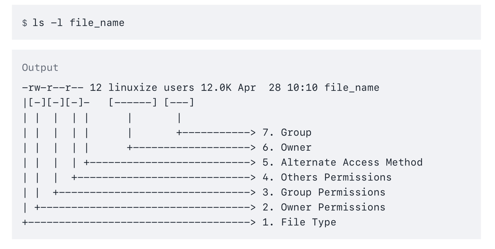
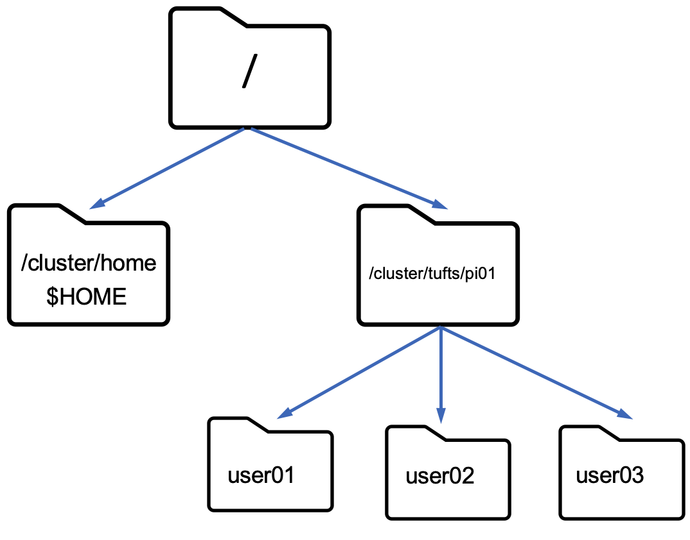

# Files and File system

## Everything is a file
**A file is an addressable location that contains some data which can take many forms.**

- Text data 

- Binary/Image data

**Files have associated meta-data** 

- Owner

- Group

- Timestamps

- Permission

- Read(r)

- Write (w)

- Execute(x)

## File permissions

## File names

- **Case-sensitive:** "myfile.txt" is different from "MyFile.txt".

- **Hidden files**: Filenames starting with a dot (.) are hidden by default.

- **File extensions:** Not mandatory, but using them helps identify file types.

- **Spaces**: Allowed but not recommended, use `_` or `–` instead.

### Best practices of file names
 
- Keep names descriptive and concise.

- Use **lowercase** for consistency.

- Avoid special characters unless necessary.

- Stick to alphanumeric characters, underscores, and hyphens.

## File organization
Everything is mounted to the root directory 

Files are referred to by their location called the **path** 

- Absolute Path (From the root) 
  - /cluster/tufts/pi01/user01

- Relative Path (From my current location)
  - user01/file01

