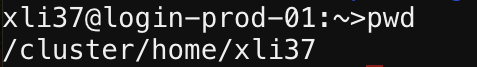
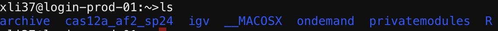
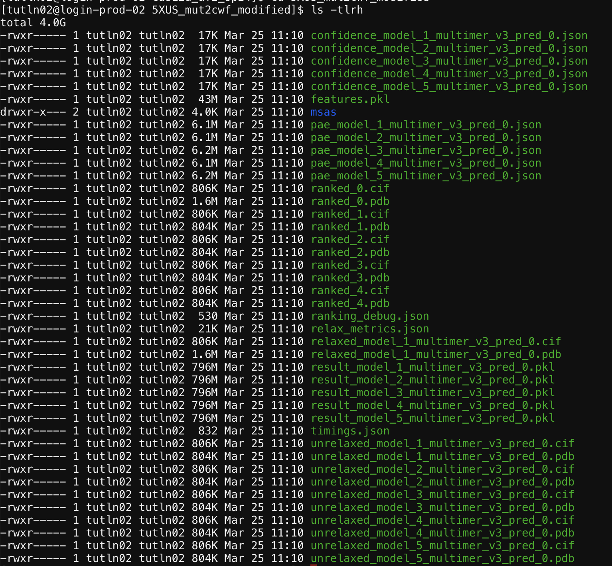

# Run AlphaFold2 on Tufts HPC with Command Line Interface (CLI)     
This tutorial will guide the reader through the process of running AlphaFold2 on the Tufts High Performance Computing (HPC) system using the command line interface.


## Prerequisites
- [Access to Tufts HPC](https://tufts.qualtrics.com/jfe/form/SV_5bUmpFT0IXeyEfj).
- [Basic familiarity with Unix/Linux command line](https://it.tufts.edu/file/introduction-basic-linux).
- [Basic familiarity with modules: Understanding how to load and unload software modules in a Unix/Linux environment](https://tufts.app.box.com/v/Pax-User-Guide). 


## Navigate To The Cluster and prepare the input file 
Navigate to: [https://ondemand.pax.tufts.edu/](https://ondemand.pax.tufts.edu/)

- Log in with your Tufts credentials
- On the top menu bar choose `Clusters->Tufts HPC Shell Access`     
- Type `pwd` to check your current directory. You should be at your home directory, which is listed as `/cluster/home/your_utln/`
 
- Type `ls` to list the files in your current directory.      
- Copy the example folder and data to your home directory by following command           
    ```bash
    cp -r /cluster/tufts/bio/tools/training/cas12a_af2_sp24/ ./ 
    ```
- Type `ls` to list the files in your current directory after copying the files.       
    


## Prepare your input data          
Input data for AlphaFold2 typically includes the amino acid sequences of the proteins you wish to model.    

Your input data should be located here: `/cluster/home/your_utln/cas12a_af2_sp24/5XUS_mut2cwf_modified.fasta`    
*Remember to replace `your_utln` with your own tufts credentia*


## Executing AlphaFold2     
Run AlphaFold2 using a command that specifies your input files, output directory, and other parameters. An example script is provided [here]()     

*Remember to edit the script before you submit it to the queue*    
You will need to replace the path to your own path.

To submit your job to gpu node, type the following command     
```
sbatch /cluster/home/your_utln/cas12a_af2_sp24/script/runaf.sh
```

## Check the results      
**ranked_0.pdb** is your best predicted structure.
This file contains the highest-ranked prediction based on the analysis, indicating it is considered the most accurate or reliable structure prediction from the set of models used.     
```
cd /cluster/home/your_utln/cas12a_af2_sp24/out/
```
       


> [!NOTE]
> If you encounter any issues or this doesn't work as expected, please feel free to reach out to Shirley Li, xue.li37@tufts.edu   
