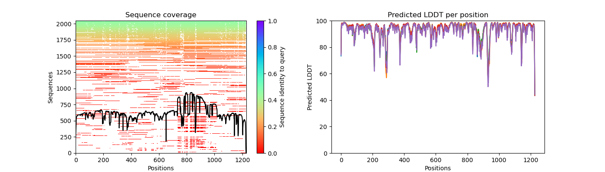

# Run AlphaFold2 on Tufts HPC with Open OnDemand App           
This tutorial will guide the reader through the process of running AlphaFold2 on the Tufts High Performance Computing (HPC) system using open ondemand app.    

## Prerequisites
- [Access to Tufts HPC](https://tufts.qualtrics.com/jfe/form/SV_5bUmpFT0IXeyEfj).


## Navigate To The Cluster and prepare the input file 
Navigate to: [https://ondemand.pax.tufts.edu/](https://ondemand.pax.tufts.edu/)

- Log in with your Tufts credentials
- On the top menu bar choose `Clusters->Tufts HPC Shell Access`     
- Type `pwd` to check your current directory. You should be at your home directory, which is listed as `/cluster/home/your_utln/`
 
- Type `ls` to list the files in your current directory.      
- Copy the example folder and data to your home directory by following command           
    ```bash
    cp -r /cluster/tufts/bio/tools/training/cas12a_af2_sp24/ ./ 
    ```
- Type `ls` to list the files in your current directory after copying the files.       
    


## Prepare your input data          
Input data for AlphaFold2 typically includes the amino acid sequences of the proteins you wish to model.    

Your input data should be located here: `/cluster/home/your_utln/cas12a_af2_sp24/5XUS_mut2cwf_modified.fasta`    
*Remember to replace `your_utln` with your own tufts credentia*

## Run AlphaFold2     
### Navigate to: [https://ondemand.pax.tufts.edu/](https://ondemand.pax.tufts.edu/)

- Log in with your Tufts credentials
- On the top menu bar choose `Bioinformatics Apps->AlphaFold`   


### Enter the following parameters to run the job.    
- `Number of hours: 24`     
- `Number of cores: 8`    
- `Amount of memory: 32GB`   
- `Select preempt or normal gpu partition: gpu`   
- `Select the GPU type: a100`    
- `Software Version: 2.3.2`   
- `Database: 20231031`   
- `Working Directory: /cluster/home/your_utln/cas12a_af2_sp24/`
- `Output directory Name: /cluster/home/your_utln/cas12a_af2_sp24/`    
- `fasta_paths: /cluster/home/your_utln/cas12a_af2_sp24/5XUS_mut2cwf_modified.fasta`
- `model_preset: multimer`
- `models_to_relax: best`  
- `num_multimer_predictions_per_model: 1`
- `max_template_date: 2020-01-01` 
Then, hit `launch`   


### Check output files         
Go back to the main page of open ondemand, on the top menu bar choose `Files -> Home Directory`     
Click `cas12a_af2_sp24`, then click `5XUS_mut2cwf_modified`, you will see the output
    

Here's the explanation of the file categories listed:

- JSON Files (*confidence_model & pae_model*): Predictive data files from different models, indicating confidence levels and pairwise alignment errors.
- Pickle File (*features.pkl*): Serialized file containing features used for model prediction.
Directory (*msas*): A folder containing multiple sequence alignments related to the analysis.
- CIF & PDB Files (*ranked_, relaxed_model_, unrelaxed_model_*): Structural data files in two formats, showing the ranked and modelled protein structures, both relaxed and unrelaxed.
- JSON Files (*ranking_debug.json, relax_metrics.json, timings.json*): Debugging, metrics, and timing information for the analysis process.
- Pickle Files (*result_model_*): Serialized files containing comprehensive results from each model prediction.

**`ranked_0.pdb` is your best predicted structure.**           
This file contains the highest-ranked prediction based on the analysis, indicating it is considered the most accurate or reliable structure prediction from the set of models used.


## AlphaFold2 Accuracy Assessment   
> !NOTE    
> To continue with this section, you will need to know some linux basics. More information can be found [here](https://it.tufts.edu/file/introduction-basic-linux).     

We can assess the accuracy of the AlphaFold prediction using:

- **Predicted Local Distance Difference Test (pLDDT)**
- **Predicted Alignment Error**

### Predicted Local Distance Difference Test (pLDDT)

- per-residue confidence metric  ranging from 0-100 (100 being the highest confidence)
- Regions below 50 could indicate disordered regions


### Predicted Alignment Error (PAE)

- The Predicted Alignment Error (PAE) gives us an expected distance error based on each residue.
- If we are more confident that the distance between two residues is accurate, then the PAE is lower (darker green). If we are less confident that the distance between two residues is accurate, the PAE is higher (lighter green)


### Navigate To The Cluster

- Now that we have an idea of what these metrics mean, let's try generating these plots for the Cas12a-CWF mutant on the cluster. First navigate to: [https://ondemand.pax.tufts.edu/](https://ondemand.pax.tufts.edu/)

- Log in with your Tufts credentials
- On the top menu bar choose `Clusters->Tufts HPC Shell Access`


- You'll see a welcome message and a bash prompt, for example for user `tutln01`:

```
[tutln01@login001 ~]$
```

- This indicates you are logged in to the login node of the cluster. Please **do not** run any program from the login node.

    
    
### Starting an Interactive Session

- To run our analyses we will need to move from the login node to a compute node. We can do this by entering:

```bash
srun -p batch --time=3:00:00 -n 2 --mem=4g --pty bash
```

*Explanation of Commands*

    - `srun`: SLURM command to run a parallel job
    - `-p`: asking for a partition, here we are requesting the batch partition
    - `--time`: time we need here we request 3 hours
    - `-n`:  number of CPUs needed here we requested 2
    - `--mem`:  memory we need here we request 4 Gigabytes
    - `--reservation`: the reservation of compute resources to use here we use the `chbe165` reservation
    - `--pty`: get a pseudo bash terminal
    


- When you get a compute node you'll note that your prompt will no longer say login and instead say the name of the node:

```
[tutln01@c1cmp048 ~]$
```

### Set Up For Analysis

- Navigate to the folder that we just ran alphafold with:

```bash
cd /cluster/home/your_utln/cas12a_af2_sp24 
```

- Given that AlphaFold2 can take anywhere from a few hours to a few days to run - AlphaFold2 predictions have already been generated for the Cas12a-CWF mutants from our study. We will use a script from the [VIB Bioinformatics Core](https://elearning.bits.vib.be/courses/alphafold/lessons/alphafold-on-the-hpc/topic/alphafold-outputs/) to visualize the accuracy of AlphaFold2's predictions. First we will need to load the software needed to run that script:


```bash
module load alphafold/2.1.1
```


### Run the python script          
- Now we will need to feed our script three arguments:
    
    - `--input_dir` input directory with model files 
    - `--output_dir` output directory to put our plots of model information
    - `--name` optional prefix to add to our file names


```bash
python script/af2_accuracy_viz.py --input_dir ./5XUS_mut2cwf_modified_prerun --output_dir ./ --name mut2cwf_modified
```


### Check the output files     
- Running this will generate two images in your current directory:

    - `mut2cwf_modified_coverage_LDDT.png` - plots of your msa coverage and pLDDT scores per residue per model
    - `mut2cwf_modified_PAE.png` - plots of your predicted alignment error 

- The following is are the pLDDT and PAE scores for the Cas12a-CWF mutant:    

    `mut2cwf_modified_coverage_LDDT.png`
    

    `mut2cwf_modified_PAE.png` 
    

- You'll note that for the pLDDT plots, that the multiple sequence alignment is plotted with a bar on the side to tell you how similar those sequences were to your query sequence.   

