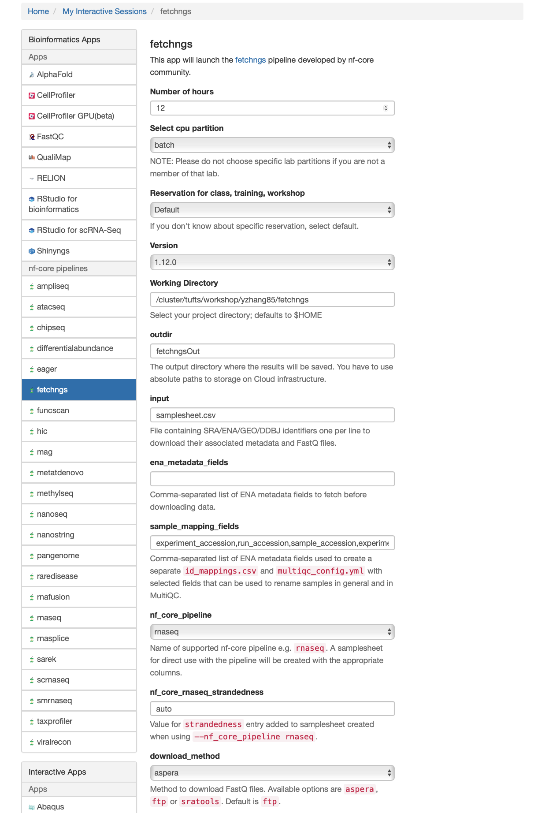
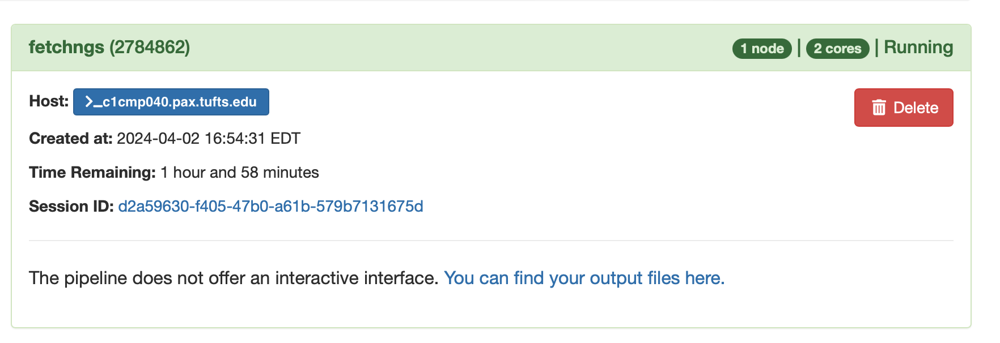

# nf-core/fetchngs
In this workshop, users will be guided through the practical application of the [nf-core fetchngs pipeline](https://nf-co.re/fetchngs/1.12.0), focusing specifically on downloading raw sequencing reads from the [NCBI database](https://www.ncbi.nlm.nih.gov/). Participants will gain insights into utilizing this powerful tool within the nf-core framework with [Open OnDemand](https://ondemand.pax.tufts.edu/) to efficiently download necessary data for bioinformatics analyses. 

## Example dataset and reference paper

In this workshop, we will analyze RNA-Seq data from the [study (Asberry et al., 2022)](https://pubs.acs.org/doi/10.1021/acs.jmedchem.2c01000) on the human epigenetic regulator `PRMT5` and its cofactor `MEP50`.

- Paper: Discovery and Biological Characterization of PRMT5:MEP50 Protein–Protein Interaction Inhibitors


- According to the paper, the raw data can be found on Gene Expression Omnibus database at `GSE80182`.


## Gene exression omnibus (GEO)

The [Gene Expression Omnibus (GEO)](https://www.ncbi.nlm.nih.gov/geo/) is a public repository that archives and freely distributes comprehensive sets of microarray, next-generation sequencing, and other forms of high-throughput functional genomic data.

You can find the page for the specific example dataset at [this link](https://www.ncbi.nlm.nih.gov/geo/query/acc.cgi?acc=GSE80182).           
                        
<br>       
The `fetchngs` pipeline is an extremely powerful tool that is capable of working with various types of IDs, such as SRA, ENA, DDBJ, and GEO IDs. You can use `GSE80182` on its own to download all available datasets. However, for this workshop, we only require 6 out of the 9 available samples. In order to obtain the necessary IDs for each of these samples, simply click on `SRA`.

The required 6 samples are from `PRMT50kd` and `GTFkd` groups, with accession numbers ranging from `SRX1693951` to `SRX1693956`. For this demo, we will exclude the remaining 3 `MEP50kd` samples.


## nf-core fetchngs

nf-core/fetchngs is a bioinformatics pipeline to fetch metadata and raw FastQ files from both public databases. At present, the pipeline supports SRA / ENA / DDBJ / GEO ids.             


In order to execute the `fetchngs` pipeline, let's start by creating a working directory where the pipeline will run.

We created the `/cluster/tufts/workshop` folder to provide storage for users to run jobs during the workshop. Inside the `workshop` folder, each user has your own folder with your Tufts UTLN as the folder name.

```
ls -1 /cluster/tufts/workshop/
amarti45/
atai01/
bcarso02/
blin01/
fvilch01/
gwidme01/
hgardn02/
hli25/
hyan01/
isanog01/
jfinne04/
kmegqu01/
kreyno07/
mcalde03/
mlehr01/
rsaid01/
shared/
smosta03/
spasch03/
xli37/
ylee02/
ymalon01/
yzhang85/
yzhao12/
zwatso01/
```

Let's create the working directory for fetchngs. 

```
cd /cluster/tufts/workshop/UTLN ## replace UTLN with your own UTLN
mkdir fetchngs
cd fetchngs
```

### Create a samplesheet.csv as input

Use the code below to create a `samplesheet.csv` file, which will be the input for fetchngs pipeline.            
```
for i in {3951..3956}
do
   echo "SRX169$i" >> samplesheet.csv
done
```

Now let's see what's in the file.         
```
cat samplesheet.csv
```

```
SRX1693951
SRX1693952
SRX1693953
SRX1693954
SRX1693955
SRX1693956
```

### Open OnDemand

In the demo, we will run the pipeline using the `fetchngs` pipeline deployed on [Tufts Open OnDemand server](https://ondemand.pax.tufts.edu/)

Under `Bioinformatcis Apps`, you can find `fetchngs` within the `nf-core pipelines` subcategory.

This pipeline is pretty simple. We can leave most parameters as default.

Below are the arguments we will use:

- Number of hours: 12
- Select cpu partition: batch
- Resveration for class, training, workshop: default
- Version: 1.12.0
- Working Directory: The direcotry your created above. For me, it is `/cluster/tufts/workshop/yzhang85/fetchngs`
- Output directory Name: fetchngsOut
- Input: samplesheet.csv
- nf_core_pipeline: rnaseq
- nf_core_rnaseq_strandedness: auto
- download_method: aspera


A screenshot of the Open OnDemand fetchngs app.          
          

<br>

Once you fill in the required fields, you can launch the job.

When the job starts, you can click the link next to `Session ID:` to view `output.log` and check the running processes of nextflow.

 
```
Script starting...
Generating connection YAML file...
This is a fresh run
You are not using Nextflow Tower
Currently Loaded Modulefiles:
  1) java/15.0.2                  4) singularity/3.8.4(default)
  2) nextflow/23.10.0(default)    5) nf-core/2.13.1
  3) squashfs/4.4
nextflow run /cluster/tufts/biocontainers/nf-core/pipelines/nf-core-fetchngs/1.12.0/1_12_0 -params-file nf-params.json -profile tufts --partition batch
Nextflow 23.10.1 is available - Please consider updating your version to it
N E X T F L O W  ~  version 23.10.0
Launching `/cluster/tufts/biocontainers/nf-core/pipelines/nf-core-fetchngs/1.12.0/1_12_0/main.nf` [chaotic_wescoff] DSL2 - revision: 0f0b67958c
WARN: Access to undefined parameter `monochromeLogs` -- Initialise it to a default value eg. `params.monochromeLogs = some_value`


------------------------------------------------------
                                        ,--./,-.
        ___     __   __   __   ___     /,-._.--~'
  |\ | |__  __ /  ` /  \ |__) |__         }  {
  | \| |       \__, \__/ |  \ |___     \`-._,-`-,
                                        `._,._,'
  nf-core/fetchngs v1.12.0
------------------------------------------------------
Core Nextflow options
  runName                   : chaotic_wescoff
  containerEngine           : singularity
  launchDir                 : /cluster/tufts/workshop/yzhang85/fetchngs
  workDir                   : /cluster/tufts/workshop/yzhang85/fetchngs/work
  projectDir                : /cluster/tufts/biocontainers/nf-core/pipelines/nf-core-fetchngs/1.12.0/1_12_0
  userName                  : yzhang85
  profile                   : tufts
  configFiles               : 

Input/output options
  input                     : samplesheet.csv
  nf_core_pipeline          : rnaseq
  download_method           : aspera
  outdir                    : fetchngsOut

Institutional config options
  config_profile_description: The Tufts University HPC cluster profile provided by nf-core/configs.
  config_profile_contact    : Yucheng Zhang
  config_profile_url        : https://it.tufts.edu/high-performance-computing

Max job request options
  max_cpus                  : 72
  max_memory                : 120 GB
  max_time                  : 7d

!! Only displaying parameters that differ from the pipeline defaults !!
------------------------------------------------------
If you use nf-core/fetchngs for your analysis please cite:

* The pipeline
  https://doi.org/10.5281/zenodo.5070524

* The nf-core framework
  https://doi.org/10.1038/s41587-020-0439-x

* Software dependencies
  https://github.com/nf-core/fetchngs/blob/master/CITATIONS.md
------------------------------------------------------
WARN: The following invalid input values have been detected:

* --partition: batch
* --config_profile_contact_github: @zhan4429
* --config_profile_contact_email: Yucheng.Zhang@tufts.edu
* --igenomes_base: /cluster/tufts/biocontainers/datasets/igenomes/

[-        ] process > NFCORE_FETCHNGS:SRA:SRA_IDS... -
[-        ] process > NFCORE_FETCHNGS:SRA:SRA_RUN... -
[-        ] process > NFCORE_FETCHNGS:SRA:SRA_FAS... -
[-        ] process > NFCORE_FETCHNGS:SRA:FASTQ_D... -
[-        ] process > NFCORE_FETCHNGS:SRA:FASTQ_D... -
[-        ] process > NFCORE_FETCHNGS:SRA:FASTQ_D... -
[-        ] process > NFCORE_FETCHNGS:SRA:ASPERA_CLI -

[-        ] process > NFCORE_FETCHNGS:SRA:SRA_IDS... -
[-        ] process > NFCORE_FETCHNGS:SRA:SRA_RUN... -
[-        ] process > NFCORE_FETCHNGS:SRA:SRA_FAS... -
[-        ] process > NFCORE_FETCHNGS:SRA:FASTQ_D... -
[-        ] process > NFCORE_FETCHNGS:SRA:FASTQ_D... -
[-        ] process > NFCORE_FETCHNGS:SRA:FASTQ_D... -
[-        ] process > NFCORE_FETCHNGS:SRA:ASPERA_CLI -
[-        ] process > NFCORE_FETCHNGS:SRA:SRA_TO_... -
[-        ] process > NFCORE_FETCHNGS:SRA:MULTIQC... -

[-        ] process > NFCORE_FETCHNGS:SRA:SRA_IDS... [  0%] 0 of 1
[-        ] process > NFCORE_FETCHNGS:SRA:SRA_RUN... -
[-        ] process > NFCORE_FETCHNGS:SRA:SRA_FAS... -
[-        ] process > NFCORE_FETCHNGS:SRA:FASTQ_D... -
[-        ] process > NFCORE_FETCHNGS:SRA:FASTQ_D... -
[-        ] process > NFCORE_FETCHNGS:SRA:FASTQ_D... -
[-        ] process > NFCORE_FETCHNGS:SRA:ASPERA_CLI -
[-        ] process > NFCORE_FETCHNGS:SRA:SRA_TO_... -
[-        ] process > NFCORE_FETCHNGS:SRA:MULTIQC... -

[-        ] process > NFCORE_FETCHNGS:SRA:SRA_IDS... [  0%] 0 of 6
[-        ] process > NFCORE_FETCHNGS:SRA:SRA_RUN... -
[-        ] process > NFCORE_FETCHNGS:SRA:SRA_FAS... -
[-        ] process > NFCORE_FETCHNGS:SRA:FASTQ_D... -
[-        ] process > NFCORE_FETCHNGS:SRA:FASTQ_D... -
[-        ] process > NFCORE_FETCHNGS:SRA:FASTQ_D... -
[-        ] process > NFCORE_FETCHNGS:SRA:ASPERA_CLI -
[-        ] process > NFCORE_FETCHNGS:SRA:SRA_TO_... -
[-        ] process > NFCORE_FETCHNGS:SRA:MULTIQC... -

executor >  slurm (1)
[01/68b765] process > NFCORE_FETCHNGS:SRA:SRA_IDS... [  0%] 0 of 6
[-        ] process > NFCORE_FETCHNGS:SRA:SRA_RUN... -
[-        ] process > NFCORE_FETCHNGS:SRA:SRA_FAS... -
[-        ] process > NFCORE_FETCHNGS:SRA:FASTQ_D... -
[-        ] process > NFCORE_FETCHNGS:SRA:FASTQ_D... -
[-        ] process > NFCORE_FETCHNGS:SRA:FASTQ_D... -
[-        ] process > NFCORE_FETCHNGS:SRA:ASPERA_CLI -
[-        ] process > NFCORE_FETCHNGS:SRA:SRA_TO_... -
[-        ] process > NFCORE_FETCHNGS:SRA:MULTIQC... -

executor >  slurm (2)
[06/90f0d7] process > NFCORE_FETCHNGS:SRA:SRA_IDS... [  0%] 0 of 6
[-        ] process > NFCORE_FETCHNGS:SRA:SRA_RUN... -
[-        ] process > NFCORE_FETCHNGS:SRA:SRA_FAS... -
[-        ] process > NFCORE_FETCHNGS:SRA:FASTQ_D... -
[-        ] process > NFCORE_FETCHNGS:SRA:FASTQ_D... -
[-        ] process > NFCORE_FETCHNGS:SRA:FASTQ_D... -
[-        ] process > NFCORE_FETCHNGS:SRA:ASPERA_CLI -
[-        ] process > NFCORE_FETCHNGS:SRA:SRA_TO_... -
[-        ] process > NFCORE_FETCHNGS:SRA:MULTIQC... -

executor >  slurm (3)
[3b/33ec6c] process > NFCORE_FETCHNGS:SRA:SRA_IDS... [  0%] 0 of 6
[-        ] process > NFCORE_FETCHNGS:SRA:SRA_RUN... -
[-        ] process > NFCORE_FETCHNGS:SRA:SRA_FAS... -
[-        ] process > NFCORE_FETCHNGS:SRA:FASTQ_D... -
[-        ] process > NFCORE_FETCHNGS:SRA:FASTQ_D... -
[-        ] process > NFCORE_FETCHNGS:SRA:FASTQ_D... -
[-        ] process > NFCORE_FETCHNGS:SRA:ASPERA_CLI -
[-        ] process > NFCORE_FETCHNGS:SRA:SRA_TO_... -
[-        ] process > NFCORE_FETCHNGS:SRA:MULTIQC... -

executor >  slurm (5)
[80/39b1b0] process > NFCORE_FETCHNGS:SRA:SRA_IDS... [  0%] 0 of 6
[-        ] process > NFCORE_FETCHNGS:SRA:SRA_RUN... -
[-        ] process > NFCORE_FETCHNGS:SRA:SRA_FAS... -
[-        ] process > NFCORE_FETCHNGS:SRA:FASTQ_D... -
[-        ] process > NFCORE_FETCHNGS:SRA:FASTQ_D... -
[-        ] process > NFCORE_FETCHNGS:SRA:FASTQ_D... -
[-        ] process > NFCORE_FETCHNGS:SRA:ASPERA_CLI -
[-        ] process > NFCORE_FETCHNGS:SRA:SRA_TO_... -
[-        ] process > NFCORE_FETCHNGS:SRA:MULTIQC... -

executor >  slurm (6)
[71/53b661] process > NFCORE_FETCHNGS:SRA:SRA_IDS... [  0%] 0 of 6
[-        ] process > NFCORE_FETCHNGS:SRA:SRA_RUN... -
[-        ] process > NFCORE_FETCHNGS:SRA:SRA_FAS... -
[-        ] process > NFCORE_FETCHNGS:SRA:FASTQ_D... -
[-        ] process > NFCORE_FETCHNGS:SRA:FASTQ_D... -
[-        ] process > NFCORE_FETCHNGS:SRA:FASTQ_D... -
[-        ] process > NFCORE_FETCHNGS:SRA:ASPERA_CLI -
[-        ] process > NFCORE_FETCHNGS:SRA:SRA_TO_... -
[-        ] process > NFCORE_FETCHNGS:SRA:MULTIQC... -

executor >  slurm (6)
[71/53b661] process > NFCORE_FETCHNGS:SRA:SRA_IDS... [  0%] 0 of 6
[-        ] process > NFCORE_FETCHNGS:SRA:SRA_RUN... -
[-        ] process > NFCORE_FETCHNGS:SRA:SRA_FAS... -
[-        ] process > NFCORE_FETCHNGS:SRA:FASTQ_D... -
[-        ] process > NFCORE_FETCHNGS:SRA:FASTQ_D... -
[-        ] process > NFCORE_FETCHNGS:SRA:FASTQ_D... -
[-        ] process > NFCORE_FETCHNGS:SRA:ASPERA_CLI -
[-        ] process > NFCORE_FETCHNGS:SRA:SRA_TO_... -
[-        ] process > NFCORE_FETCHNGS:SRA:MULTIQC... -

executor >  slurm (7)
[80/39b1b0] process > NFCORE_FETCHNGS:SRA:SRA_IDS... [ 83%] 5 of 6
[9e/846ed1] process > NFCORE_FETCHNGS:SRA:SRA_RUN... [  0%] 0 of 4
[-        ] process > NFCORE_FETCHNGS:SRA:SRA_FAS... -
[-        ] process > NFCORE_FETCHNGS:SRA:FASTQ_D... -
[-        ] process > NFCORE_FETCHNGS:SRA:FASTQ_D... -
[-        ] process > NFCORE_FETCHNGS:SRA:FASTQ_D... -
[-        ] process > NFCORE_FETCHNGS:SRA:ASPERA_CLI -
[-        ] process > NFCORE_FETCHNGS:SRA:SRA_TO_... -
[-        ] process > NFCORE_FETCHNGS:SRA:MULTIQC... -

executor >  slurm (8)
[71/53b661] process > NFCORE_FETCHNGS:SRA:SRA_IDS... [100%] 6 of 6 ✔
[48/d703d4] process > NFCORE_FETCHNGS:SRA:SRA_RUN... [  0%] 0 of 6
[-        ] process > NFCORE_FETCHNGS:SRA:SRA_FAS... -
[-        ] process > NFCORE_FETCHNGS:SRA:FASTQ_D... -
[-        ] process > NFCORE_FETCHNGS:SRA:FASTQ_D... -
[-        ] process > NFCORE_FETCHNGS:SRA:FASTQ_D... -
[-        ] process > NFCORE_FETCHNGS:SRA:ASPERA_CLI -
[-        ] process > NFCORE_FETCHNGS:SRA:SRA_TO_... -
[-        ] process > NFCORE_FETCHNGS:SRA:MULTIQC... -

executor >  slurm (10)
[71/53b661] process > NFCORE_FETCHNGS:SRA:SRA_IDS... [100%] 6 of 6 ✔
[b5/171552] process > NFCORE_FETCHNGS:SRA:SRA_RUN... [  0%] 0 of 6
[-        ] process > NFCORE_FETCHNGS:SRA:SRA_FAS... -
[-        ] process > NFCORE_FETCHNGS:SRA:FASTQ_D... -
[-        ] process > NFCORE_FETCHNGS:SRA:FASTQ_D... -
[-        ] process > NFCORE_FETCHNGS:SRA:FASTQ_D... -
[-        ] process > NFCORE_FETCHNGS:SRA:ASPERA_CLI -
[-        ] process > NFCORE_FETCHNGS:SRA:SRA_TO_... -
[-        ] process > NFCORE_FETCHNGS:SRA:MULTIQC... -

executor >  slurm (12)
[71/53b661] process > NFCORE_FETCHNGS:SRA:SRA_IDS... [100%] 6 of 6 ✔
[aa/4d377f] process > NFCORE_FETCHNGS:SRA:SRA_RUN... [  0%] 0 of 6
[-        ] process > NFCORE_FETCHNGS:SRA:SRA_FAS... -
[-        ] process > NFCORE_FETCHNGS:SRA:FASTQ_D... -
[-        ] process > NFCORE_FETCHNGS:SRA:FASTQ_D... -
[-        ] process > NFCORE_FETCHNGS:SRA:FASTQ_D... -
[-        ] process > NFCORE_FETCHNGS:SRA:ASPERA_CLI -
[-        ] process > NFCORE_FETCHNGS:SRA:SRA_TO_... -
[-        ] process > NFCORE_FETCHNGS:SRA:MULTIQC... -

executor >  slurm (12)
[71/53b661] process > NFCORE_FETCHNGS:SRA:SRA_IDS... [100%] 6 of 6 ✔
[9e/846ed1] process > NFCORE_FETCHNGS:SRA:SRA_RUN... [ 16%] 1 of 6
[-        ] process > NFCORE_FETCHNGS:SRA:SRA_FAS... -
[-        ] process > NFCORE_FETCHNGS:SRA:FASTQ_D... -
[-        ] process > NFCORE_FETCHNGS:SRA:FASTQ_D... -
[-        ] process > NFCORE_FETCHNGS:SRA:FASTQ_D... -
[-        ] process > NFCORE_FETCHNGS:SRA:ASPERA_CLI -
[-        ] process > NFCORE_FETCHNGS:SRA:SRA_TO_... -
[-        ] process > NFCORE_FETCHNGS:SRA:MULTIQC... -

executor >  slurm (13)
[71/53b661] process > NFCORE_FETCHNGS:SRA:SRA_IDS... [100%] 6 of 6 ✔
[aa/4d377f] process > NFCORE_FETCHNGS:SRA:SRA_RUN... [100%] 6 of 6 ✔
[-        ] process > NFCORE_FETCHNGS:SRA:SRA_FAS... -
[-        ] process > NFCORE_FETCHNGS:SRA:FASTQ_D... -
[-        ] process > NFCORE_FETCHNGS:SRA:FASTQ_D... -
[-        ] process > NFCORE_FETCHNGS:SRA:FASTQ_D... -
[46/4aa4c0] process > NFCORE_FETCHNGS:SRA:ASPERA_... [  0%] 0 of 5
[-        ] process > NFCORE_FETCHNGS:SRA:SRA_TO_... -
[-        ] process > NFCORE_FETCHNGS:SRA:MULTIQC... -

executor >  slurm (15)
[71/53b661] process > NFCORE_FETCHNGS:SRA:SRA_IDS... [100%] 6 of 6 ✔
[aa/4d377f] process > NFCORE_FETCHNGS:SRA:SRA_RUN... [100%] 6 of 6 ✔
[-        ] process > NFCORE_FETCHNGS:SRA:SRA_FAS... -
[-        ] process > NFCORE_FETCHNGS:SRA:FASTQ_D... -
[-        ] process > NFCORE_FETCHNGS:SRA:FASTQ_D... -
[-        ] process > NFCORE_FETCHNGS:SRA:FASTQ_D... -
[55/81029f] process > NFCORE_FETCHNGS:SRA:ASPERA_... [  0%] 0 of 6
[-        ] process > NFCORE_FETCHNGS:SRA:SRA_TO_... -
[-        ] process > NFCORE_FETCHNGS:SRA:MULTIQC... -

executor >  slurm (16)
[71/53b661] process > NFCORE_FETCHNGS:SRA:SRA_IDS... [100%] 6 of 6 ✔
[aa/4d377f] process > NFCORE_FETCHNGS:SRA:SRA_RUN... [100%] 6 of 6 ✔
[-        ] process > NFCORE_FETCHNGS:SRA:SRA_FAS... -
[-        ] process > NFCORE_FETCHNGS:SRA:FASTQ_D... -
[-        ] process > NFCORE_FETCHNGS:SRA:FASTQ_D... -
[-        ] process > NFCORE_FETCHNGS:SRA:FASTQ_D... -
[1a/eaaf05] process > NFCORE_FETCHNGS:SRA:ASPERA_... [  0%] 0 of 6
[-        ] process > NFCORE_FETCHNGS:SRA:SRA_TO_... -
[-        ] process > NFCORE_FETCHNGS:SRA:MULTIQC... -

executor >  slurm (18)
[71/53b661] process > NFCORE_FETCHNGS:SRA:SRA_IDS... [100%] 6 of 6 ✔
[aa/4d377f] process > NFCORE_FETCHNGS:SRA:SRA_RUN... [100%] 6 of 6 ✔
[-        ] process > NFCORE_FETCHNGS:SRA:SRA_FAS... -
[-        ] process > NFCORE_FETCHNGS:SRA:FASTQ_D... -
[-        ] process > NFCORE_FETCHNGS:SRA:FASTQ_D... -
[-        ] process > NFCORE_FETCHNGS:SRA:FASTQ_D... -
[c6/019c9d] process > NFCORE_FETCHNGS:SRA:ASPERA_... [  0%] 0 of 6
[-        ] process > NFCORE_FETCHNGS:SRA:SRA_TO_... -
[-        ] process > NFCORE_FETCHNGS:SRA:MULTIQC... -

executor >  slurm (18)
[71/53b661] process > NFCORE_FETCHNGS:SRA:SRA_IDS... [100%] 6 of 6 ✔
[aa/4d377f] process > NFCORE_FETCHNGS:SRA:SRA_RUN... [100%] 6 of 6 ✔
[-        ] process > NFCORE_FETCHNGS:SRA:SRA_FAS... -
[-        ] process > NFCORE_FETCHNGS:SRA:FASTQ_D... -
[-        ] process > NFCORE_FETCHNGS:SRA:FASTQ_D... -
[-        ] process > NFCORE_FETCHNGS:SRA:FASTQ_D... -
[c6/019c9d] process > NFCORE_FETCHNGS:SRA:ASPERA_... [  0%] 0 of 6
[-        ] process > NFCORE_FETCHNGS:SRA:SRA_TO_... -
[-        ] process > NFCORE_FETCHNGS:SRA:MULTIQC... -

executor >  slurm (18), local (1)
[71/53b661] process > NFCORE_FETCHNGS:SRA:SRA_IDS... [100%] 6 of 6 ✔
[aa/4d377f] process > NFCORE_FETCHNGS:SRA:SRA_RUN... [100%] 6 of 6 ✔
[-        ] process > NFCORE_FETCHNGS:SRA:SRA_FAS... -
[-        ] process > NFCORE_FETCHNGS:SRA:FASTQ_D... -
[-        ] process > NFCORE_FETCHNGS:SRA:FASTQ_D... -
[-        ] process > NFCORE_FETCHNGS:SRA:FASTQ_D... -
[46/4aa4c0] process > NFCORE_FETCHNGS:SRA:ASPERA_... [ 16%] 1 of 6
[29/62b05a] process > NFCORE_FETCHNGS:SRA:SRA_TO_... [  0%] 0 of 1
[-        ] process > NFCORE_FETCHNGS:SRA:MULTIQC... -

executor >  slurm (18), local (3)
[71/53b661] process > NFCORE_FETCHNGS:SRA:SRA_IDS... [100%] 6 of 6 ✔
[aa/4d377f] process > NFCORE_FETCHNGS:SRA:SRA_RUN... [100%] 6 of 6 ✔
[-        ] process > NFCORE_FETCHNGS:SRA:SRA_FAS... -
[-        ] process > NFCORE_FETCHNGS:SRA:FASTQ_D... -
[-        ] process > NFCORE_FETCHNGS:SRA:FASTQ_D... -
[-        ] process > NFCORE_FETCHNGS:SRA:FASTQ_D... -
[55/81029f] process > NFCORE_FETCHNGS:SRA:ASPERA_... [ 50%] 3 of 6
[cd/e82a75] process > NFCORE_FETCHNGS:SRA:SRA_TO_... [ 66%] 2 of 3
[-        ] process > NFCORE_FETCHNGS:SRA:MULTIQC... -

executor >  slurm (18), local (3)
[71/53b661] process > NFCORE_FETCHNGS:SRA:SRA_IDS... [100%] 6 of 6 ✔
[aa/4d377f] process > NFCORE_FETCHNGS:SRA:SRA_RUN... [100%] 6 of 6 ✔
[-        ] process > NFCORE_FETCHNGS:SRA:SRA_FAS... -
[-        ] process > NFCORE_FETCHNGS:SRA:FASTQ_D... -
[-        ] process > NFCORE_FETCHNGS:SRA:FASTQ_D... -
[-        ] process > NFCORE_FETCHNGS:SRA:FASTQ_D... -
[1a/eaaf05] process > NFCORE_FETCHNGS:SRA:ASPERA_... [ 66%] 4 of 6
[cd/e82a75] process > NFCORE_FETCHNGS:SRA:SRA_TO_... [ 66%] 2 of 3
[-        ] process > NFCORE_FETCHNGS:SRA:MULTIQC... -

executor >  slurm (18), local (4)
[71/53b661] process > NFCORE_FETCHNGS:SRA:SRA_IDS... [100%] 6 of 6 ✔
[aa/4d377f] process > NFCORE_FETCHNGS:SRA:SRA_RUN... [100%] 6 of 6 ✔
[-        ] process > NFCORE_FETCHNGS:SRA:SRA_FAS... -
[-        ] process > NFCORE_FETCHNGS:SRA:FASTQ_D... -
[-        ] process > NFCORE_FETCHNGS:SRA:FASTQ_D... -
[-        ] process > NFCORE_FETCHNGS:SRA:FASTQ_D... -
[1a/eaaf05] process > NFCORE_FETCHNGS:SRA:ASPERA_... [ 66%] 4 of 6
[bc/d2790a] process > NFCORE_FETCHNGS:SRA:SRA_TO_... [100%] 4 of 4
[-        ] process > NFCORE_FETCHNGS:SRA:MULTIQC... -

executor >  slurm (18), local (5)
[71/53b661] process > NFCORE_FETCHNGS:SRA:SRA_IDS... [100%] 6 of 6 ✔
[aa/4d377f] process > NFCORE_FETCHNGS:SRA:SRA_RUN... [100%] 6 of 6 ✔
[-        ] process > NFCORE_FETCHNGS:SRA:SRA_FAS... -
[-        ] process > NFCORE_FETCHNGS:SRA:FASTQ_D... -
[-        ] process > NFCORE_FETCHNGS:SRA:FASTQ_D... -
[-        ] process > NFCORE_FETCHNGS:SRA:FASTQ_D... -
[c3/26736c] process > NFCORE_FETCHNGS:SRA:ASPERA_... [ 83%] 5 of 6
[c1/a5ca55] process > NFCORE_FETCHNGS:SRA:SRA_TO_... [ 80%] 4 of 5
[-        ] process > NFCORE_FETCHNGS:SRA:MULTIQC... -

executor >  slurm (18), local (6)
[71/53b661] process > NFCORE_FETCHNGS:SRA:SRA_IDS... [100%] 6 of 6 ✔
[aa/4d377f] process > NFCORE_FETCHNGS:SRA:SRA_RUN... [100%] 6 of 6 ✔
[-        ] process > NFCORE_FETCHNGS:SRA:SRA_FAS... -
[-        ] process > NFCORE_FETCHNGS:SRA:FASTQ_D... -
[-        ] process > NFCORE_FETCHNGS:SRA:FASTQ_D... -
[-        ] process > NFCORE_FETCHNGS:SRA:FASTQ_D... -
[c6/019c9d] process > NFCORE_FETCHNGS:SRA:ASPERA_... [100%] 6 of 6 ✔
[6a/2e0f70] process > NFCORE_FETCHNGS:SRA:SRA_TO_... [100%] 6 of 6 ✔
[-        ] process > NFCORE_FETCHNGS:SRA:MULTIQC... -

executor >  slurm (18), local (6)
[71/53b661] process > NFCORE_FETCHNGS:SRA:SRA_IDS... [100%] 6 of 6 ✔
[aa/4d377f] process > NFCORE_FETCHNGS:SRA:SRA_RUN... [100%] 6 of 6 ✔
[-        ] process > NFCORE_FETCHNGS:SRA:SRA_FAS... -
[-        ] process > NFCORE_FETCHNGS:SRA:FASTQ_D... -
[-        ] process > NFCORE_FETCHNGS:SRA:FASTQ_D... -
[-        ] process > NFCORE_FETCHNGS:SRA:FASTQ_D... -
[c6/019c9d] process > NFCORE_FETCHNGS:SRA:ASPERA_... [100%] 6 of 6 ✔
[6a/2e0f70] process > NFCORE_FETCHNGS:SRA:SRA_TO_... [100%] 6 of 6 ✔
[-        ] process > NFCORE_FETCHNGS:SRA:MULTIQC... [  0%] 0 of 1

executor >  slurm (19), local (6)
[71/53b661] process > NFCORE_FETCHNGS:SRA:SRA_IDS... [100%] 6 of 6 ✔
[aa/4d377f] process > NFCORE_FETCHNGS:SRA:SRA_RUN... [100%] 6 of 6 ✔
[-        ] process > NFCORE_FETCHNGS:SRA:SRA_FAS... -
[-        ] process > NFCORE_FETCHNGS:SRA:FASTQ_D... -
[-        ] process > NFCORE_FETCHNGS:SRA:FASTQ_D... -
[-        ] process > NFCORE_FETCHNGS:SRA:FASTQ_D... -
[c6/019c9d] process > NFCORE_FETCHNGS:SRA:ASPERA_... [100%] 6 of 6 ✔
[6a/2e0f70] process > NFCORE_FETCHNGS:SRA:SRA_TO_... [100%] 6 of 6 ✔
[9c/6b23e9] process > NFCORE_FETCHNGS:SRA:MULTIQC... [  0%] 0 of 1

executor >  slurm (19), local (6)
[71/53b661] process > NFCORE_FETCHNGS:SRA:SRA_IDS... [100%] 6 of 6 ✔
[aa/4d377f] process > NFCORE_FETCHNGS:SRA:SRA_RUN... [100%] 6 of 6 ✔
[-        ] process > NFCORE_FETCHNGS:SRA:SRA_FAS... -
[-        ] process > NFCORE_FETCHNGS:SRA:FASTQ_D... -
[-        ] process > NFCORE_FETCHNGS:SRA:FASTQ_D... -
[-        ] process > NFCORE_FETCHNGS:SRA:FASTQ_D... -
[c6/019c9d] process > NFCORE_FETCHNGS:SRA:ASPERA_... [100%] 6 of 6 ✔
[6a/2e0f70] process > NFCORE_FETCHNGS:SRA:SRA_TO_... [100%] 6 of 6 ✔
[9c/6b23e9] process > NFCORE_FETCHNGS:SRA:MULTIQC... [  0%] 0 of 1

executor >  slurm (19), local (6)
[71/53b661] process > NFCORE_FETCHNGS:SRA:SRA_IDS... [100%] 6 of 6 ✔
[aa/4d377f] process > NFCORE_FETCHNGS:SRA:SRA_RUN... [100%] 6 of 6 ✔
[-        ] process > NFCORE_FETCHNGS:SRA:SRA_FAS... -
[-        ] process > NFCORE_FETCHNGS:SRA:FASTQ_D... -
[-        ] process > NFCORE_FETCHNGS:SRA:FASTQ_D... -
[-        ] process > NFCORE_FETCHNGS:SRA:FASTQ_D... -
[c6/019c9d] process > NFCORE_FETCHNGS:SRA:ASPERA_... [100%] 6 of 6 ✔
[6a/2e0f70] process > NFCORE_FETCHNGS:SRA:SRA_TO_... [100%] 6 of 6 ✔
[9c/6b23e9] process > NFCORE_FETCHNGS:SRA:MULTIQC... [100%] 1 of 1 ✔

executor >  slurm (19), local (6)
[71/53b661] process > NFCORE_FETCHNGS:SRA:SRA_IDS... [100%] 6 of 6 ✔
[aa/4d377f] process > NFCORE_FETCHNGS:SRA:SRA_RUN... [100%] 6 of 6 ✔
[-        ] process > NFCORE_FETCHNGS:SRA:SRA_FAS... -
[-        ] process > NFCORE_FETCHNGS:SRA:FASTQ_D... -
[-        ] process > NFCORE_FETCHNGS:SRA:FASTQ_D... -
[-        ] process > NFCORE_FETCHNGS:SRA:FASTQ_D... -
[c6/019c9d] process > NFCORE_FETCHNGS:SRA:ASPERA_... [100%] 6 of 6 ✔
[6a/2e0f70] process > NFCORE_FETCHNGS:SRA:SRA_TO_... [100%] 6 of 6 ✔
[9c/6b23e9] process > NFCORE_FETCHNGS:SRA:MULTIQC... [100%] 1 of 1 ✔
-[nf-core/fetchngs] Pipeline completed successfully-
WARN: =============================================================================
  Please double-check the samplesheet that has been auto-created by the pipeline.

  Public databases don't reliably hold information such as strandedness
  information, controls etc

  All of the sample metadata obtained from the ENA has been appended
  as additional columns to help you manually curate the samplesheet before
  running nf-core/other pipelines.
===================================================================================

executor >  slurm (19), local (6)
[71/53b661] process > NFCORE_FETCHNGS:SRA:SRA_IDS... [100%] 6 of 6 ✔
[aa/4d377f] process > NFCORE_FETCHNGS:SRA:SRA_RUN... [100%] 6 of 6 ✔
[-        ] process > NFCORE_FETCHNGS:SRA:SRA_FAS... -
[-        ] process > NFCORE_FETCHNGS:SRA:FASTQ_D... -
[-        ] process > NFCORE_FETCHNGS:SRA:FASTQ_D... -
[-        ] process > NFCORE_FETCHNGS:SRA:FASTQ_D... -
[c6/019c9d] process > NFCORE_FETCHNGS:SRA:ASPERA_... [100%] 6 of 6 ✔
[6a/2e0f70] process > NFCORE_FETCHNGS:SRA:SRA_TO_... [100%] 6 of 6 ✔
[9c/6b23e9] process > NFCORE_FETCHNGS:SRA:MULTIQC... [100%] 1 of 1 ✔
-[nf-core/fetchngs] Pipeline completed successfully-
WARN: =============================================================================
  Please double-check the samplesheet that has been auto-created by the pipeline.

  Public databases don't reliably hold information such as strandedness
  information, controls etc

  All of the sample metadata obtained from the ENA has been appended
  as additional columns to help you manually curate the samplesheet before
  running nf-core/other pipelines.
===================================================================================
Completed at: 02-Apr-2024 17:05:05
Duration    : 10m 8s
CPU hours   : 3.0
Succeeded   : 25


Cleaning up...
```
## Check the output files       
Once your job is completed, you should be able to see the following output files in your output directory.          


In the `fastq/` directory, the downloaded FASTQ files are located.                        


Within the `samplesheet/` directory, there's a file called `samplesheet.csv` that holds all the essential information needed for the subsequent nf-core/rnaseq pipeline.           


## Clean up

### Check the size of the output files    
If you check the size of your output files through `du -sh *`, you can see the work/ directory occupies significant storage space. 


### nextflow clean

Let's check the log file first.       
```
cd /cluster/tufts/workshop/yzhang85/fetchngs
module load nextflow
nextflow log
```

You should see some useful runtime information of completed jobs in the current directory. We can also use the `RUN NAME` and `nextflow clean` to clean the `work` directory. In this case, the `RUN NAME` is `irreverent_rutherford`.

```
TIMESTAMP          	DURATION	RUN NAME       	STATUS	REVISION ID	SESSION ID                          	COMMAND                                                                                                                                                
2024-04-02 16:54:56	10m 9s  	chaotic_wescoff	OK    	0f0b67958c 	0857d9f5-2ebe-48cb-a85d-0f0808a77496	nextflow run /cluster/tufts/biocontainers/nf-core/pipelines/nf-core-fetchngs/1.12.0/1_12_0 -params-file nf-params.json -profile tufts --partition batch
```

```
$ nextflow clean chaotic_wescoff -f
Removed /cluster/tufts/workshop/yzhang85/fetchngs/work/01/68b7658bc646ef617e006094556faa
Removed /cluster/tufts/workshop/yzhang85/fetchngs/work/06/90f0d770a353e3827f61493361b756
Removed /cluster/tufts/workshop/yzhang85/fetchngs/work/3b/33ec6cb90b84d1209c3f34b738b70a
Removed /cluster/tufts/workshop/yzhang85/fetchngs/work/ee/0922d9edcc4c1549b6d1340feb3f1a
Removed /cluster/tufts/workshop/yzhang85/fetchngs/work/80/39b1b03fd711a8ea9bef282d7fc125
Removed /cluster/tufts/workshop/yzhang85/fetchngs/work/71/53b661f0cd56a9e6bb45480bcf5676
Removed /cluster/tufts/workshop/yzhang85/fetchngs/work/9e/846ed1911d06053e84719b31a442dd
Removed /cluster/tufts/workshop/yzhang85/fetchngs/work/48/d703d40187f2d1518d5c84c35063be
Removed /cluster/tufts/workshop/yzhang85/fetchngs/work/c4/3b014c613532f5e4a939116592a3fb
Removed /cluster/tufts/workshop/yzhang85/fetchngs/work/b5/171552017ca1e7e0458da38e8f4338
Removed /cluster/tufts/workshop/yzhang85/fetchngs/work/8b/8877252cd5a7cb4905265f456cde91
Removed /cluster/tufts/workshop/yzhang85/fetchngs/work/aa/4d377ffa0133c83fa5310bba069847
Removed /cluster/tufts/workshop/yzhang85/fetchngs/work/46/4aa4c0c5edb9a0499ee152a1853f41
Removed /cluster/tufts/workshop/yzhang85/fetchngs/work/0c/f19f2fd5025c8e1954bc183f33e8c6
Removed /cluster/tufts/workshop/yzhang85/fetchngs/work/55/81029fdb988aa8a37267eb821d73d3
Removed /cluster/tufts/workshop/yzhang85/fetchngs/work/1a/eaaf05e3dec16dd0e16fffcb76143c
Removed /cluster/tufts/workshop/yzhang85/fetchngs/work/c3/26736c6bc1faa638cab3cc6d7e7b88
Removed /cluster/tufts/workshop/yzhang85/fetchngs/work/c6/019c9d3e5c1ff32ca0b2c0af5758ba
Removed /cluster/tufts/workshop/yzhang85/fetchngs/work/29/62b05ab9fd87a8ecde69f4d14ecd4c
Removed /cluster/tufts/workshop/yzhang85/fetchngs/work/92/1af049324bb3fc85367a4e691720c7
Removed /cluster/tufts/workshop/yzhang85/fetchngs/work/cd/e82a75cbe6bbb5494987accac728af
Removed /cluster/tufts/workshop/yzhang85/fetchngs/work/bc/d2790ae814446df06655e9449e6f5d
Removed /cluster/tufts/workshop/yzhang85/fetchngs/work/c1/a5ca55d38b7b7def3b8660041cda8f
Removed /cluster/tufts/workshop/yzhang85/fetchngs/work/6a/2e0f707f95c7a32a63c07f877b61b1
Removed /cluster/tufts/workshop/yzhang85/fetchngs/work/9c/6b23e94d4c044755be76bf76c71489
```

You also clean the `work/` directory by `rm -r work/`    


### Summary       
After successfully running this pipeline, your specified output directory will contain the FASTQ files that were downloaded from the NCBI database. These files will be the raw sequencing reads that you will use for the next pipeline, nf-core/rnaseq. Next, we will proceed with the [nf-core/rnaseq](https://nf-co.re/rnaseq/3.14.0) pipeline to further process this dataset and conduct RNA-Seq data analysis.

[Next: rnaseq](02_rnaseq.md)

[Previous: Introduction](00_introduction.md)
