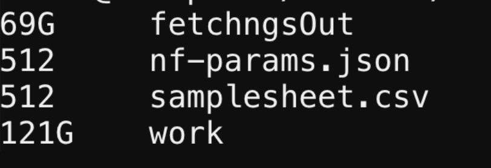

# nf-core/fetchngs
In this workshop, users will be guided through the practical application of the [nf-core fetchngs pipeline](https://nf-co.re/fetchngs/1.12.0), focusing specifically on downloading raw sequencing reads from the [NCBI database](https://www.ncbi.nlm.nih.gov/). Participants will gain insights into utilizing this powerful tool within the nf-core framework with [Open OnDemand](https://ondemand.pax.tufts.edu/) to efficiently download necessary data for bioinformatics analyses. 

## Example Dataset and Reference paper

In this workshop, we will analyze RNAseq data from a [study (Asberry et al., 2022)](https://pubs.acs.org/doi/10.1021/acs.jmedchem.2c01000) on the human epigenetic regulator `PRMT5` and its cofactor `MEP50`.

- Paper: Discovery and Biological Characterization of PRMT5:MEP50 Protein–Protein Interaction Inhibitors


- According to the paper, the raw data can be found on Gene Expression Omnibus database at `GSE80182`.


## Gene exression omnibus (GEO)

The [Gene Expression Omnibus (GEO)](https://www.ncbi.nlm.nih.gov/geo/) is a public repository that archives and freely distributes comprehensive sets of microarray, next-generation sequencing, and other forms of high-throughput functional genomic data.

You can find the page for the specific example dataset at [this link](https://www.ncbi.nlm.nih.gov/geo/query/acc.cgi?acc=GSE80182).           
                         
<br>       
The `fetchngs` pipeline is an extremely powerful tool that is capable of working with various types of IDs, such as SRA, ENA, DDBJ, and GEO IDs. You can use `GSE80182` on its own to download all available datasets. However, for this workshop, we only require 6 out of the 9 available samples. In order to obtain the necessary IDs for each of these samples, simply click on `SRA`.

The required 6 samples are from `PRMT50kd` and `GTFkd` groups, with accession numbers ranging from `SRX1693951` to `SRX1693956`. For this demo, we will exclude the remaining 3 `MEP50kd` samples.


## nf-core Fetchngs


nf-core/fetchngs is a bioinformatics pipeline to fetch metadata and raw FastQ files from both public databases. At present, the pipeline supports SRA / ENA / DDBJ / GEO ids.             


In order to execute the `fetchngs` pipeline, let's start by creating a working directory where the pipeline will run.
For example, you can create a directory similar to this:
`/cluster/tufts/biocontainers/workshop/Spring2024/fetchngs/`.
If you belong to a group, you can create a folder in your group directory and use it as the working directory. **However, please DO NOT use your `$HOME` directory**.      
> [!WARNING]       
> nf-core pipeline requires a lot of storage to run, please do not run within your $HOME directory. 

```
mkdir -p /cluster/tufts/biocontainers/workshop/Spring2024/fetchngs/ ## Change it to your directory!!!
cd /cluster/tufts/biocontainers/workshop/Spring2024/fetchngs/
```

### Create a samplesheet.csv as input

Use the code below to create a `samplesheet.csv` file, which will be the input for fetchngs pipeline.            
```
for i in {3951..3956}
do
   echo "SRX169$i" >> samplesheet.csv
done
```

Now let's see what's in the file.         
```
cat samplesheet.csv
```

```
SRX1693951
SRX1693952
SRX1693953
SRX1693954
SRX1693955
SRX1693956
```

### Open OnDemand

In the demo, we will run the pipeline using the `fetchngs` pipeline deployed on [Tufts Open OnDemand server](https://ondemand.pax.tufts.edu/)

Under `Bioinformatcis Apps`, you can find `fetchngs` within the `nf-core pipelines` subcategory.

This pipeline is pretty simple. We can leave most parameters as default.

Below are the arguments we will use:

- Number of hours: 12
- Select cpu partition: batch
- Resveration for class, training, workshop: default
- Version: 1.12.0
- Working Directory: The direcotry your created above. For me, it is `/cluster/tufts/biocontainers/workshop/Spring2024/fetchngs`
- Output directory Name: fetchngsOut
- Input: samplesheet.csv
- nf_core_pipeline: rnaseq
- nf_core_rnaseq_strandedness: auto
- download_method: aspera


A screenshot of the Open OnDemand fetchngs app.          
          

<br>

Once you fill in the required fields, you can launch the job.

When the job starts, you can click the link next to `Session ID:` to view `output.log` and check the running processes of nextflow.

```
------------------------------------------------------
                                        ,--./,-.
        ___     __   __   __   ___     /,-._.--~'
  |\ | |__  __ /  ` /  \ |__) |__         }  {
  | \| |       \__, \__/ |  \ |___     \`-._,-`-,
                                        `._,._,'
  nf-core/fetchngs v1.12.0
------------------------------------------------------
Core Nextflow options
  runName                   : irreverent_rutherford
  containerEngine           : singularity
  launchDir                 : /cluster/tufts/biocontainers/workshop/Spring2024/fetchngs
  workDir                   : /cluster/tufts/biocontainers/workshop/Spring2024/fetchngs/work
  projectDir                : /cluster/tufts/biocontainers/nf-core/pipelines/nf-core-fetchngs/1.12.0/1_12_0
  userName                  : yzhang85
  profile                   : tufts
  configFiles               :

Input/output options
  input                     : samplesheet.csv
  nf_core_pipeline          : rnaseq
  download_method           : aspera
  outdir                    : fetchngsOut

Institutional config options
  config_profile_description: The Tufts University HPC cluster profile provided by nf-core/configs.
  config_profile_contact    : Yucheng Zhang
  config_profile_url        : https://it.tufts.edu/high-performance-computing

Max job request options
  max_cpus                  : 72
  max_memory                : 120 GB
  max_time                  : 7d

!! Only displaying parameters that differ from the pipeline defaults !!
------------------------------------------------------
If you use nf-core/fetchngs for your analysis please cite:

* The pipeline
  https://doi.org/10.5281/zenodo.5070524

* The nf-core framework
  https://doi.org/10.1038/s41587-020-0439-x

* Software dependencies
  https://github.com/nf-core/fetchngs/blob/master/CITATIONS.md
------------------------------------------------------
WARN: The following invalid input values have been detected:

* --partition: batch
* --config_profile_contact_github: @zhan4429
* --config_profile_contact_email: Yucheng.Zhang@tufts.edu
* --igenomes_base: /cluster/tufts/biocontainers/datasets/igenomes/


[-        ] process > NFCORE_FETCHNGS:SRA:SRA_IDS... -
[-        ] process > NFCORE_FETCHNGS:SRA:SRA_RUN... -
[-        ] process > NFCORE_FETCHNGS:SRA:SRA_FAS... -

[-        ] process > NFCORE_FETCHNGS:SRA:SRA_IDS... -
[-        ] process > NFCORE_FETCHNGS:SRA:SRA_RUN... -
[-        ] process > NFCORE_FETCHNGS:SRA:SRA_FAS... -
[-        ] process > NFCORE_FETCHNGS:SRA:FASTQ_D... -
[-        ] process > NFCORE_FETCHNGS:SRA:FASTQ_D... -
[-        ] process > NFCORE_FETCHNGS:SRA:FASTQ_D... -
[-        ] process > NFCORE_FETCHNGS:SRA:ASPERA_CLI -
[-        ] process > NFCORE_FETCHNGS:SRA:SRA_TO_... -
[-        ] process > NFCORE_FETCHNGS:SRA:MULTIQC... -

[-        ] process > NFCORE_FETCHNGS:SRA:SRA_IDS... [  0%] 0 of 2
[-        ] process > NFCORE_FETCHNGS:SRA:SRA_RUN... -
[-        ] process > NFCORE_FETCHNGS:SRA:SRA_FAS... -
[-        ] process > NFCORE_FETCHNGS:SRA:FASTQ_D... -
[-        ] process > NFCORE_FETCHNGS:SRA:FASTQ_D... -
[-        ] process > NFCORE_FETCHNGS:SRA:FASTQ_D... -
[-        ] process > NFCORE_FETCHNGS:SRA:ASPERA_CLI -
[-        ] process > NFCORE_FETCHNGS:SRA:SRA_TO_... -
[-        ] process > NFCORE_FETCHNGS:SRA:MULTIQC... -

.
.
.

executor >  slurm (19), local (6)
[81/8a2aaa] process > NFCORE_FETCHNGS:SRA:SRA_IDS... [100%] 6 of 6 ✔
[4f/ee3a77] process > NFCORE_FETCHNGS:SRA:SRA_RUN... [100%] 6 of 6 ✔
[-        ] process > NFCORE_FETCHNGS:SRA:SRA_FAS... -
[-        ] process > NFCORE_FETCHNGS:SRA:FASTQ_D... -
[-        ] process > NFCORE_FETCHNGS:SRA:FASTQ_D... -
[-        ] process > NFCORE_FETCHNGS:SRA:FASTQ_D... -
[54/cf3d1d] process > NFCORE_FETCHNGS:SRA:ASPERA_... [100%] 6 of 6 ✔
[cb/3d036d] process > NFCORE_FETCHNGS:SRA:SRA_TO_... [100%] 6 of 6 ✔
[0f/409afa] process > NFCORE_FETCHNGS:SRA:MULTIQC... [  0%] 0 of 1

executor >  slurm (19), local (6)
[81/8a2aaa] process > NFCORE_FETCHNGS:SRA:SRA_IDS... [100%] 6 of 6 ✔
[4f/ee3a77] process > NFCORE_FETCHNGS:SRA:SRA_RUN... [100%] 6 of 6 ✔
[-        ] process > NFCORE_FETCHNGS:SRA:SRA_FAS... -
[-        ] process > NFCORE_FETCHNGS:SRA:FASTQ_D... -
[-        ] process > NFCORE_FETCHNGS:SRA:FASTQ_D... -
[-        ] process > NFCORE_FETCHNGS:SRA:FASTQ_D... -
[54/cf3d1d] process > NFCORE_FETCHNGS:SRA:ASPERA_... [100%] 6 of 6 ✔
[cb/3d036d] process > NFCORE_FETCHNGS:SRA:SRA_TO_... [100%] 6 of 6 ✔
[0f/409afa] process > NFCORE_FETCHNGS:SRA:MULTIQC... [100%] 1 of 1 ✔
-[nf-core/fetchngs] Pipeline completed successfully-
WARN: =============================================================================
  Please double-check the samplesheet that has been auto-created by the pipeline.

  Public databases don't reliably hold information such as strandedness
  information, controls etc

  All of the sample metadata obtained from the ENA has been appended
  as additional columns to help you manually curate the samplesheet before
  running nf-core/other pipelines.
===================================================================================

executor >  slurm (19), local (6)
[81/8a2aaa] process > NFCORE_FETCHNGS:SRA:SRA_IDS... [100%] 6 of 6 ✔
[4f/ee3a77] process > NFCORE_FETCHNGS:SRA:SRA_RUN... [100%] 6 of 6 ✔
[-        ] process > NFCORE_FETCHNGS:SRA:SRA_FAS... -
[-        ] process > NFCORE_FETCHNGS:SRA:FASTQ_D... -
[-        ] process > NFCORE_FETCHNGS:SRA:FASTQ_D... -
[-        ] process > NFCORE_FETCHNGS:SRA:FASTQ_D... -
[54/cf3d1d] process > NFCORE_FETCHNGS:SRA:ASPERA_... [100%] 6 of 6 ✔
[cb/3d036d] process > NFCORE_FETCHNGS:SRA:SRA_TO_... [100%] 6 of 6 ✔
[0f/409afa] process > NFCORE_FETCHNGS:SRA:MULTIQC... [100%] 1 of 1 ✔
-[nf-core/fetchngs] Pipeline completed successfully-
WARN: =============================================================================
  Please double-check the samplesheet that has been auto-created by the pipeline.

  Public databases don't reliably hold information such as strandedness
  information, controls etc

  All of the sample metadata obtained from the ENA has been appended
  as additional columns to help you manually curate the samplesheet before
  running nf-core/other pipelines.
===================================================================================
Completed at: 02-Mar-2024 18:15:53
Duration    : 11m 9s
CPU hours   : 3.0
Succeeded   : 25


Cleaning up...
```
## Check the output files       
Once your job is completed, you should be able to see the following output files in your output directory.          


In the `fastq/` directory, the downloaded FASTQ files are located.                        


Within the `samplesheet/` directory, there's a file called `samplesheet.csv` that holds all the essential information needed for the subsequent nf-core/rnaseq pipeline.           


## Clean up

### Check the size of the output files    
If you check the size of your output files through `du -sh *`, you can see the work/ directory occupies significant storage space. 



### nextflow clean

Let's check the log file first.       
```
cd /cluster/tufts/biocontainers/workshop/Spring2024/fetchngs
module load nextflow
nextflow log
```

You should see some useful runtime information of completed jobs in the current directory. We can also use the `RUN NAME` and `nextflow clean` to clean the `work` directory. In this case, the `RUN NAME` is `irreverent_rutherford`.

```
TIMESTAMP          	DURATION	RUN NAME             	STATUS	REVISION ID	SESSION ID                          	COMMAND
2024-03-02 18:04:43	11m 10s 	irreverent_rutherford	OK    	0f0b67958c 	9a5c876b-5c30-48c2-b55e-48677363f295	nextflow run /cluster/tufts/biocontainers/nf-core/pipelines/nf-core-fetchngs/1.12.0/1_12_0 -params-file nf-params.json -profile tufts --partition batch
```

```
$ nextflow clean -f irreverent_rutherford
Removed /cluster/tufts/biocontainers/workshop/Spring2024/fetchngs/work/f5/74497ebf3f36efad09ebee8519ecef
Removed /cluster/tufts/biocontainers/workshop/Spring2024/fetchngs/work/7b/178457f133774858a5d10e852523f6
Removed /cluster/tufts/biocontainers/workshop/Spring2024/fetchngs/work/98/7ddfa1cf4613615bfcecb6ecf167c6
Removed /cluster/tufts/biocontainers/workshop/Spring2024/fetchngs/work/cc/902cb642aed4dd1850839a7fe75071
Removed /cluster/tufts/biocontainers/workshop/Spring2024/fetchngs/work/d4/32dbdf8949e9f0d4587be17d4fc389
Removed /cluster/tufts/biocontainers/workshop/Spring2024/fetchngs/work/81/8a2aaa2778e136340e164d0bb3b32b
Removed /cluster/tufts/biocontainers/workshop/Spring2024/fetchngs/work/79/ed8e515c7254f134a3ce64c7950338
Removed /cluster/tufts/biocontainers/workshop/Spring2024/fetchngs/work/6d/0f7a5dda1757f73707679db3679a6c
Removed /cluster/tufts/biocontainers/workshop/Spring2024/fetchngs/work/94/89f0f178a6c8d4c89f002488ef7210
Removed /cluster/tufts/biocontainers/workshop/Spring2024/fetchngs/work/0d/7d12d9af85cb90948451ce8c0b19c9
Removed /cluster/tufts/biocontainers/workshop/Spring2024/fetchngs/work/9e/c00aee33d6aef6a0a89da09c9e5cd9
Removed /cluster/tufts/biocontainers/workshop/Spring2024/fetchngs/work/4f/ee3a77e70b291a6e25dae4585df441
Removed /cluster/tufts/biocontainers/workshop/Spring2024/fetchngs/work/fc/5fb242a14185a9436cce712e2b6c0e
Removed /cluster/tufts/biocontainers/workshop/Spring2024/fetchngs/work/18/9177c2cb956a008bb56aeaa2a3a017
Removed /cluster/tufts/biocontainers/workshop/Spring2024/fetchngs/work/5b/ea1a20f00545b992bd1859c5610491
Removed /cluster/tufts/biocontainers/workshop/Spring2024/fetchngs/work/26/a54f3214a0027f03a1fe283cae9a27
Removed /cluster/tufts/biocontainers/workshop/Spring2024/fetchngs/work/28/bd7c27332450b8bece51e146095f93
Removed /cluster/tufts/biocontainers/workshop/Spring2024/fetchngs/work/54/cf3d1d89eb40b606212f258fb67952
Removed /cluster/tufts/biocontainers/workshop/Spring2024/fetchngs/work/37/ef25f395f24219da52ac358b28e3da
Removed /cluster/tufts/biocontainers/workshop/Spring2024/fetchngs/work/9e/2d06e438872212d93e3d8bb6c62cb6
Removed /cluster/tufts/biocontainers/workshop/Spring2024/fetchngs/work/57/81810c59f69ae020ea55fc06dc8f34
Removed /cluster/tufts/biocontainers/workshop/Spring2024/fetchngs/work/a7/64edfa8692cf35cb95604635b24d89
Removed /cluster/tufts/biocontainers/workshop/Spring2024/fetchngs/work/18/9486c4cb3ffb0e1692b032757d012e
Removed /cluster/tufts/biocontainers/workshop/Spring2024/fetchngs/work/cb/3d036ddc1e77fde9620839c3c0c733
Removed /cluster/tufts/biocontainers/workshop/Spring2024/fetchngs/work/0f/409afa1c6ded02885970255b88da06
```

You also clean the `work/` directory by `rm -r work/`    


### Summary       
After successfully running this pipeline, your specified output directory will contain the FASTQ files that were downloaded from the NCBI database. These files will be the raw sequencing reads that you will use for the next pipeline, nf-core/rnaseq. Next, we will proceed with the [nf-core/rnaseq](https://nf-co.re/rnaseq/3.14.0) pipeline to further process this dataset and conduct RNA-Seq data analysis.

