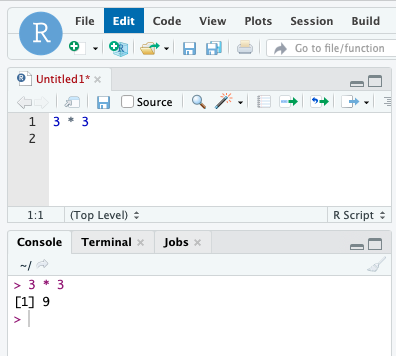

# R Basics 

## New R script

Now we will create an R script. R commands can be entered into the console, but saving these commands in a script will allow us to rerun these commands at a later date. To create an R script we will need to either:

- Go to `File > New File > R script`
- Click the `New File` icon and select R script


---

## Running R Code

When running R code you have a few options:

  Running One Line/Chunk:
  
  - Put your cursor at the beginning of the line of code and hit `Ctrl + Enter` on Windows or  &#8984; + `Enter` on MacOSX.
    
  - Highlight the line/chunk of code and hit `Ctrl + Enter` or &#8984; + `Enter`.
    
  Running The Entire Script:
  
  - Clicking `Source` at the top of the script window.

---
    
## Calculations

Let's try running some R code! R can be used to run all sorts of calculations just like a calculator:



You will notice that we ran this code in the script window but you can see the output in the console. 
When we work with calculations it is useful to remember the order of operations - here are their equivalents in R:

- **Parentheses:** `(`, `)`
- **Exponents:** `^` or `**`
- **Multiply:** `*`
- **Divide:** `/`
- **Add:** `+`
- **Subtract:** `-`

Let's look at some examples:

```R
10 * 3^3
```

!!! info ""
    ```
    [1] 270
    ```

```R
(400 / 10) * (4e2) # 4e2 is the same as 4^2
```

!!! info ""
    ```
    [1] 16000
    ```

You'll notice that in the last equation we added words after a `#` and the equation still ran. This is what is known as a comment, where everything after the `#` is not registered as R code. Commenting is immensely valuable for giving your code context so that you and whoever else reads it knows the purpose of a given chunk of code.

Additionally there are functions built in R to perform mathematical calculations:

```R
abs(10) # absolute value
```

!!! info ""
    ```
    [1] 10
    ```

??? note "More Examples"
    
    ```R
    sqrt(25) # square root
    ```

    !!! info ""
        ```
        [1] 5
        ```

    ```R
    log(10) # natural logarithm
    ```
    
    !!! info ""
        ```
        [1] 2.302585
        ```

    ```
    [1] 2.302585
    ```

    ```R
    log10(10) # log base 10
    ```
    !!! info ""
        ```
        [1] 1
        ```
---

## Comparisons

R can also be used to make comparisons. Here we note the operators used to do so:

- **Equals:** `==`
- **Does Not Equal:** `!=`
- **Less Than Or Equal** `<=`
- **Greater Than Or Equal** `>=`
- **Greater Than** `>`
- **Less Than** `<`

```R
2 == 2
```

!!! info ""
    ```
    [1] TRUE
    ```

??? note "More Examples"
  
    ```R
    2 != 2
    ```
    !!! info ""
        ```
        [1] FALSE
        ```
        
    ```R
    3 <= 10
    ```
    
    !!! info ""
        ```
        [1] TRUE
        ```


!!! note
    Unless the number is an integer, do not use `==` to compare. This is due to the fact that the decimal value may appear the same in R but from a machine level the two values can be very different.

---

## Variables & Vectors

Dealing with values can be cumbersome. In R, values can be assigned to words using the `<-` operator:

```R
x <- 35 # assigning a value of 35
x
```

!!! info ""
    ```
    [1] 35
    ```
    
```R
x <- x + 5 # changing value to 40
x
```

!!! info ""
    ```
    [1] 40
    ```
    
You'll notice that we initially assigned `x` to a value of `35` and then updated value to `40`. This is important to keep in mind because the last value assigned to `x` will be kept. Variables can I have a combination lowercase letters, uppercase letters, underscores and periods:

```R
value <- 40
biggerValue <- 45
even_bigger_value <- 50
biggest.value <- 55
```
```R
value
biggerValue
even_bigger_value
biggest.value
```

!!! info ""
    ```
    [1] 40
    [1] 45
    [1] 50
    [1] 55
    ```

!!! note
    Take note that the spelling needs to be consistent to call the variable correctly.
    
We can also assign a series of values in a specific order to a variable to create what is called a **vector**:

```R
someVector <- 5:10
someVector
```
!!! info ""
    ```
    [1]  5  6  7  8  9 10
    ```

---

## Environment

As you may have noticed we have been assigning variables and they have been added to your `Environment` window:


If you would like to declutter your environment, you have a few options:

- You can use the `rm()` function to remove which ever variables you'd like. To remove more than one just put a comma between variable names.
- You can clear **all variables** by clicking the broom icon:


!!! danger
     Be careful when removing variables, especially if these values took a long time to generate!

---

## R Packages

Aside from the base functions there are thousands of custom fuctions which are bundled in R packages. We can access these functions by loading the package that contains them. On the Tufts HPC, groups of packages are available. To access them you will need to specify the path where these packages are held. To identify the base group of packages, we can use the `libPaths()` function:

```R
.libPaths()
```

!!! info ""
    ```
    [1] "/opt/shared/R/4.0.0/lib64/R/library"
    ```

This is the base R library for OnDemand and it is rather limited. We will pull in a more complete library by pointing to it:

```R
.libPaths(c('/cluster/tufts/hpc/tools/R/4.0.0'))
.libPaths()
```

!!! info ""
    ```
    [1] "/cluster/tufts/hpc/tools/R/4.0.0"    "/opt/shared/R/4.0.0/lib64/R/library"
    ```

Now you'll note we are first pointing to the `/cluster/tufts/hpc/tools/R/4.0.0` library first for packages! You'll can see what packagews are available in the`Packages` window:


To load a package you can use the `library()` function:

```R
library(ggplot2)
```

!!! note
     If you need a package installed in this shared library, reach out to TTS Reasarch Technology, at tts-research@tufts.edu
     
     
