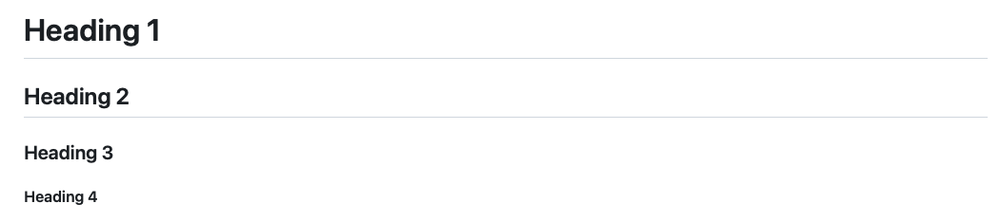

# R Markdown

When we analyze data it is often nice to produce reports describing the process we took to deliver results. 
So far we have been working with R scripts to run code. R markdown combines R code with markdown language to produce a report that 
combines code, text and figures.

## Markdown language

Markdown language is a way of writing text that gets rendered a certain way when the html file is created. This way we can avoid writing html code directly!
Let's run through the basics:

### Lists

You can make a list with:

```
- item 1
- item 2
- item 3
```

Or like:

```
* item 1
* item 2
* item 3
```

And both will render:

- item 1
- item 2
- item 3

## Headers

To create different sized headers use:

```
# Heading 1
## Heading 2
### Heading 3
#### Heading 4
```



## Bold/Italics

We can write bold/italics with:

```
**this is bold**
*this is italics*
```

**this is bold**
*this is italics*

## Hyperlinks/Images

To create a hyperlink you can use:

```
[GitHub](https://github.com)
```

[GitHub](https://github.com)

To insert images:

```

```


## Markdown Report 
