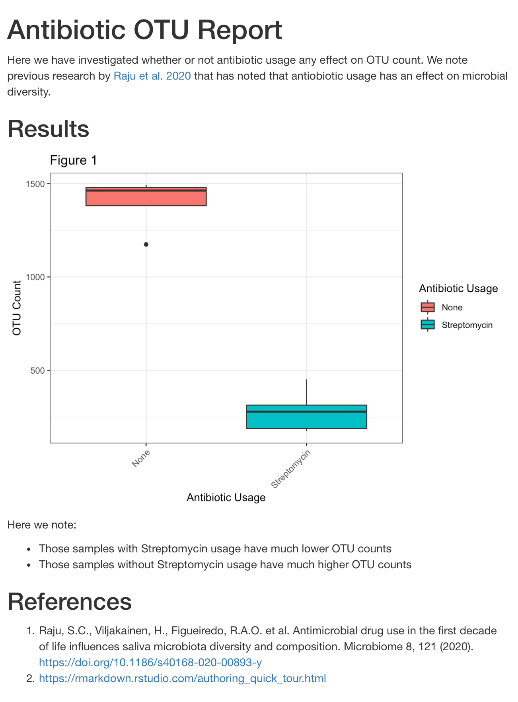

# R Markdown

When we analyze data it is often nice to produce reports describing the process we took to deliver results. 
So far we have been working with R scripts to run code. R markdown combines R code with markdown language to produce a report that 
combines code, text and figures.


## Markdown language

Markdown language is a way of writing text that gets rendered a certain way when the html file is created. This way we can avoid writing html code directly!
Let's run through the basics:

### Lists

You can make a list with:

```
- item 1
- item 2
- item 3
```

Or like:

```
* item 1
* item 2
* item 3
```

And both will render:

- item 1
- item 2
- item 3

## Headers

To create different sized headers use:

```
# Heading 1
## Heading 2
### Heading 3
#### Heading 4
```


## Bold/Italics

We can write bold/italics with:

```
**this is bold**
*this is italics*
```

**this is bold**
*this is italics*

## Hyperlinks/Images

To create a hyperlink you can use:

```
[GitHub](https://github.com)
```

[GitHub](https://github.com)

To insert images:

```

```


## Code

We can insert code and the plots that the code creates with:

````
```{r load_data,eval=FALSE}
plot(pressure)
```
````

Here we add an option, `echo=FALSE` to indicate we don't want to show the code itself, just the result. There are other options as well:

- `results = "hide"` to hide any results
- `eval = FALSE` to show and not evaluate code
- `warning = FALSE` to hide warnings
- `message = FALSE` to hide messages
- `fig.height` or `fig.width` to modify plot dimensions, in inches

!!! tip
    If you'd like the same options repeated, you can set them in the begninning of the markdown document like so:
    
    ````
    ```{r global_options, echo=FALSE}
    knitr::opts_chunk$set(fig.path="Figs/", message=FALSE, warning=FALSE,
                          echo=FALSE, results="hide", fig.width=11)
    ```
    ````

## Markdown Report 

Now that we know the lingo, let's set up an R markdown report for our results!

````
# Antibiotic OTU Report

Here we have investigated whether or not antibiotic usage any effect on OTU count. We note previous research by [Raju et al. 2020](https://microbiomejournal.biomedcentral.com/articles/10.1186/s40168-020-00893-y) that has noted that antiobiotic usage has an effect on microbial diversity.

## Results

```{r plot.otu,echo=FALSE}
library(ggplot2)
meta <- read.table("metadata.tsv",sep="\t",stringsAsFactors=FALSE)
ggplot(data = meta, mapping = aes(x = AntibioticUsage, y = OtuCount,fill= AntibioticUsage)) +
  geom_boxplot()+
  theme_bw() +
  theme(axis.text.x = element_text(angle = 45,hjust = 1)) +
  labs(
    x = "Antibiotic Usage",      # x axis title
    y = "OTU Count",             # y axis title
    title = "Figure 1",          # main title of figure
    fill = "Antibiotic Usage"   # title of legend
  )
```

Here we note:

- Those samples with Streptomycin usage have much lower OTU counts
- Those samples without Streptomycin usage have much higher OTU counts

## References

1. Raju, S.C., Viljakainen, H., Figueiredo, R.A.O. et al. Antimicrobial drug use in the first decade of life influences saliva microbiota diversity and composition. Microbiome 8, 121 (2020). https://doi.org/10.1186/s40168-020-00893-y
2. https://rmarkdown.rstudio.com/authoring_quick_tour.html

````

We can "knit" our results into a report by hitting the `knit` button at the top of the script window. You should then see a an html file of your results:

!!! abstract "R Markdown Report"

    

## References

- [R Markdown](https://rmarkdown.rstudio.com/authoring_quick_tour.html)
- [Intro to R and RStudio for Genomics](https://datacarpentry.org/genomics-r-intro/)
