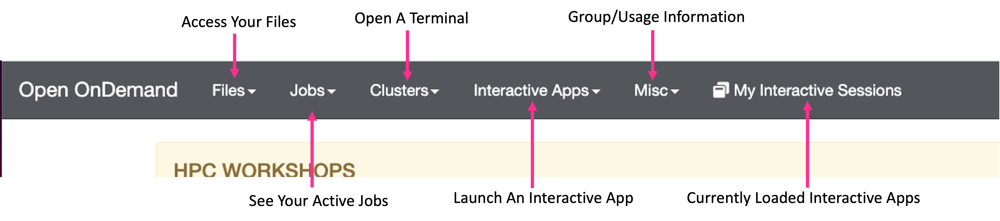
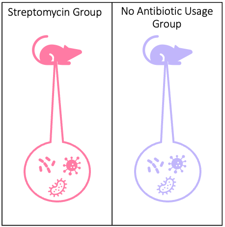

# Introduction To RStudio For Life Sciences

!!! example "Prerequisites"
    - [Request an account](http://research.uit.tufts.edu/) on the Tufts HPC Cluster
    - Connect to the [VPN](https://access.tufts.edu/vpn)

---

## Learning objectives

!!! abstract "Today we are going to learn about"

    - project organization
    - R packages and how to access them on the tufts HPC
    - working with variables and data frames
    - visualizing data
    - and finally writing a markdown report of our findings

---

## Navigate To The Cluster

Once you have an account and are connected to the VPN/Tufts Network, navigate to the [OnDemand Website](https://ondemand.pax.tufts.edu/){:target="_blank" rel="noopener"} and log in with your tufts credentials. Once you are logged in you'll notice a few navigation options:



Click on `Interactive Apps > RStudio Pax` and you will see a form to fill out to request compute resources to use RStudio on the Tufts HPC cluster. We will fill out the form with the following entries:

- `Number of hours` : `3`
- `Number of cores` : `1`
- `Amount of memory` : `4GB`
- `R version` : `4.0.0`
- `Reservation for class, training, workshop` : `GET THIS FROM DELILAH`
- `Load Supporting Modules`: `boost/1.63.0-python3 java/1.8.0_60 gsl/2.6`

Click `Launch` and wait until your session is ready. Click `Connect To RStudio Server`, and you will notice a new window will pop up with RStudio. 

??? question "Have you logged into the cluster?"
    - Yes (put up a green check mark in zoom)
    - No (raise hand in zoom)
    
---

## Introduction To RStudio

RStudio is what is known as an Integrated Development Environment or IDE. Here you can write scripts, run R code, use R packages, view plots, and manage projects. This pane is broken up into three panels:

- **The Interactive R console/Terminal (left)**
- **Environment/History/Connections (upper right)**
- **Files/Plots/Packages/Help/Viewer (lower right)**


## Project Management

Before we dive into R it is worth taking a moment to talk about project management. Often times data analysis is incremental and files build up over time resulting in messy directories:


Sifting through a non-organized file system can make it difficult to find files, share data/scripts, and identify different versions of scripts. To remedy this, It is reccomended to work within an R Project.

---

## R Project

To Create a new R project:

1. Go to `File` > `New Project`
2. `New Directory`
3. `New Project`
4. Create a name for your project (e.g. `R-Practice`)
5. `Create Project`

You will notice that your RStudio console switches to this project directory. When you log out of RStudio you can open this project again by clicking the `.Rproj` file in the project directory. 

!!! note
    The paths will be relative to this project directory as a safe guard against referencing data from outside sources. 

??? question "Have you created the project?"
    - Yes (put up a green check mark in zoom)
    - No (raise hand in zoom)

--- 

## File Organization

- You noticed now that you are inside your project folder
- Let's start by creating some folders to you organize our files
- In the files window click new folder and enter scripts
- Let's do this again to create a data folder and a results folder

---

## Data Principles

- Treat data as read-only
- Store raw data separately from cleaned data if you do need to manipulate it
- Ensure scripts to clean data are kept in a separate `scripts` folder
- Treat reproducible results as disposable

!!! tip
    Result files are good candidate files to cut if you are getting low on storage.

---

## Getting Data



- Today we will be using a fake dataset assessing the taxa count on the mouse microbiome before and after antibiotic usage.
- To copy over this data we will use an R function called file.copy. 
- A function takes some input and delivers an output. 
- In this case we specify two inputs the location of our file and where we want to copy it to. 
- The function's output is copying over this file. So let's try it copy over using the following commands:


```{r data.copy,warning=F,message=F}
file.copy(from="/cluster/tufts/bio/tools/training/intro-to-r/data/meta.tsv", to="./data/")
file.copy(from="/cluster/tufts/bio/tools/training/intro-to-r/data/meta2.tsv", to="./data/")
```

So here you'll note we copied over the file metadata.tsv to the data folder. Let's copy over our script:

```{r script.copy,warning=F,message=F}
file.copy(from="/cluster/tufts/bio/tools/training/intro-to-r/scripts/intro-to-r.Rmd", to="./scripts")
```

Here we copy over our script intro-to-r to the scripts folder.

---

## Opening the Script

Now let's start by opening our script. Go to scripts and then double click on intro-to-r.Rmd!
