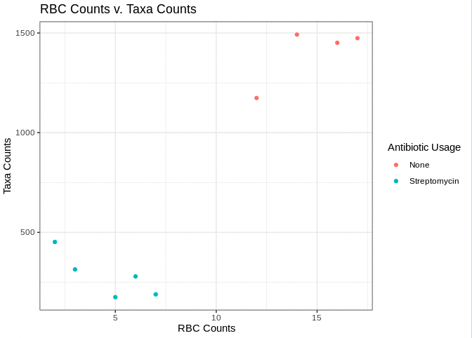

!!! info "output"

    ```
    [1] 18
    ```


!!! info "output"

    ```
    [1] 23
    
    [1] 43
    
    [1] 3 4 6
    ```


!!! info "output"
    
    ```
    [1] 4
    
    [1] 10
    ```


!!! info "output"

    ```
    Registered S3 methods overwritten by 'dbplyr':
    method         from
    print.tbl_lazy     
    print.tbl_sql      
    ── Attaching packages ─────────── tidyverse 1.3.0 ──
    ✓ ggplot2 3.3.5     ✓ purrr   0.3.4
    ✓ tibble  3.1.6     ✓ dplyr   1.0.8
    ✓ tidyr   1.2.0     ✓ stringr 1.4.0
    ✓ readr   1.4.0     ✓ forcats 0.5.1
    ── Conflicts ────────────── tidyverse_conflicts() ──
    x dplyr::filter() masks stats::filter()
    x dplyr::lag()    masks stats::lag()
    ```


!!! info "output"

    ````
    spec_tbl_df [9 × 5] (S3: spec_tbl_df/tbl_df/tbl/data.frame)
     $ SampleID       : chr [1:9] "sample 1" "sample 2" "sample 3" "sample 4" ...
     $ AntibioticUsage: chr [1:9] "None" "None" "None" "None" ...     
     $ Day            : chr [1:9] "Day0" "Day0" "Day0" "Day0" ...     
     $ Organism       : chr [1:9] "mouse" "mouse" "mouse" "mouse" ...    
     $ TaxaCount      : num [1:9] 1174 1474 1492 1451 314 ...    
     - attr(*, "spec")=     
      .. cols(     
      ..   SampleID = col_character(),  
      ..   AntibioticUsage = col_character(),
      ..   Day = col_character(),
      ..   Organism = col_character(),
      ..   TaxaCount = col_double()
      .. )
    ````
  

!!! info "output"

    ```
    [1] "Day0"
    
    [1] "Day0"
    ```


!!! info "output"

    ```
    [1] "None"         "None"         "None"         "None"         "Streptomycin" "Streptomycin" "Streptomycin"
    
    [8] "Streptomycin" "Streptomycin"
    ```
    

!!! info "output"

    ```
    [1] "Streptomycin"
    
    [1] "Streptomycin"
    ```


!!! info "output"

    ```
    [1] "sample 1" "sample 2" "sample 3" "sample 4"
    
    [1] TRUE
    ```


!!! info "output" 

    ```
      SampleID AntibioticUsage
      <chr>    <chr>          
    1 sample 1 None           
    2 sample 2 None           
    3 sample 3 None           
    4 sample 4 None           
    5 sample 5 Streptomycin   
    6 sample 6 Streptomycin 
    ```


!!! info "output"

    ```
    SampleID AntibioticUsage Day   Organism TaxaCount
    <chr>    <chr>           <chr> <chr>        <dbl>
    1 sample 5 Streptomycin    Day5  mouse          314
    2 sample 6 Streptomycin    Day5  mouse          189
    3 sample 7 Streptomycin    Day5  mouse          279
    4 sample 8 Streptomycin    Day5  mouse          175
    5 sample 9 Streptomycin    Day5  mouse          452
    ```
         


!!! info "output"

    ```
      SampleID   RBC
      <chr>    <dbl>
    1 sample 1    12
    2 sample 2    17
    3 sample 3    14
    4 sample 4    16
    5 sample 5     3
    6 sample 6     7
    ```
         

!!! info "output"

    ```
      SampleID AntibioticUsage Day   Organism TaxaCount   RBC  
      <chr>    <chr>           <chr> <chr>        <dbl> <dbl>   
    1 sample 1 None            Day0  mouse         1174    12
    2 sample 2 None            Day0  mouse         1474    17 
    3 sample 3 None            Day0  mouse         1492    14 
    4 sample 4 None            Day0  mouse         1451    16
    5 sample 5 Streptomycin    Day5  mouse          314     3
    6 sample 6 Streptomycin    Day5  mouse          189     7 
    ```
          

!!! info "output"

    ```
      SampleID AntibioticUsage Day   Organism TaxaCount   RBC RBC_Status    
      <chr>    <chr>           <chr> <chr>        <dbl> <dbl> <chr>         
    1 sample 1 None            Day0  mouse         1174    12 Low RBC Count 
    2 sample 2 None            Day0  mouse         1474    17 High RBC Count
    3 sample 3 None            Day0  mouse         1492    14 High RBC Count
    4 sample 4 None            Day0  mouse         1451    16 High RBC Count
    5 sample 5 Streptomycin    Day5  mouse          314     3 Low RBC Count 
    6 sample 6 Streptomycin    Day5  mouse          189     7 Low RBC Count   
    ```
        
        


              
