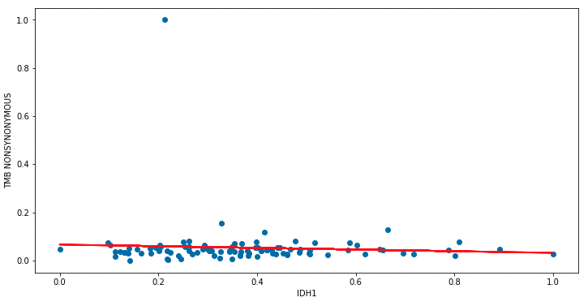

# Introduction To Linear Regression

!!! attention
    Please be sure to have followed the instructions on the [setup page](../setup.md)
    
## Linear Regression

In a regression model assesses the relationship between two quantitative variables by fitting a line to the data. 
Using our glioblastoma data, we will assess the relationship between IDH1 gene expression (a gene commonly mutated in this type of cancer) 
and TMB score (a measure of mutational burden). You can use a regression model to determine:

- how strong the relationship between these two variables is
- the value of the dependent variable given the independent variable

A linear model follows the following formula:

$$ 
y = \beta_0 + \beta_1 X + \epsilon
$$

- $y$: dependent variable
- $\beta_0$: intercept (where $y$ = 0)
- $\beta_1$: regression coefficient or slope
- $X$: independent variable
- $\epsilon$: error or our estimate (what is the variation in our regression coefficient)

This formula describes the best fit line for our data that tries to minimizes our error $\epsilon$:


Let's start by loading our data:

=== "R"

    ```R
    ## Loading our packages
    ## Load the counts data
    ## Load the meta data
    .libPaths(c("/cluster/tufts/hpc/tools/R/4.0.0"))
    library(tidyverse)
    library(caret)
    
    counts <- read.csv(
      file="data/gbm_cptac_2021/data_mrna_seq_fpkm.txt",
      header = T,
      sep = "\t") 

    meta <- read.csv(
      file = "data/gbm_cptac_2021/data_clinical_sample.txt",
      skip=4,
      header = T,
      sep = "\t"
    )
    ```

=== "Python"
    
    Open a new notebook by going to `File` > `New` > `Notebook`. In a code block enter:
    
    ```py
    ## Import our libraries
    ## Import our data set
    import pandas as pd
    import numpy as np
    from matplotlib import pyplot as plt
    import statsmodels.formula.api as smf

    counts = pd.read_csv(
        'data/gbm_cptac_2021/data_mrna_seq_fpkm.txt' ,
        sep = '\t')
    meta = pd.read_csv(
        'data/gbm_cptac_2021/data_clinical_sample.txt' , 
        sep = '\t',
        skiprows=4)
    ```

Now we will need to do some data cleaning before we plug this into our model:

=== "R"

    ```R
    ## Change the patient id column to match 
    ## column names in the counts df
    meta$PATIENT_ID = gsub("-",".",meta$PATIENT_ID)
    
    ## grab IDH1 gene expression
    idh1 = counts %>%
      filter(Hugo_Symbol == "IDH1") %>%
      select(-Hugo_Symbol) %>%
      t() %>%
      as.data.frame() %>%
      mutate(PATIENT_ID = rownames(.))
      
    colnames(idh1) <- c("IDH1","PATIENT_ID")
    
    ## merge meta data and IDH1 
    ## gene expression
    merged <- merge(
      meta,
      idh1,
      by="PATIENT_ID")
    ```

=== "Python"
    
    ```py
    ## Grab IDH1 row and transpose 
    ## ensure that patient id is a column
    ## and that IDH1 is the column name
    IDH1= counts.loc[counts["Hugo_Symbol"] == "IDH1",]
    IDH1 = IDH1.T
    IDH1["PATIENT_ID"] = IDH1.index
    IDH1.columns = ["IDH1","PATIENT_ID"]

    ## Grab TMB score
    ## merge IDH1 gene expression and TMB score
    ## merging this way ensures data are organized
    ## by patient 
    TMB= meta[['PATIENT_ID','TMB_NONSYNONYMOUS']]
    merged=pd.merge(IDH1,TMB,on="PATIENT_ID")
    merged = merged.set_index('PATIENT_ID')
    merged.head()
    ```
These data, IDH1 gene expression and TMB score are on two different scales. To ensure a fair comparison of these variables we will normalize (or bring our data to a common scale) our data:

=== "R"

    ```R
    ## create a normalization function
    ## apply this function to our data 
    ## to get data on a similar scale
    NormalizeData <- function(data){
      normalized = (data - min(data)) / (max(data) - min(data))
      return(normalized)
    }

    norm = as.data.frame(
      apply(merged %>% select(IDH1,TMB_NONSYNONYMOUS), 2,NormalizeData)
    )
    ```

=== "Python"
    
    ```py
    ## You might notice our data is on two 
    ## drastically different scales
    ## We will normalize our data

    def NormalizeData(data):
        normalized = (data - np.min(data)) / (np.max(data) - np.min(data))
        df = pd.DataFrame(normalized)
        return normalized

    norm = NormalizeData(merged)
    ```

Now we can fit our regression model!

=== "R"

    ```R
    ## fit our linear regression model
    model <- lm(TMB_NONSYNONYMOUS ~ IDH1, data = norm)
    
    ## let's plot our data
    ## with the predicted values
    ggplot(norm, aes(x=IDH1, y=TMB_NONSYNONYMOUS)) + 
      geom_point() +
      theme_bw() +
      ylab("TMB") +
      xlab("IDH1") +
      geom_smooth(method=lm)
    ```
    
    
    
=== "Python"
    
    ```py
    ## fit our linear regression model
    tmb = norm['TMB_NONSYNONYMOUS']
    idh1 = norm['IDH1'].astype(float)
    model = sm.OLS(tmb,idh1).fit()
    
    ## Let's plot our data
    ## along with the predictions from 
    ## our model
    plt.figure(figsize=(12, 6))
    plt.plot(norm['IDH1'], norm['TMB_NONSYNONYMOUS'], 'o') 
    plt.plot(norm['IDH1'], model.predict(idh1), 'r', linewidth=2)
    plt.xlabel('IDH1')
    plt.ylabel('TMB NONSYNONYMOUS')

    plt.show()
    ```
    
    
    
    
## Model Results

To assess our model we will generate a summary of some important metrics:

=== "R"

    ```R
    summary(model)
    ```
    
    ```
    Call:
    lm(formula = TMB_NONSYNONYMOUS ~ IDH1, data = norm)
    
    Residuals:
           Min         1Q     Median         3Q        Max 
    -1.198e-06 -4.604e-07 -2.363e-07  1.870e-08  1.835e-05 
    
    Coefficients:
                  Estimate Std. Error t value Pr(>|t|)  
    (Intercept)  1.393e-06  5.759e-07   2.419   0.0174 *
    IDH1        -7.703e-07  1.202e-06  -0.641   0.5230  
    ---
    Signif. codes:  0 ‘***’ 0.001 ‘**’ 0.01 ‘*’ 0.05 ‘.’ 0.1 ‘ ’ 1
    
    Residual standard error: 1.937e-06 on 97 degrees of freedom
    Multiple R-squared:  0.004218,	Adjusted R-squared:  -0.006048 
    F-statistic: 0.4109 on 1 and 97 DF,  p-value: 0.523
    ```
=== "Python"
    
    ```py
    model.summary()
    ```
    
    ```
    OLS Regression Results
    Dep. Variable:	TMB_NONSYNONYMOUS	R-squared:	0.161
    Model:	OLS	Adj. R-squared:	0.152
    Method:	Least Squares	F-statistic:	18.76
    Date:	Thu, 01 Sep 2022	Prob (F-statistic):	3.58e-05
    Time:	20:40:33	Log-Likelihood:	84.739
    No. Observations:	99	AIC:	-167.5
    Df Residuals:	98	BIC:	-164.9
    Df Model:	1		
    Covariance Type:	nonrobust		
            coef	std err	t	P>|t|	[0.025	0.975]
    IDH1	0.1089	0.025	4.332	0.000	0.059	0.159
    Omnibus:	197.980	Durbin-Watson:	2.022
    Prob(Omnibus):	0.000	Jarque-Bera (JB):	26069.945
    Skew:	8.511	Prob(JB):	0.00
    Kurtosis:	80.655	Cond. No.	1.00
    ```
    
Let's cover what a few of these mean:

=== "R"

    ```R
    
    ```
    
=== "Python"
    
    ```py
    ```

    
## Assumptions

## References

- [scribbr](https://www.scribbr.com/statistics/simple-linear-regression/)
- [STHDA](http://www.sthda.com/english/articles/40-regression-analysis/165-linear-regression-essentials-in-r/)
