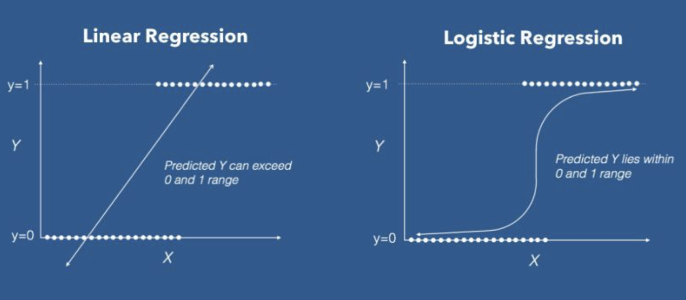

# Introduction To Logistic Regression

!!! attention
    Please be sure to have followed the instructions on the [setup page](../setup.md)
    
## Logistic Regression

A logistic regression model attempts to classify, so for example can ALDH3A1 gene expression to predict smoking status? So how do we do this? We could fit a linear model to our data but we would end up with something like this:



Here we see that if we used a linear model, we'd end up predicting values that are not our two catetories - smoker or non-smoker (and on the graph 0 or 1). So how do we fit our data when it is binary? We use a sigmoid function:

$$ p(X) = \frac{ e^{\beta_{0} + \beta_{1}X} }{1 + e^{\beta_{0} + \beta_{1}X} } $$

- $p(X)$ : probability of smoking status given ALDH3A1 gene expression
- $X$ : ALDH3A1 gene expression
- $\beta_{0}$ : y intercept
- $\beta_{1}$ : slope of our line

This sigmoid function creates our S-shaped curve! However we'd like our probability to be linear relationship with X. So we can manipulate this equation to get:

$$ \frac{p(X)}{1 - p(X)} = e^{\beta_{0} + \beta_{1}X}$$

Where $\frac{p(X)}{1 - p(X)}$ is known as the **odds ratio** and this can range from $0$ to $\infty$. However, again this doesn't match our 0 to 1 scale, so we take the log of both sides to get:

$$ log(\frac{p(X)}{1 - p(X)}) = \beta_{0} + \beta_{1}X $$

Here we get $log(\frac{p(X)}{1 - p(X)})$ or the **logit function** - where a one unity increase in $X$ increases $p(X)$ by $\beta_{0}$. 

## Making the Model

First let's do some preprocessing to get our combine ALDH3A1 gene expression with smoking status:

=== "R"

    ```R
    ## load our libraries via our library path
    .libPaths(c("/cluster/tufts/hpc/tools/R/4.0.0"))
    library(tidyverse)
    library(caret)
    library(ggplot2)

    ## load our counts and meta data
    counts <- read.csv(
      file="data/gbm_cptac_2021/data_mrna_seq_fpkm.txt",
      header = T,
      sep = "\t") 

    meta <- read.csv(
      file = "data/gbm_cptac_2021/data_clinical_patient.txt",
      skip=4,
      header = T,
      sep = "\t"
    )

    ## ensure our patient ID's match between 
    ## the counts and meta data
    meta$PATIENT_ID = gsub("-",".",meta$PATIENT_ID)

    ## grab IDH1 gene expression and 
    ## patient ID 
    aldh3a1 = counts %>%
      filter(Hugo_Symbol == "ALDH3A1") %>%
      select(-Hugo_Symbol) %>%
      t() %>%
      as.data.frame() %>%
      mutate(PATIENT_ID = rownames(.))

    colnames(aldh3a1) <- c("aldh3a1","PATIENT_ID")

    ## merge counts and meta data
    merged <- merge(
      meta,
      aldh3a1,
      by="PATIENT_ID")

    ## create smoking status variable
    ## and normalize ALDH3A1 expression
    merged <- merged %>%
      mutate(smoking = ifelse(grepl("non-smoker",SMOKING_HISTORY),0,1)) %>%
      mutate(aldh3a1 = log2(aldh3a1+1))
    ```
=== "Python"

    ```py
    
    ```
    
Now let's take a look at our data:

=== "R"

    ```R
    ## let's plot our data
    ggplot(merged, aes(x=aldh3a1, y=smoking)) + 
      geom_point() +
      theme_bw() +
      ylab("Smoking Status") +
      xlab("ALDH3A1 Gene Expression") 
    ```
    
    
    
=== "Python"

    ```py
    
    ```

We see that there isn't a great delineation between the two conditions - smoking and non-smoking. But let's creat our logistic regression model to confirm:

=== "R"

    ```R
    ## let's make our model
    model <- glm( smoking ~ aldh3a1, data = merged, family = binomial)
    summary(model) 
    ```
    
    ```
    Call:
    glm(formula = smoking ~ aldh3a1, family = binomial, data = merged)

    Deviance Residuals: 
        Min       1Q   Median       3Q      Max  
    -1.0299  -0.9776  -0.9364   1.3867   1.4800  

    Coefficients:
                {==Estimate Std. Error z value Pr(>|z|)==}
    (Intercept)  {==0.15978==}    1.61680   0.099    0.921
    aldh3a1     {==-0.05947    0.13897  -0.428    0.669==}
    
    (Dispersion parameter for binomial family taken to be 1)
    
        Null deviance: 127.95  on 96  degrees of freedom
    Residual deviance: 127.77  on 95  degrees of freedom
      (2 observations deleted due to missingness)
    AIC: 131.77

    Number of Fisher Scoring iterations: 4
    ```
    
=== "Python"

    ```py
    
    ```

## References

- [datacamp](https://www.datacamp.com/tutorial/logistic-regression-R)
- [STHDA](http://www.sthda.com/english/articles/36-classification-methods-essentials/151-logistic-regression-essentials-in-r/)
