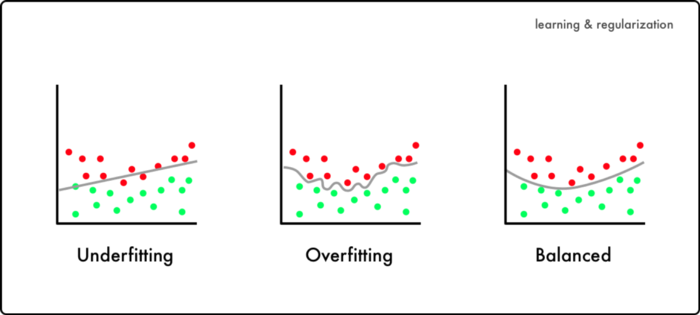
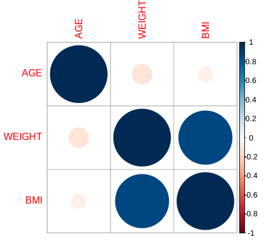

# Introduction To Multivariate Regression

!!! example "Prerequisites"
    - [Request an account](http://research.uit.tufts.edu/) on the Tufts HPC Cluster
    - Connect to the [VPN](https://access.tufts.edu/vpn)
    - Please be sure to have followed the instructions on the [setup page](../setup.md)
    
## Multivariate Regression

In the [linear regression](linear-model.md) and [logistic regression](logistic-regression.md) tutorials we cover univariate modelling - 
or modelling with one variable. Here we discuss how to create multivariate models, or models with multiple independent variables. 

### Pre-Processing

=== "R"
    
    ```R
    ## load our libraries via our library path
    .libPaths(c("/cluster/tufts/hpc/tools/R/4.0.0"))
    library(tidyverse)
    library(caret)
    library(ggplot2)

    ## load our counts and meta data
    counts <- read.csv(
      file="data/gbm_cptac_2021/data_mrna_seq_fpkm.txt",
      header = T,
      sep = "\t") 

    meta <- read.csv(
      file = "data/gbm_cptac_2021/data_clinical_patient.txt",
      skip=4,
      header = T,
      sep = "\t"
    )

    ## ensure our patient ID's match between 
    ## the counts and meta data
    meta$PATIENT_ID = gsub("-",".",meta$PATIENT_ID)

    ## grab IDH1 gene expression and 
    ## patient ID 
    aldh3a1 = counts %>%
      filter(Hugo_Symbol == "ALDH3A1") %>%
      select(-Hugo_Symbol) %>%
      t() %>%
      as.data.frame() %>%
      mutate(PATIENT_ID = rownames(.))

    colnames(aldh3a1) <- c("aldh3a1","PATIENT_ID")

    ## merge counts and meta data
    merged <- merge(
      meta,
      aldh3a1,
      by="PATIENT_ID")

    ## create smoking status variable
    ## and normalize ALDH3A1 expression
    merged <- merged %>%
      mutate(smoking = ifelse(grepl("non-smoker",SMOKING_HISTORY),0,1)) %>%
      mutate(aldh3a1 = log2(aldh3a1+1))
    ```

=== "Python"

    ```py
    ```
    
### Build a Multivariate Model

=== "R"
    
    ```R
    ## build several multivariate models
    model1 <- glm( smoking ~ AGE, data = merged, family = binomial)
    model2 <- glm( smoking ~  AGE + WEIGHT , data = merged, family = binomial)
    model3 <- glm( smoking ~  AGE + WEIGHT + BMI , data = merged, family = binomial)
    AIC(model1,
        model2,
        model3)
    BIC(model1,
        model2,
        model3)
    ```
    
    ```
           df      AIC
    model1  2 130.1894
    model2  3 121.4100
    model3  4 123.2545
    
           df      BIC
    model1  2 135.3797
    model2  3 129.1953
    model3  4 133.6350
    ```

=== "Python"

    ```py
    ```

## AIC & BIC

Above, we created several logistic regression models with different numbers of variables (separated by a `+` sign). We also display the **Akaike information criterion (AIC)** and the **Bayesian information criterion (BIC)** values for the different models. So what are these? These are values are a way of summarizing our models and seeing at what point adding too many variables interferes rather that helps. The lower the AIC/BIC, the better the model. Above we note that model 2 has the lowest AIC/BIC and when we add the third term, `BMI`, we raise our criterion values. 

## Overfitting

So why might adding more variables hurt our model if it can help improve our model metrics? Well, while adding more variables can help improve our model's metrics, it doesn't necessarily mean it can help improve our model's ability to predict. Here is a visual:



Here we see that when a model is under fit, it doesn't necessary follow the direction of the data. On the other hand, if we are too good at predicting our data set, we trade off with the ability to predict new data. 

## Multicollinearity

Additionally, we need to think carefully about the variables we are plugging into our model. Each variable should add **new** information and should not correlate with one another. Let's try to determine this visually:

=== "R"

    ```R
    ## grab our correlations
    ## plot these correlations
    cors <- cor(merged %>% select(AGE,WEIGHT,BMI))
    corrplot::corrplot(cors)
    ```
    
    
    
=== "Python"

    ```py
    ```
    
We can also use the **variance inflation factor (VIF)** to assess multicollinearity - with values between 5 and 10 indicating multicollinearity:

=== "R"

    ```R
    ## use the vif function to
    ## assess multicollinearity
    car::vif(model2)
    car::vif(model3)
    ```
    
    ```
         AGE   WEIGHT 
    1.106764 1.106764 
         AGE   WEIGHT      BMI 
    1.108918 3.265643 3.123681 
    ```
    
=== "Python"

    ```py
    ```
    
Here we see that while the VIF values of `WEIGHT` and `BMI` do not go over 5, we see in the correlation plot that these variables are indeed highly correlated. Also, when `BMI` is added to `model3` we see that the VIF values for `WEIGHT` and `BMI` are bumped up closer to 5. 

??? question "Why do you think that BMI has a lower VIF than WEIGHT?"
    Weight is used to calculate BMI. However, BMI also captures information about height which isn't captured by our WEIGHT variable.
    
    
## References

- [STHDA](http://www.sthda.com/english/articles/38-regression-model-validation/158-regression-model-accuracy-metrics-r-square-aic-bic-cp-and-more/)
- [Towards Data Science - overfitting](https://towardsdatascience.com/8-simple-techniques-to-prevent-overfitting-4d443da2ef7d)
- [Towards Data Science - logistic](https://towardsdatascience.com/assumptions-of-logistic-regression-clearly-explained-44d85a22b290)
