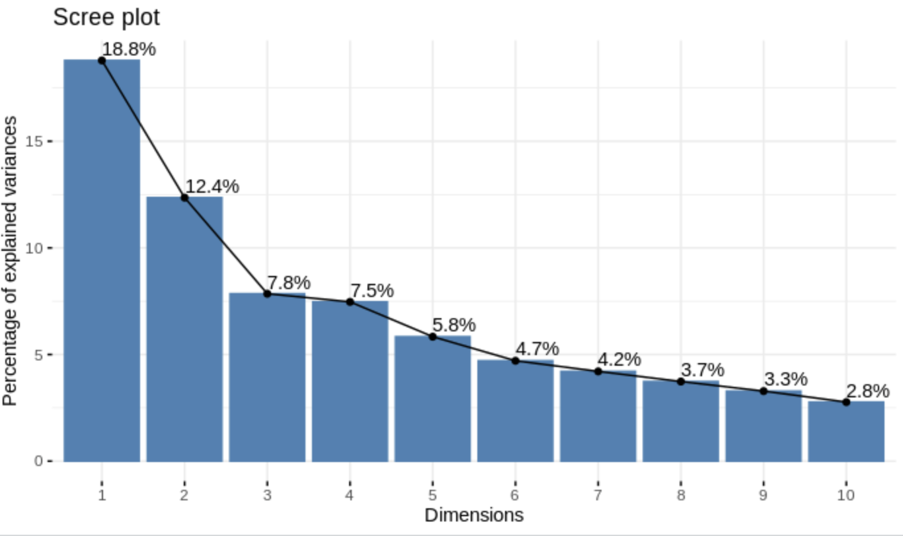
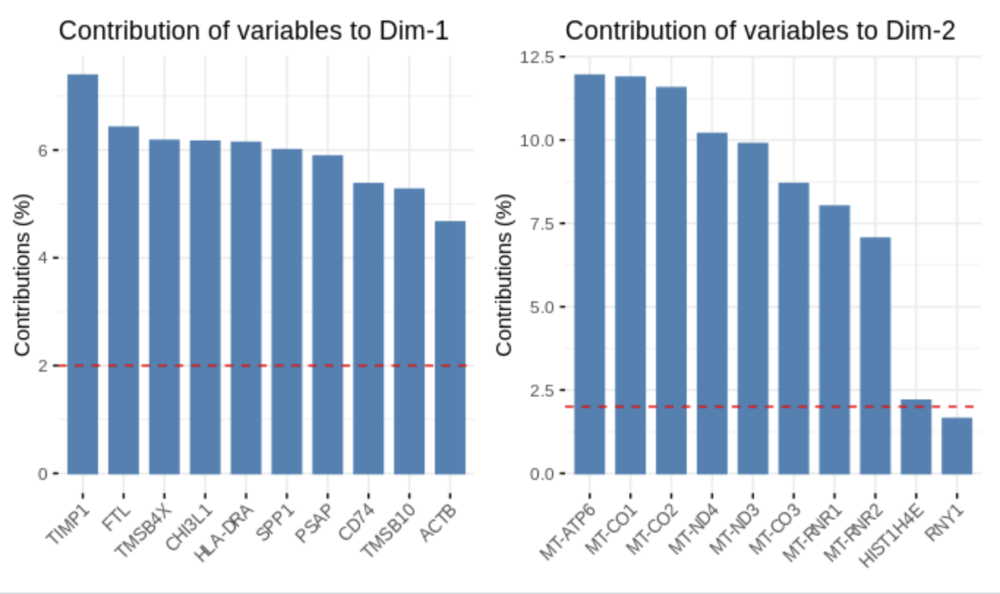

# Introduction To Dimension Reduction

!!! attention
    Please be sure to have followed the instructions on the [setup page](../setup.md)
    
- Process of reducing the number of variables to a set of principal values where variation in your data becomes apparent. Here is an example with three dimensions:

<figure markdown>
  { width="500" }
  <figcaption>Dimension Reduction Example</figcaption>
</figure>

- Here we see that most of the variation is visible along the x-y axes
- So what are the advantages:

  - simplification
  - denoising
  - variable selection
  - visualization

## Principal Component Analysis (PCA)

- PCA works by summarizing a set of continuous (quantitative) multivariate (multiple variable) data into a set of **linearly uncorrelated** variables called principal components.

### Pros

- can be used on large data
- can be used with sparse data
- preserves the structure (reproducible)

### Cons

- if one variable is on a different scale (like kg instead of g) it can bias the results. So ensure data is on one scale!
- points can be crowded with large numbers of observations and reveal no pattern
- susceptible to outliers

Let's try this in code! First we will need to do some preprocessing:

=== "R"

    ``` R
    ## load our libraries via our library path
    .libPaths(c("/cluster/tufts/hpc/tools/R/4.0.0"))
    library(tidyverse)
    library(FactoMineR)
    library(factoextra)
    library(ggplot2)
    library(missMDA)
    library(patchwork)
    
    ## load counts/meta data
    counts <- read.csv(
      file="data/gbm_cptac_2021/data_mrna_seq_fpkm.txt",
      header = T,
      sep = "\t")

    meta <- read.csv(
      file = "data/gbm_cptac_2021/data_clinical_patient.txt",
      skip=4,
      header = T,
      sep = "\t"
    )
    
    ## ensure patient IDs match 
    ## patient IDs in counts data
    meta <- meta %>%
      mutate(PATIENT_ID = gsub("-",".",meta$PATIENT_ID)) %>%
      column_to_rownames("PATIENT_ID")
    ```

=== "Python"

    ``` py
    # still in development - sorry!
    ```

Now we will ensure our data are on a common scale by log2 transforming it. This will ensure that we don't bias our PCA in the direction of higher magnitude variables. We will also select the top 50 genes with the highest variance as usually high variance genes are more biologically interesting. 

=== "R"

    ``` R
    ## log2 normalize our data
    norm = log2(counts %>% select(-Hugo_Symbol)+1)

    ## extract variances
    vars = apply(
      counts %>% select(-Hugo_Symbol),
      1, 
      function(x){return(var(x,na.rm = T))})

    ## select the genes with the
    ## top 50 variances
    selected <- norm %>%
      filter(rank(-vars)<=50) %>%
      mutate(gene = counts$Hugo_Symbol[rank(-vars)<=50]) %>%
      column_to_rownames("gene") %>%
      t() %>%
      merge(.,meta,by="row.names",all=TRUE) %>%
      column_to_rownames("Row.names")
    ```

=== "Python"

    ``` py
    # still in development - sorry!
    ```

## PCA Plot Interpretation

=== "R"

    ``` R
    ## run PCA and extract eigenvalues
    pca <- PCA(selected[,1:50],graph = FALSE)
    head(get_eig(pca))

    ## visualize our eigenvalues/principal components
    fviz_screeplot(pca,addlabels = TRUE)
    ```
    
    ```
          eigenvalue variance.percent cumulative.variance.percent
    Dim.1   9.395012        18.790023                    18.79002
    Dim.2   6.177962        12.355925                    31.14595
    Dim.3   3.924839         7.849677                    38.99563
    Dim.4   3.734111         7.468223                    46.46385
    Dim.5   2.917162         5.834324                    52.29817
    Dim.6   2.352690         4.705380                    57.00355
    ```
    
    
    
=== "Python"

    ``` py
    # still in development - sorry!
    ```
Here we display our our principal components (`Dim.1`,`Dim.2`, etc.) and their **eigenvalues** - or amount of variation that this principal component captures. For example, the first principal component has an eigenvalue of ~ 9.395 and captures about 18.8% of the variance in the data. We can also visualize which variables are manipulating our data the most and our samples themselves:

=== "R"

    ``` R
    ## which variables are contributing
    ## to principal components
    fviz_contrib(pca, choice = "var", axes = 1, top = 10) |
      fviz_contrib(pca, choice = "var", axes = 2, top = 10) 

    ## let's visualize our samples in 
    ## principal component space
    fviz_pca_ind(pca,
                 label = "none", # hide individual labels
                 habillage = as.factor(selected$SEX), # color by groups
                 addEllipses = FALSE # Concentration ellipses
    )
    ```
    
    
    
    
    
=== "Python"

    ``` py
    # still in development - sorry!
    ```

Here we note that the gene TIMP1, contributes the most to variance of principal component 1. Interestingly, this gene [has been implicated in immune infiltration in glioblastoma](https://bmcneurol.biomedcentral.com/articles/10.1186/s12883-021-02477-1). We also can see in the variance contribution plot for the second principal component that MT-ATP6 contributes the most to the variance of this dimension. In the plot below the variable contribution plot, we visualize our samples along the first two principal components and color by sex. Here we do not see a discernable pattern - but this kind of coloring is useful say if you want to ensure two conditions are distributed the way you'd expect.

!!! example
    An example of using PCA to see if conditions are distributed as expected could be a case-control study. Do your case patients cluster together and do your control patients cluster together.

## References

- [RPubs](https://rpubs.com/Saskia/520216)
- [STHDA](http://www.sthda.com/english/wiki/factoextra-r-package-easy-multivariate-data-analyses-and-elegant-visualization)
