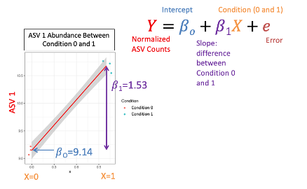

When assessing a microbial community, you might be interested to determine which taxa are differentially abundant between conditions. Given that we have a counts matrix we can use DESeq2!

## Phylum Present

Before we assess which phylum are differentially abundant, a bar plot can be a quick first pass at determining this:

```R
## filter out top 20 ASVs
## create a barplot of their distribution
## between samples/conditions
top20 <- names(sort(taxa_sums(ps), decreasing=TRUE))[1:20]
ps.top20 <- transform_sample_counts(ps, function(OTU) OTU/sum(OTU))
ps.top20 <- prune_taxa(top20, ps.top20)
plot_bar(ps.top20, x="Run", fill="Phylum") + 
  facet_wrap(~Host, scales="free_x")+
  theme_bw()+
  theme(axis.text.x = element_text(angle = 65,hjust=1))
```


Here we note that the wild type seem to have an abundance of Campylobacteria and the C57BL/6NTac have an abundance of Bacteriodota. Let's see if our DESeq2 results confirm this.

## Differential Abundance 

Differential Abundance measures which taxa are differentially abundant between conditions. So how does it work:

- DESeq2 Normalization:
1. Geometric mean per ASV
2. Divide rows by geometric mean
3. Take the median of each sample
4. Divide all ASV counts by that median


- DESeq2 Model
1. The normalized abundances of an ASV are plotted against two conditions
2. The regression line that connects these data is used to determine the p-value for differential abundance



- DESeq2 P-Value
1. The Slope or 𝛽1 is used to calculate a Wald Test Statistic 𝑍
2. This statistic is compared to a normal distribution to determine the probability of getting that statistic 


Now how do we do this in R?

```R
# Differential Abundance

## convert phyloseq object to DESeq object this dataset was downsampled and 
## as such contains zeros for each ASV, we will need to
## add a pseudocount of 1 to continue and ensure the data are still integers
## run DESeq2 against Host status, and ensure wild type is control,
## filter for significant changes and add in phylogenetic info
dds = phyloseq_to_deseq2(ps, ~ Host)
dds@assays@data@listData$counts = apply((dds@assays@data@listData$counts +1),2,as.integer)
dds = DESeq(dds, test="Wald", fitType="parametric")
res = data.frame(
  results(dds,
          cooksCutoff = FALSE, 
          contrast = c("Host","C57BL/6NTac","Mus musculus domesticus")))
sigtab = res %>%
  cbind(tax_table(ps)[rownames(res), ]) %>%
  dplyr::filter(padj < 0.05) 

## order sigtab in direction of fold change
## plot differential abundance
sigtab <- sigtab %>%
  mutate(Phylum = factor(as.character(Phylum), 
                        levels=names(sort(tapply(
                          sigtab$log2FoldChange, 
                          sigtab$Phylum, 
                          function(x) max(x)))))
  )
ggplot(sigtab , aes(x=Phylum, y=log2FoldChange, color=padj)) + 
  geom_point(size=6) + 
  theme_bw() +
  theme(axis.text.x = element_text(angle = 60, hjust = 1)) +
  ggtitle("Mus musculus domesticus v. C57BL/6NTac")
```


So how did our results stack up to our graph? Well, the wild type seem to have an abundance of Campylobacteria and the C57BL/6NTac have an abundance of Bacteriodota. However, you'll note that Proteobacteria are severely downregulated in our C57BL/6NTac mice when they only show up in one sample in the wild-type mice. This is why it is useful to confirm that your DESeq2 results are not biased by outliers. It should also be mentioned that we are only dealing with 8 samples here to speed up the tutorial. However, small sample sizes can paint a misleading picture if you are not careful.
