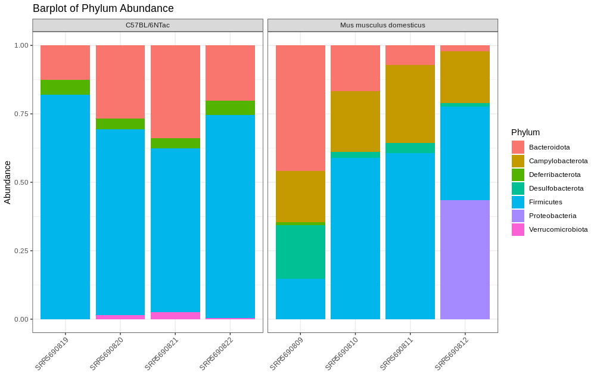
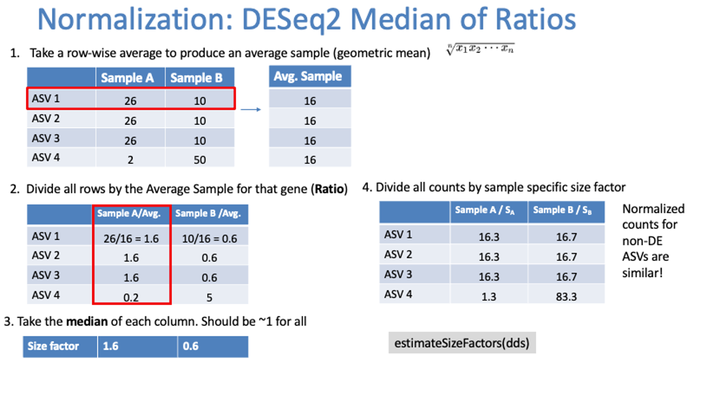
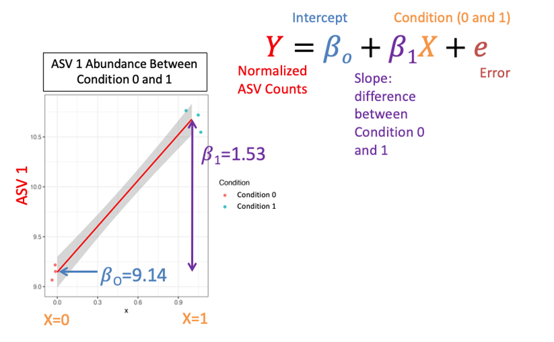
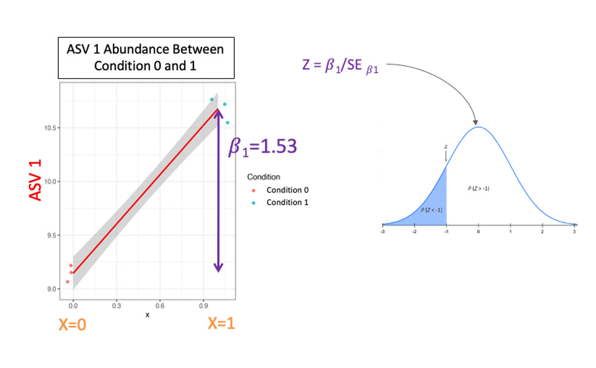
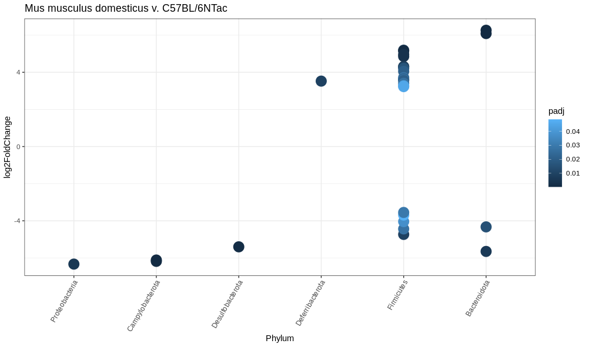

When assessing a microbial community, you might be interested to determine which taxa are differentially abundant between conditions. Given that we have a counts matrix we can use DESeq2!

## Phylum Present

Before we assess which phylum are differentially abundant, a bar plot can be a quick first pass at determining this:

**Code Chunk 16**


```R
# transform the sample counts to proportions
# separate out our proportions
# separate our our tax info
ps.prop <- transform_sample_counts(ps, function(OTU) OTU/sum(OTU))
otu = data.frame(t(data.frame(ps.prop@otu_table)))
tax = data.frame(ps.prop@tax_table) 

# merge the otu table and phylum column
# reshape our data to be accepted by ggplot
# merge taxa data with sample meta data
merged <- merge(otu,
                 tax %>% select(Phylum),
                 by="row.names") %>%
  select(-Row.names) %>%
  reshape2::melt() %>%
  merge(.,
        data.frame(ps.prop@sam_data) %>%
          select(Run,Host),
        by.x="variable",
        by.y="Run")

# plot our taxa 
ggplot(merged,aes(x=variable,y=value,fill=Phylum)) +
  geom_bar(stat='identity') +
  theme_bw()+
  theme(axis.text.x = element_text(angle=45,hjust=1))+
  labs(
    x="",
    y="Abundance",
    title = "Barplot of Phylum Abundance"
  )+
  facet_wrap(Host ~ ., scales = "free_x")
```



Here we note that the wild type seem to have an abundance of Campylobacteria and the C57BL/6NTac have an abundance of Bacteriodota. Let's see if our DESeq2 results confirm this.


## Differential Abundance 

Differential Abundance measures which taxa are differentially abundant between conditions. So how does it work:

### DESeq2 Normalization:
1. Geometric mean per ASV
2. Divide rows by geometric mean
3. Take the median of each sample
4. Divide all ASV counts by that median

<figure markdown>
  { width="800" }
</figure>

### DESeq2 Model
1. The normalized abundances of an ASV are plotted against two conditions
2. The regression line that connects these data is used to determine the p-value for differential abundance

<figure markdown>
  { width="800" }
</figure>


### DESeq2 P-Value
1. The Slope or 𝛽1 is used to calculate a Wald Test Statistic 𝑍
2. This statistic is compared to a normal distribution to determine the probability of getting that statistic 

<figure markdown>
  { width="800" }
</figure>

Now how do we do this in R?

**Code Chunk 17**


```R
# Differential Abundance

## convert phyloseq object to DESeq object this dataset was downsampled and 
## as such contains zeros for each ASV, we will need to
## add a pseudocount of 1 to continue and ensure the data are still integers
## run DESeq2 against Host status, and ensure wild type is control,
## filter for significant changes and add in phylogenetic info
dds = phyloseq_to_deseq2(ps, ~ Host)
dds@assays@data@listData$counts = apply((dds@assays@data@listData$counts +1),2,as.integer)
dds = DESeq(dds, test="Wald", fitType="parametric")
res = data.frame(
  results(dds,
          cooksCutoff = FALSE, 
          contrast = c("Host","C57BL/6NTac","Mus musculus domesticus")))
sigtab = res %>%
  cbind(tax_table(ps)[rownames(res), ]) %>%
  dplyr::filter(padj < 0.05) 

## order sigtab in direction of fold change
## plot differential abundance
sigtab <- sigtab %>%
  mutate(Phylum = factor(as.character(Phylum), 
                        levels=names(sort(tapply(
                          sigtab$log2FoldChange, 
                          sigtab$Phylum, 
                          function(x) max(x)))))
  )
ggplot(sigtab , aes(x=Phylum, y=log2FoldChange, color=padj)) + 
  geom_point(size=6) + 
  theme_bw() +
  theme(axis.text.x = element_text(angle = 60, hjust = 1)) +
  ggtitle("Mus musculus domesticus v. C57BL/6NTac")
```



!!! example "Explanation of Results"

    - Wild type seem to have an abundance of Campylobacteria and the C57BL/6NTac have an abundance of Bacteriodota
    - Proteobacteria are severely downregulated in our C57BL/6NTac mice. However, they only show up in one sample!
    - Be sure that your data are not influenced by outliers!
    - Additionally, we collapsed our ASV's to the Phylum level since all ASV's had an identified phylum
    

## References
1. [Galaxy Project - Metagenomics](https://training.galaxyproject.org/training-material/topics/metagenomics/tutorials/mothur-miseq-sop/tutorial.html)
2. [Microbiome 101](https://www.ncbi.nlm.nih.gov/pmc/articles/PMC6391518/)
3. [Current understanding of the human microbiome](https://www.nature.com/articles/nm.4517)
4. [Amplicon and metagenomics overview](https://astrobiomike.github.io/misc/amplicon_and_metagen)
5. [Variable regions of the 16S ribosomal RNA](https://www.nature.com/articles/nrmicro3330/figures/1)
6. [A primer on microbial bioinformatics for nonbioinformaticians](https://www.clinicalmicrobiologyandinfection.com/article/S1198-743X(17)30709-7/fulltext)
7. [usearch](https://www.drive5.com/usearch/manual/fastq_files.html)
8. [Sample Multiplexing Overview](https://www.illumina.com/techniques/sequencing/ngs-library-prep/multiplexing.html)
9. [DADA2: High resolution sample inference from Illumina amplicon data](https://www.ncbi.nlm.nih.gov/pmc/articles/PMC4927377/)
10. [Chimeric 16S rRNA sequence formation and detection in Sanger and 454-pyrosequenced PCR amplicons](https://genome.cshlp.org/content/21/3/494/F1.expansion.html)
11. [DADA2 Pipeline Tutorial (1.16)](https://benjjneb.github.io/dada2/tutorial.html)
12. [Statistics How To](https://www.statisticshowto.com/)
13. [Hierarchical Clustering in Data Mining](https://www.geeksforgeeks.org/hierarchical-clustering-in-data-mining/)
14. [Abundance-based dissimilarity metrics](https://www.dataanalytics.org.uk/abundance-based-dissimilarity-metrics/)
15. [Differential expression analysis with DESeq2](https://hbctraining.github.io/DGE_workshop/lessons/04_DGE_DESeq2_analysis.html)
16. [Introduction to RNA-Seq with Galaxy](https://tuftsdatalab.github.io/Research_Technology_Bioinformatics/workshops/IntroToRNAseqGalaxy/slides/galaxyWorkshop_idgh1001_15Feb2022.pdf)
17. [Evaluation of 16S rRNA Databases for Taxonomic Assignments Using a Mock Community](https://www.ncbi.nlm.nih.gov/pmc/articles/PMC6440677/)
18. [Wild Mouse Gut Microbiota Promotes Host Fitness and Improves Disease Resistance](https://www.ncbi.nlm.nih.gov/pmc/articles/PMC6887100/)
19. [Normalization and microbial differential abundance strategies depend upon data characteristics](https://microbiomejournal.biomedcentral.com/articles/10.1186/s40168-017-0237-y)
20. [Waste Not, Want Not: Why Rarefying Microbiome Data Is Inadmissible](https://journals.plos.org/ploscompbiol/article?id=10.1371/journal.pcbi.1003531)
21. [A Primer on Metagenomics](https://journals.plos.org/ploscompbiol/article?id=10.1371/journal.pcbi.1000667)

