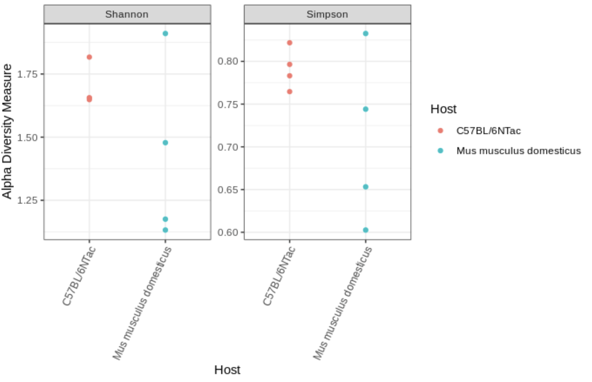

## Making a PhyloSeq Object

Once we have quantified our community, we can analyze its composition. Two main methods of doing so are exploring the **alpha** and **beta** diversity of the community. First we will need to take our taxonomic data and pass it to the `phyloseq` package for easier manipulation:

**Code Chunk 12**


```R
# Create phyloseq object

## upload meta data for study
## use this metadata to create the phyloseq object
meta <- read.csv("./data/metaData/metaData.txt")
rownames(meta) <- meta$Run
ps <- phyloseq(otu_table(seqtab.nochim, taxa_are_rows=FALSE), 
               sample_data(meta), 
               tax_table(taxa)
               )
               
# Update ASV names to be shorter

## The full ASV DNA sequence can be hard to look at
## for this reason we move the sequence information to 
## the refseq slot of the phyloseq object
dna <- Biostrings::DNAStringSet(taxa_names(ps))
names(dna) <- taxa_names(ps)
ps <- merge_phyloseq(ps, dna)
taxa_names(ps) <- paste0("ASV", seq(ntaxa(ps)))
```

## Alpha Diversity

- The ecological complexity of a single sample
- We can use the Shannon or Simpson Diversity indices to measure this complexity per sample.

??? example "Optional: How to calculate these diversity metrics"
    

- Here we note:

    - **Shannon Diversity Index:** higher values = higher diversity
    - **Simpson Diversity Index:** higher values = higher diversity

In R we can visualize this with:

**Code Chunk 13**


```R
# Plotting
plot_richness(ps, x="Host", measures=c("Shannon", "Simpson"), color="Host")+
  theme_bw()+
  theme(axis.text.x = element_text(angle=65,hjust=1))
```



!!! note
    When running alpha and beta diversity plots you will notice some errors. This is due to the subsampling we needed to do on this data
    to ensure multiple users could run this workshop at the same time.

## Beta Diversity

- The ecological complexity between samples
- We can visualize how our samples group together by ordination – a dimension reduction technique to help visualize sample to sample distance. An ordination metric we can use is the Bray-Curtis distance:

??? example "Optional: How to calculate Bray-Curtis distance"
    

We can plot this in R code:

**Code Chunk 14**


```R
## Transform data to proportions 
## as appropriate for Bray-Curtis distances
ps.prop <- transform_sample_counts(ps, function(otu) otu/sum(otu))
ord.nmds.bray <- ordinate(ps.prop, method="NMDS", distance="bray")
plot_ordination(ps.prop, ord.nmds.bray, color="Host", title="Bray NMDS")+
  theme_bw()
```


Here we note that the wild type and C57BL/6NTac cluster together.

??? question "Which mouse line do you expect to be more spread on the Bray-Curtis Distance plot?"
    - Laboratory Mouse Line (C57BL/6NTac)
    - Wild Type (Mus musculus domesticus)
