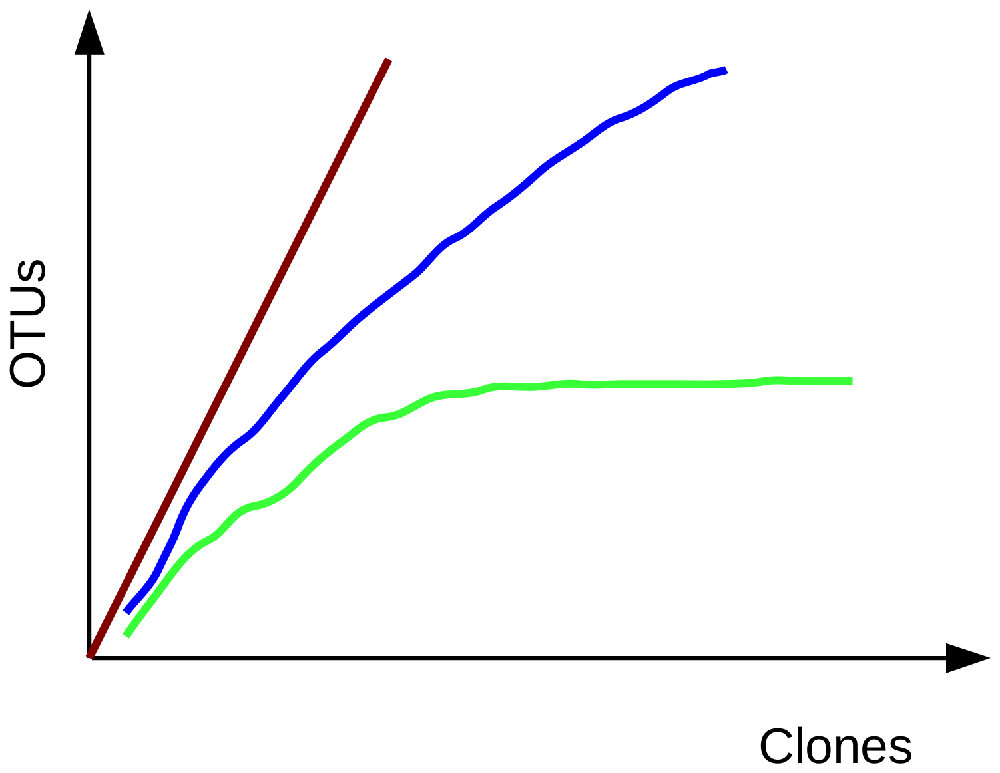
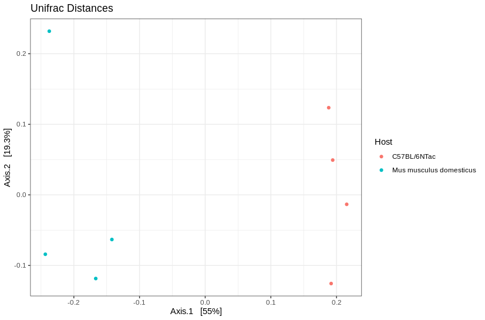

## Constructing the Phylogenetic Tree

We will now construct a phylogenic tree based on our sequence data. To construct our tree we will be first aligning our ASV's using ClustalW and then constructing a phylogenetic tree via the neighborhood joining method. 


!!! info "To learn more about ClustalW and the neighborhood joining method visit:"
    - [Clustal W and Clustal X version 2.0](https://academic.oup.com/bioinformatics/article/23/21/2947/371686?login=true)
    - [The neighbor-joining method: a new method for reconstructing phylogenetic trees.](https://academic.oup.com/mbe/article/4/4/406/1029664?login=true)
  
Let's work this in R!


```R
# extract sequences
# name the sequences with their sequence so 
# that the ends of the phylogenetic tree are labeled
# align these sequences
seqs <- getSequences(seqtab)
names(seqs) <- seqs 
mult <- msa(seqs, method="ClustalW", type="dna", order="input")

# convert multiple sequence alignment to a phyDat object
# calculate the nucleotide distances between ASVs
# use a neighbor joining algorithm to generate the tree
# finally calculate the likelihood of the tree given the sequence alignment
phang.align <- as.phyDat(mult, type="DNA", names=getSequence(seqtab))
dm <- dist.ml(phang.align)
treeNJ <- NJ(dm)
fit = pml(treeNJ, data=phang.align)
```

## Making a PhyloSeq Object

Once we have quantified our community, we can analyze its composition. Two main methods of doing so are exploring the **alpha** and **beta** diversity of the community. First we will need to take our taxonomic data and pass it to the `phyloseq` package for easier manipulation:

**Code Chunk 13**


```R
# Create phyloseq object

# upload meta data for study
# ensure the rownames of our meta data are our sample name
meta <- read.csv("../data/metaData.txt")
rownames(meta) <- meta$Run

# combine the ASV table, the meta data, and taxonomic data
# to create the phyloseq object
ps <- phyloseq(otu_table(seqtab.nochim, taxa_are_rows=FALSE), 
               sample_data(meta), 
               tax_table(taxa),
               phy_tree(fit$tree)
               )

# Update ASV names to be shorter

# The full ASV DNA sequence can be hard to look at
# for this reason we move the sequence information to 
# the refseq slot of the phyloseq object
dna <- Biostrings::DNAStringSet(taxa_names(ps))
names(dna) <- taxa_names(ps)
ps <- merge_phyloseq(ps, dna)
taxa_names(ps) <- paste0("ASV", seq(ntaxa(ps)))
```

## To Rarefy Or Not To Rarefy?

- Rarefaction curves are used to estimate the fraction of species that have been sequenced and usually result in a plot looking something like the following:



!!! info "What does this mean?"

    - Green curve: a plateau is present and it appears that most species have been sequenced
    - Blue curve: this appears to be a species rich environment and we have not hit our plateau yet
    - Brown curve: only a small fraction of the species appear to have been sequenced as the curve is rapidly rising

- There has been recent debate about whether or not to rarefy amplicon sequencing data:
    - **Pros**: [Weiss et al. 2017](https://microbiomejournal.biomedcentral.com/articles/10.1186/s40168-017-0237-y) have noted that sequencing depth has an effect on ordination space and how species richness is displayed 
    - **Cons**: [McMurdie and Holmes 2014](https://journals.plos.org/ploscompbiol/article?id=10.1371/journal.pcbi.1003531) have noted that this depends on the species richness metric. 
- In this tutorial we won't be applying rarefaction to our data.


## Alpha Diversity

- The ecological complexity of a single sample
- We can use the Shannon or Simpson Diversity indices to measure this complexity per sample.

??? example "Optional: How to calculate these diversity metrics"
    

- Here we note:

    - **Shannon Diversity Index:** higher values = higher diversity
    - **Simpson Diversity Index:** higher values = higher diversity

In R we can visualize this with:

**Code Chunk 14**


```R
# Plotting Alpha Diversity Metrics
plot_richness(ps, x="Host", measures=c("Shannon", "Simpson"), color="Host")+
  theme_bw()+
  theme(axis.text.x = element_text(angle=65,hjust=1))
```


!!! note
    When running alpha and beta diversity plots you will notice some errors. This is due to the subsampling we needed to do on this data
    to ensure multiple users could run this workshop at the same time.

## Beta Diversity

- The ecological complexity between samples
- We can visualize how our samples group together by ordination – a dimension reduction technique to help visualize sample to sample distance.
- Here we will use the Unifrac metric to assess sample distance. 
- Alternatively we could have used the Bray-Curtis distance, however the Bray-Curtis distance is measured soley off the ASV counts where as the Unifrac distance also accounts for phylogeny.

We can plot this in R code:

**Code Chunk 15**


```R
# calculate the unifrac distance between samples 
# plot unifrac distances
ordu = ordinate(ps, "PCoA", "unifrac", weighted=TRUE)
plot_ordination(ps, ordu, color="Host")+
  theme_bw()+
  labs(title = "Unifrac Distances")
```



Here we note that the wild type and C57BL/6NTac cluster together.

??? question "Which mouse line do you expect to be more spread on the Bray-Curtis Distance plot?"
    - Laboratory Mouse Line (C57BL/6NTac)
    - Wild Type (Mus musculus domesticus)
