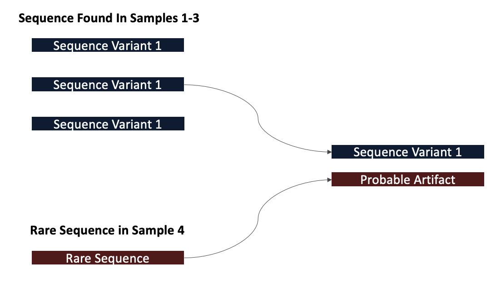

## DADA2 Error Model

- The DADA2 error model attempts to assess whether a sequence is too abundant to be explained by errors in amplicon sequencing. 

Here we will leverage this model to learn error rates and then plot them:

**Code Chunk 5**


```R
# Learn Error Rates

# dada2 uses a parametric model to learn the error rates
# for each sequence
errForward <- learnErrors(filtForward)
errReverse <- learnErrors(filtReverse)

# plot the error rate against theoretical error rates
plotErrors(errForward,nominalQ=TRUE)

```


!!! info
    So the red line indicates our expected error rate. Essentially, as the quality score gets better so does our error rate. 
    The black points/line our are actual error rates and we are looking for the trend of the black line to match the trend of the red line. 
    Here we expect a little deviation since our sample has been subsampled.

## Inferring Sequence Variants 

- So far, we have assigned p-values for each sequence in each sample
- DADA2 then tries to determine which sequences are of biological origin and which aren’t by assessing which sequences are present in other samples
- If a sequence is present in another sample, it is more likely that it is a real biological sequence



**Code Chunk 6**


```R
# Infer Sequnce Variants

# we will now run the dada2 algorithm 
# this algorithm delivers "true" sequence variants
# with information gathered from the error model 
# generated above
dadaForward <- dada(filtForward, err=errForward)
dadaReverse <- dada(filtReverse, err=errReverse)

# let's get a summary of our first sample
dadaForward[[1]]

```

```
dada-class: object describing DADA2 denoising results
35 sequence variants were inferred from 430 input unique sequences.
Key parameters: OMEGA_A = 1e-40, OMEGA_C = 1e-40, BAND_SIZE = 16
```

!!! info
    Here we note that even though we have 430 unique sequences in our data, only 35 of them have been deemed true sequence variants.


