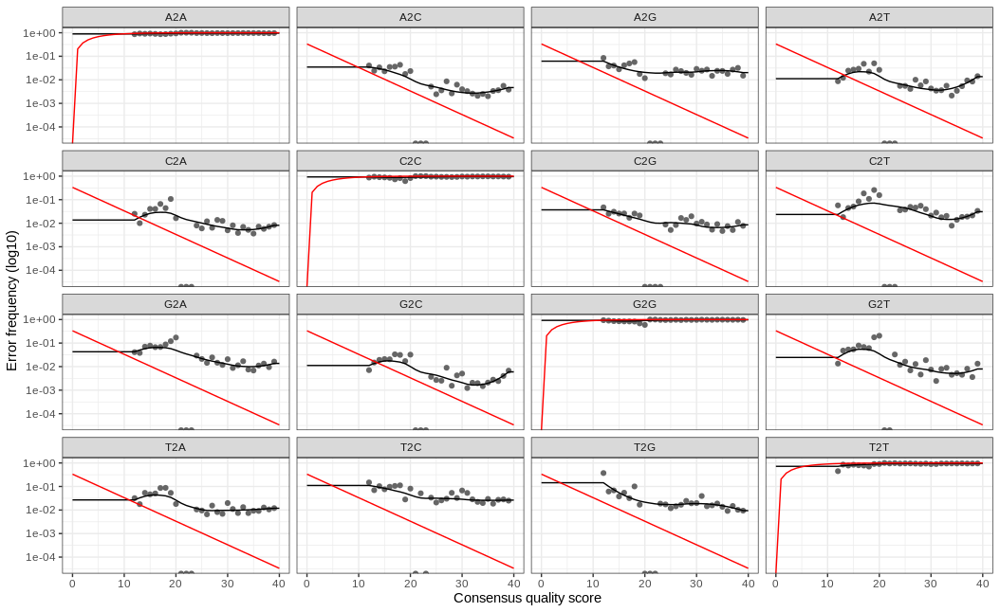

## DADA2 Error Model

- The DADA2 error model attempts to assess whether a sequence is too abundant to be explained by errors in amplicon sequencing. 

Here we will leverage this model to learn error rates and then plot them:

**Code Chunk 5**


```R
# Learn Error Rates

## dada2 uses a parametric model to learn the error rates
## for each amplicon data set
errForward <- learnErrors(filtForward)
errReverse <- learnErrors(filtReverse)
plotErrors(errForward,nominalQ=TRUE)
```



!!! info
    So the red line indicates our expected error rate. Essentially, as the quality score gets better so does our error rate. 
    The black points/line our are actual error rates and we are looking for the trend of the black line to match the trend of the red line. 
    Here we expect a little deviation since our sample has been subsampled.

## Inferring Sequence Variants 

- So far, we have assigned p-values for each sequence in each sample
- DADA2 then tries to determine which sequences are of biological origin and which aren’t by assessing which sequences are present in other samples
- If a sequence is present in another sample, it is more likely that it is a real biological sequence


**Code Chunk 6**


```R
# Sample Inference

## we will now run the dada2 algorithm 
## this algorithm delivers "true" sequence variants
## with information gathered from the error model 
## generated above
dadaForward <- dada(filtForward, err=errForward)
dadaReverse <- dada(filtReverse, err=errReverse)
dadaForward[[1]]
```

```
dada-class: object describing DADA2 denoising results
17 sequence variants were inferred from 662 input unique sequences.
Key parameters: OMEGA_A = 1e-40, OMEGA_C = 1e-40, BAND_SIZE = 16
```

!!! info
    Here we note that even though we have 662 unique sequences in our data, only 17 of them have been deemed true sequence variants.

## ASVs vs. OTUs

Traditional 16S metagenomic approaches use OTUs or operational taxonomic units instead of ASVs. So why does DADA2 use ASVs? First let's cover what an OTU is:

- Methods that use OTUs, cluster sequences are clustered together by similarity 
- Those sequences with above a 97% identity threshold are clustered into an OTU
- These OTUs are then combined into a consensus sequence and mapped to a reference database to determine which species it is from


Originally, OTUs were used to mitigate possible sequence errors by clustering similar sequences and getting a consensus sequence. 
However, this method has been found to inflate the number of unique sequences. 
By contrast, ASV analysis derives an error term to assess the possibility of a sequencing error. 
These sequences are then mapped directly to the organism of interest - giving nucleotide resolution. 


