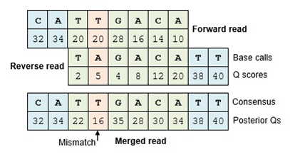
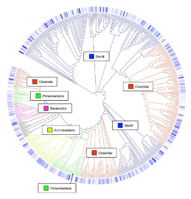
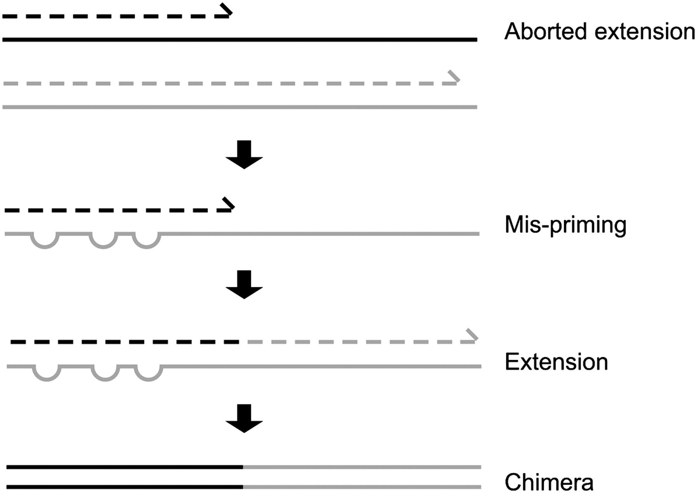

## Merging Reads

- For paired-end data there is a good deal of overlap between the forward and reverse read
- To resolve this redundancy, these reads are collapsed into contigs

<figure markdown>
  { width="500" }
</figure>


Let's do this with code now!


```R
# Merge Read Pairs

# so far we have "denoised", so to speak, 
# these sequence variants. We now need to merge the
# forward and reverse strands
mergers <- mergePairs(
  dadaForward,
  filtForward,
  dadaReverse, 
  filtReverse, 
  verbose=TRUE)

```

```
619 paired-reads (in 18 unique pairings) successfully merged out of 807 (in 82 pairings) input.
570 paired-reads (in 29 unique pairings) successfully merged out of 815 (in 136 pairings) input.
619 paired-reads (in 28 unique pairings) successfully merged out of 868 (in 128 pairings) input.
713 paired-reads (in 18 unique pairings) successfully merged out of 860 (in 76 pairings) input.
609 paired-reads (in 29 unique pairings) successfully merged out of 851 (in 133 pairings) input.
620 paired-reads (in 30 unique pairings) successfully merged out of 810 (in 115 pairings) input.
679 paired-reads (in 28 unique pairings) successfully merged out of 845 (in 104 pairings) input.
616 paired-reads (in 28 unique pairings) successfully merged out of 830 (in 106 pairings) input.
```

!!! info 
    Here we see that for each sample we get the number of reads that were able to be successfully merged out of the total number of reads that could be merged.
    

## ASVs vs. OTUs

- Now that we have finally merged our sequence variants we are left with an Amplicon Sequence Variant. 
- Traditional 16S metagenomic approaches use OTUs or operational taxonomic units instead of ASVs. 
- So why does DADA2 use ASVs? First let's cover what an OTU is:

    - Methods that use OTUs, cluster sequences are clustered together by an adjustable similarity threshold usually around 97%
    - These OTUs are then combined into a consensus sequence and mapped to a reference database to determine which species it is from



Originally, OTUs were used to mitigate the false discovery rate by clustering similar sequences and getting a consensus sequence. 
However, this method has been found to inflate the number of unique sequences. 
By contrast, ASV analysis derives an error term to assess the possibility of a sequencing error. 
These sequences are then mapped directly to the organism of interest - giving nucleotide resolution. 

## ASV Table

Now that our sequences are merged we can create an ASV counts table, basically telling us how which samples contain which ASV's:


```R
# Making a Sequence Table

# now that we have merged sequences we can construct
# an Amplicon Sequence Variant (ASV) table
seqtab <- makeSequenceTable(mergers)

```

## Chimera Removal

- During Sequencing microbial DNA is subjected to PCR to amplify DNA
- During PCR it is possible for two unrelated templates to form a non-biological hybrid sequence
- DADA2 finds these chimeras by:
    - aligning each sequence to more abundant sequences 
    - now check low abundant sequences and determine:
        - can this sequence be created if we mix the left and right sides of the abundant sequences

<figure markdown>
  { width="500" }
</figure>

Now in code:


```R
# Removing Chimeras

# Chimeric sequences occur as errors during PCR 
# when two unrelated templates for a hybrid sequence
# we will need to remove them before going forward

seqtab.nochim <- removeBimeraDenovo(seqtab, method="consensus", verbose=TRUE)

```

Now let's check if any chimeric sequences are removed:


```R
## check to see if the dimensions are different
## between the chimera filtered and unfiltered
## ASV tables

dim(seqtab)
dim(seqtab.nochim)
```

```
[1]   8 119
[1]   8 117
```

!!! info 
    We can see here that 2 chimeric sequences were removed because our before and after sequence count matrices differ by two columns.

## Pipeline Quality Control 

We will also take a moment to do some final QC:


```R
# Final QC

## we have performed quite a few steps 
## and it would be nice to get a final qc check 
## before assigning taxonomy
getN <- function(x) sum(getUniques(x))
finalQC <- cbind(
  out, 
  sapply(dadaForward, getN),
  sapply(dadaReverse, getN),
  sapply(mergers, getN),
  rowSums(seqtab.nochim))
colnames(finalQC) <- c("input", "filtered", "denoisedF", "denoisedR", "merged", "nonchim")
rownames(finalQC) <- sampleNames
finalQC
```

```
           input filtered denoisedF denoisedR merged nonchim
SRR5690809  1000      905       840       855    619     611
SRR5690810  1000      937       853       885    570     549
SRR5690811  1000      937       880       910    619     594
SRR5690812  1000      924       886       888    713     700
SRR5690819  1000      938       872       906    609     609
SRR5690820  1000      916       870       844    620     620
SRR5690821  1000      921       883       879    679     679
SRR5690822  1000      940       865       891    616     616
```

!!! info
    Here we see that we start with 1000 sequences per sample, end up with around 900 after filtering, around 800 after denoising to 
    find unique sequences, and around 600-700 sequences after merging sequences and removing chimeric sequences.

## Assigning Taxonomy

- To determine which taxon each  ASV belongs to DADA2 uses a naïve bayes classifier 
- This classifier uses a set of reference sequences with known taxonomy, here we use the SILVA database, as the training set and and outputs taxonomic assignments with bootstrapped confidence


```R
# Assigning Taxonomy

# dada2 uses a naive Bayes classifier when
# assigning taxonomy. This means we need a training
# set of sequences with known taxonomy information.
# here we use the silva database

taxa <- assignTaxonomy(seqtab.nochim, "../data/silva_nr99_v138.1_train_set.fa.gz")
```

## Databases

While we use the SILVA database here, there are other options databases:

- [NCBI 16S RefSeq Database](https://www.ncbi.nlm.nih.gov/refseq/targetedloci/16S_process/)
- [Greengenes](https://greengenes.secondgenome.com)

[Park SC, Won S. 2018](https://www.ncbi.nlm.nih.gov/pmc/articles/PMC6440677/) performed a benchmarking study assessing these three databases and found that Greengenes predicted fewer correct genera and that SILVA and EzBioCloud predicted roughly similar correct genera. However, SILVA had more false postitives. The authors note that this is probably due to the size of SILVA since it was roughly 4 times the size of EzBioCloud in 2018. 

!!! success "Time for a break!"
