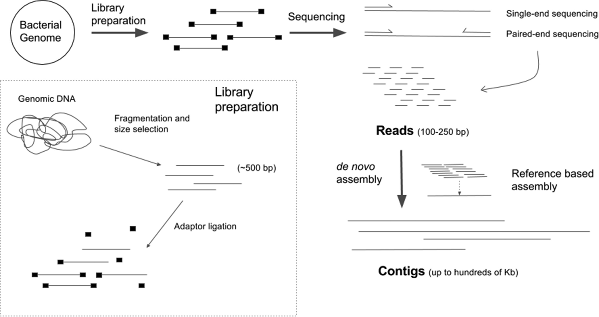
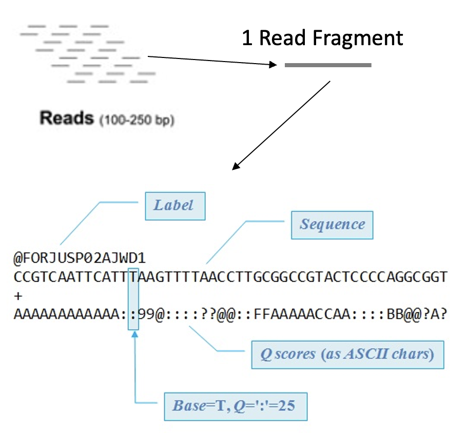
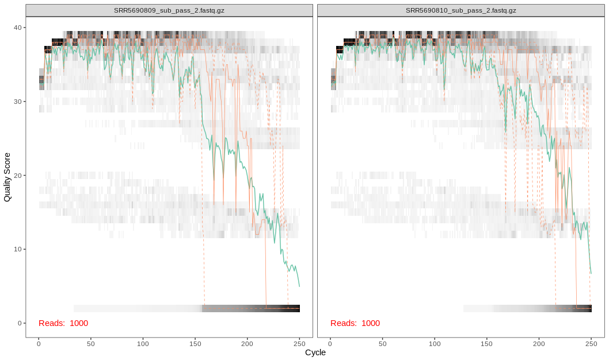

## Sequencing Overview

- Marker gene (16S, 18S, or ITS) is selected
- Primers target areas of high conservation in gene 
- DNA is fragmented 
- Adapters are added to help the DNA attach to a flow cell
- Barcodes may also be added to identify which DNA came from which sample
- The fragments are sequenced to produce reads
- Reads can be single-end (one strand sequenced) or paired-end (both strands sequenced) 



## Sequencing Read Data

- After sequencing we end up with a FASTQ file which contains:
    - A sequence label
    - The nucleic acid sequence
    - A separator
    - The quality score for each base pair



## Demultiplexing

- Sometimes samples are mixed to save on sequencing cost 
- To identify which DNA is from which sample Barcodes are added
- Before moving forward samples need to separated and those DNA barcodes need to be removed 
- Tools like [sabre](https://github.com/najoshi/sabre) can demultiplex pooled FASTQ data


## Quality Scores

- Quality Scores are the probability that a base was called in error
- Higher scores indicate that the base is less likely to be incorrect
- Lower scores indicate that the base is more likely to be incorrect

## DADA2 Quality Control

!!! warning
    DADA2 assumes that your read data has had any adapters removed and that your data is demultiplexed! 
    Check out [sabre](https://github.com/najoshi/sabre) to demultiplex your samples and [Cutadapt](https://cutadapt.readthedocs.io/en/stable/)
    to remove adapters
   
We begin by specifying the path to our data, sorting by forward and reverse strands, and grabbing our sample names:

**Code Chunk 2**


```R
# path to files
path <- "../data/raw_fastq"

# sort our files by forward and reverse strands 
# so that the sample names for each strand matches
# our data has the pattern "_pass_1.fastq.gz" 
# and "_pass_2.fastq.gz"
path2Forward <- sort(
  list.files(
    path,
    pattern="_pass_1.fastq.gz",
    full.names = TRUE)
  )
path2Reverse <- sort(
  list.files(
    path,
    pattern="_pass_2.fastq.gz",
    full.names = TRUE)
  )

# now let's grab our sample names
sampleNames <- sapply(
  strsplit(
    basename(path2Forward), "_"), `[`, 1)
```

DADA2 has built in plotting features that allow you to inspect your fastq files:

**Code Chunk 3**


```R
# plot the forward strand quality plot of our first two sample
dada2::plotQualityProfile(path2Forward[1:2])+
  guides(scale = "none")
```


```R
# plot the reverse strand quality plot of our first two sample
dada2::plotQualityProfile(path2Reverse[1:2])+
  guides(scale = "none")
```



!!! info "What does the graph tell us?"

    - Here we see that the quality scores drop off around the 200th base position for the forward reads and the 150th base position for the reverse reads
    - The
    - The error rate is considered when determining true biological sequences but is more sensitive to rare biological senquences when reads are trimmed.

!!! danger "Trimming Considerations"
    
    - The data we are using are 2x250 V4 sequence data. For data that do not overlap as much (i.e. data from the V1-V2 or V3-V4 regions), please ensure that your truncation length is larger than 20 + biological.length.variation of nucleotides between the your strands. 

## Trimming 

Here we notice a dip in quality scores and will trim using the base DADA2 filters:

**Code Chunk 4**


```R
# create new file names for filtered forward/reverse fastq files
# name each file name in the vector with the sample name
# this way we can compare the forward and reverse files 
# when we filter and trim
filtForward <- file.path(path, "filtered", paste0(sampleNames, "_F_filt.fastq.gz"))
filtReverse <- file.path(path, "filtered", paste0(sampleNames, "_R_filt.fastq.gz"))
names(filtForward) <- sampleNames
names(filtReverse) <- sampleNames

# Now we will filter and trim our sequences
out <- filterAndTrim(
  path2Forward,
  filtForward,
  path2Reverse, 
  filtReverse,
  truncLen = c(200,150),
  maxN=0, 
  maxEE=c(2,2), 
  truncQ=2, 
  rm.phix=TRUE,
  compress=TRUE)

```

!!! info "What do these options mean?"
    - `truncLen`: truncate reads after this base 
        - Here we truncate after base 200 for the forward reads and after basae 150 for the reverse reads
    - `maxN`: After truncation, sequences with more than maxN Ns will be discarded. Note that dada does not allow Ns.
    - `maxEE`: After truncation, reads with higher than maxEE "expected errors" will be discarded.
    - `truncQ`: Truncate reads at the first instance of a quality score less than or equal to `truncQ`
    - `rm.phix`: If TRUE, discard reads that match against the phiX genome
        - the PhiX genome is often used in Illumina control runs and it is neccary to remove reads from this genome to assess your microbial community of interest.
    - `compress`:  If TRUE, the output fastq file(s) are gzipped
