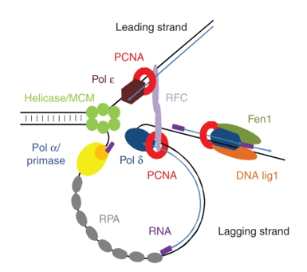
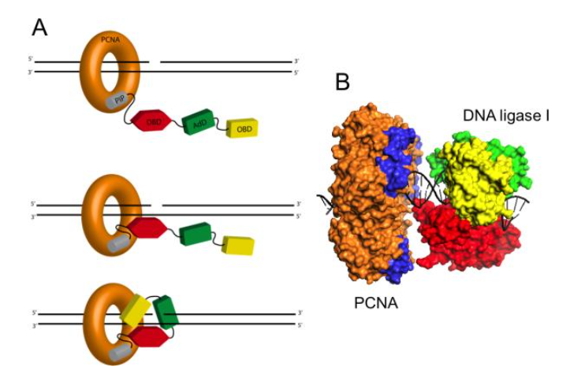

## Log into the HPC cluster’s On Demand Interface

- Open a Chrome browser and go to [On Demand](https://ondemand.pax.tufts.edu/){:target="_blank" rel="noopener"}
- Log in with your Tufts Credentials
- On the top menu bar choose `Clusters->Tufts HPC Shell Access`


- You'll see a welcome message and a bash prompt, for example for user `tutln01`:

```
[tutln01@login001 ~]$
```

- This indicates you are logged in to the login node of the cluster. Please **do not** run any program from the login node.

## Starting an Interactive Session

- To run our analyses we will need to move from the login node to a compute node. We can do this by entering:

```bash
srun -p batch --time=3:00:00 -n 2 --mem=4g --reservation=bioworkshop --pty bash
```

Where:

!!! example "Explanation of Commands"

    - `srun`: SLURM command to run a parallel job
    - `-p`: asking for a partition, here we are requesting the batch partition
    - `--time`: time we need here we request 3 hours
    - `-n`:  number of CPUs needed here we requested 2
    - `--mem`:  memory we need here we request 4 Gigabytes
    - `--reservation`: the reservation of compute resources to use here we use the `bioworkshop` reservation
    - `--pty`: get a pseudo bash terminal
    
!!! warning 
    
    The `bioworkshop` reservation will be unavailable after December 7th. This reservation is a temporary reservation for this class. 

- When you get a compute node you'll note that your prompt will no longer say login and instead say the name of the node:

```
[tutln01@c1cmp048 ~]$
```

## Set Up For Analysis

- To get our AlphaFold data we will enter:

```bash
cp -r /cluster/tufts/bio/tools/training/af2Workshop ./
```

- You will note that we are copying an existing directory with AlphaFold output rather than generating it. This is because depending on the protein and compute resource availability, running AlphaFold can take a few hours to over a day. At the end of this workshop will be instructions for creating a batch script to run AlphaFold. 
- Today we will examine how well AlphaFold predicted the structures of Proliferating Cell Nuclear Antigen and DNA ligase 1.

### Proliferating Cell Nuclear Antigen (PCNA)

PCNA is a very well conserved protein across eukaryotes and even Archea. It acts as a processivity factor of DNA Polymerase delta, necessary for DNA replication:



Aside from DNA replication PCNA is involved in:

* chromatin remodelling 
    
* DNA repair
    
* sister-chromatid cohesion

* cell cycle control

It should also be noted that PCNA is a multimeric protein consisting of three monomers.

### DNA ligase 1 (LIG1)

As evidenced by the picture above, DNA Ligase 1 is also involved in DNA replication but also DNA repair. As a part of the DNA replication machinery, DNA Ligase 1 joins Okazaki fragments during lagging strand DNA sythesis. This ligase also interacts with PCNA:



Here we note that DNA ligase is a monomer consisting of the following domains:

- PCNA interacting motif
- Oligemer Binding Fold Domain
- Adenylation Domain
- DNA Binding Domain

The contact between the PCNA interacting motif and PCNA induce a conformational change to create the DNA ligase catalytic region. 

## FASTA Format

So we have copied over our:
- initial data
- the scripts used to run AlphaFold2
- AlphaFold2 output

We will start by taking a look at the input data for PCNA, it's protein sequence. We can check it out by running the following command:

```bash
cat af2Workshop/data/1AXC.fasta 
```

```
>1AXC_1|Chain A|PCNA|Homo sapiens (9606)
MFEARLVQGSILKKVLEALKDLINEACWDISSSGVNLQSMDSSHVSLVQLTLRSEGFDTYRCDRNLAMGVNLTSMSKILKCAGNEDIITLRAEDNADTLALVFEAPNQEKVSDYEMKLMDLDVEQLGIPEQEYSCVVKMPSGEFARICRDLSHIGDAVVISCAKDGVKFSASGELGNGNIKLSQTSNVDKEEEAVTIEMNEPVQLTFALRYLNFFTKATPLSSTVTLSMSADVPLVVEYKIADMGHLKYYLAPKIEDEEGS
>1AXC_2|Chain B|P21/WAF1|Homo sapiens (9606)
GRKRRQTSMTDFYHSKRRLIFS
>1AXC_1|Chain C|PCNA|Homo sapiens (9606)
MFEARLVQGSILKKVLEALKDLINEACWDISSSGVNLQSMDSSHVSLVQLTLRSEGFDTYRCDRNLAMGVNLTSMSKILKCAGNEDIITLRAEDNADTLALVFEAPNQEKVSDYEMKLMDLDVEQLGIPEQEYSCVVKMPSGEFARICRDLSHIGDAVVISCAKDGVKFSASGELGNGNIKLSQTSNVDKEEEAVTIEMNEPVQLTFALRYLNFFTKATPLSSTVTLSMSADVPLVVEYKIADMGHLKYYLAPKIEDEEGS
>1AXC_2|Chain D|P21/WAF1|Homo sapiens (9606)
GRKRRQTSMTDFYHSKRRLIFS
>1AXC_1|Chain E|PCNA|Homo sapiens (9606)
MFEARLVQGSILKKVLEALKDLINEACWDISSSGVNLQSMDSSHVSLVQLTLRSEGFDTYRCDRNLAMGVNLTSMSKILKCAGNEDIITLRAEDNADTLALVFEAPNQEKVSDYEMKLMDLDVEQLGIPEQEYSCVVKMPSGEFARICRDLSHIGDAVVISCAKDGVKFSASGELGNGNIKLSQTSNVDKEEEAVTIEMNEPVQLTFALRYLNFFTKATPLSSTVTLSMSADVPLVVEYKIADMGHLKYYLAPKIEDEEGS
>1AXC_2|Chain F|P21/WAF1|Homo sapiens (9606)
GRKRRQTSMTDFYHSKRRLIFS
```

!!! example "What does this mean?"
    - Here we have 6 sequences (indicating this protein is a multimer) and each sequence has two lines:
        - A line starting with `>` which is the sequence header and contains information about the sequence
        - A second line with the amino acid sequence
        - Note here that the fasta file is called `1AXC.fasta` and does not mention PCNA. This is because 1AXC is the PDB code for the PCNA structure we plan to use. 
        
        
